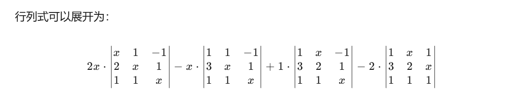
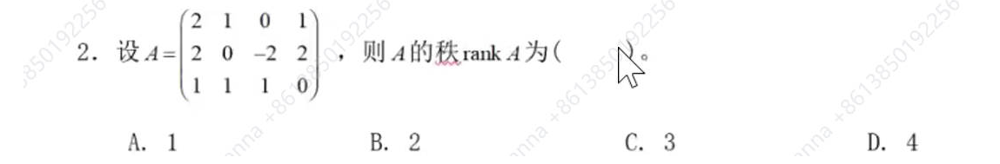
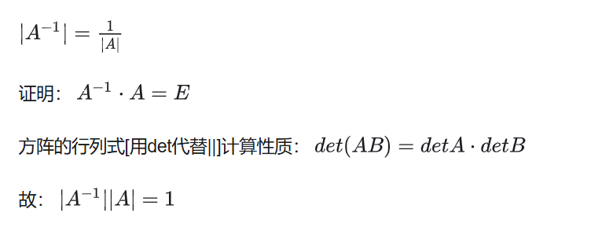
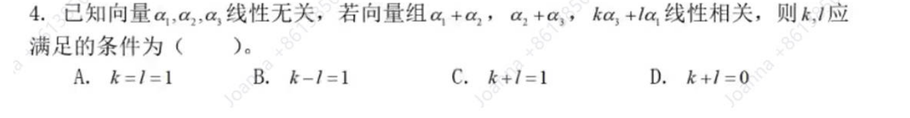
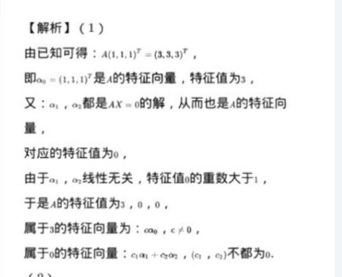

# 一、选择题
## 1、

D
## 2、

B
## 3、

[分块矩阵的行列式](https://ccjou.wordpress.com/2013/06/07/%E5%88%86%E5%A1%8A%E7%9F%A9%E9%99%A3%E7%9A%84%E8%A1%8C%E5%88%97%E5%BC%8F/)

D
=det(A)* det((2/3*B)^(-1))

书40页性质（ii)

|kA|=k^n|A|
 =det(A)* (det(*B)^(-1)) * (3/2)^3=27/8
## 4、
 
 书P87 存在不为0的系数k1a1+k2a2+k3a3...=0则线性相关
 
 
x+zl=0
x+y=0
y+zk=0
从 x+y=0 可得将1式和3式相加得l+k=0

选D
# 二、

# 三、

书P120特征向量和特征值的定义

P=(a1,a2,a3),使PAP-1=对角矩阵，将P施密特正交化，单位化后得到Q
