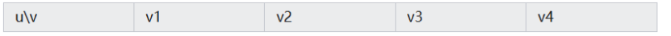
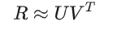
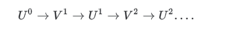
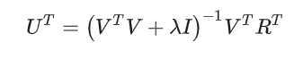

# 1、随机变量是什么,然后和编程中的变量有什么区别和关系

随机变量是跟取得样本值有关系

但是编程中的变量是人为定的

**随机变量(随机数量)：变量中的值是随机现象的结果**

**确定性：编程中的变量在赋值后，其值是确定的，而随机变量的值是不确定的，只有概率分布。**

**用途：编程中的变量用于存储和操作具体的数据值，而随机变量用于描述随机事件的数学模型。**

# 2、协同过滤算法是什么

协同过滤算法是一种推荐系统算法，通过分析用户的行为、偏好和历史记录，为用户推荐可能感兴趣的内容或物品。它基于“用户与用户之间”或“物品与物品之间”的相似性来生成推荐。

1、ALS算法原理

交替最小二乘算法是推荐系统中常用的一种矩阵分解技术。它的基本思想是将**用户-物品评分矩阵分解为用户因子矩阵和物品因子矩阵的乘积**，然后通过迭代方式分别优化这两个矩阵，最终逼近原始评分矩阵。这种方法能够揭示用户和物品之间的潜在关系，从而提供更准确的推荐。
在我们的实现中，ALS.train方法接受四个参数：训练数据集、隐语义因子的个数、迭代次数和正则化参数。这些参数共同决定了模型的性能和准确性。

（1）基本原理

用户对物品的打分行为可以用一个矩阵（R）来表示：

矩阵中的打分值rij表示用户 ui 对物品 vj 的打分，其中”?”表示用户没有打分，这也就是要通过机器学习的方法去预测这个打分值，从而达到推荐的目的。

（2）模型抽象

根据协同过滤的思想，R矩阵的行向量对应每个用户U，列向量对应每个物品V。ALS的核心思想是：将用户和物品都投射到k维空间，也就是说假设有k个隐向量特征，至于这个k个隐向量是什么不用关系（可能是标签，年龄，性别等），将每个用户和每个物品都用k维的向量来表示，把他们的内积近似为打分值，这样便可以得到近似的评分。

其中：
 为打分矩阵（m∗n，m表示用户个数，n表示物品个数）
U 表示用户对隐含特征的偏好矩阵（m∗k）
V 表示物品对隐含特征的归属矩阵（n∗K）

（3）代价函数

有显式反馈代价函数和隐式反馈代价函数两种，此处使用显式反馈代价函数。
如果用户对物品有明确的评分行为，那么可以对比重构出来的评分矩阵和实际的评分矩阵，便可得到误差。由于用户对物品的评分却失很多，仅以有评分行为的物品去计算误差。下面是显式反馈的代价函数。

其中：λ 为正则项系数

（4）算法求解

凸函数，而且变量耦合在一起，常规的梯度下降算法不能求解。但是先固定U求V，再固定V求U，如此迭代下去，问题就可以解决了。这是一个最小二乘的问题，由于一般隐含的特征k不会太大，可以直接当做是正规方程去解决。如此的交替的使用最小二乘去求解，所以名字就叫做交替最小二乘法。

有显氏反馈求解和隐氏反馈求解，此处使用隐式反馈求解。
固定 V 求解 U，对公式进行求导化简，可得：

同理，固定 U 求解 V，对公式进行求导化简，可得：

# 3、RAG底层原理

https://blog.csdn.net/a2875254060/article/details/142468037

https://zhuanlan.zhihu.com/p/708049545

RAG（检索增强生成）

**是从知识库中检索到的问答对，增强了LLM的提示词（prompt），LLM拿着增强后的Prompt生成了问题答案。**

**将文本分块并嵌入向量，利用transformer编码器模型处理，对所有向量建立索引，并创建LLM提示语以指导模型回答用户查询，结合搜索步骤获取的上下文。运行时，使用相同编码器模型将用户查询向量化，执行索引搜索找到top-k结果，从数据库检索对应文本块，作为上下文提供给LLM提示语。**

检索：检索是RAG流程的第一步，从预先建立的知识库中检索与问题相关的信息。这一步的目的是为后续的生成过程提供有用的上下文信息和知识支撑。

增强：RAG中增强是将检索到的信息用作生成模型（即大语言模型）的上下文输入，以增强模型对特定问题的理解和回答能力。这一步的目的是将外部知识融入生成过程中，使生成的文本内容更加丰富、准确和符合用户需求。通过增强步骤，LLM模型能够充分利用外部知识库中的信息。

生成：生成是RAG流程的最后一步。这一步的目的是结合LLM生成符合用户需求的回答。生成器会利用检索到的信息作为上下文输入，并结合大语言模型来生成文本内容。

# 4、SOTA的全称是什么

state of the art

意思是“最先进的”或”最前沿的”。在技术、学术或工程领域，SOTA
通常用来描述当前某个领域中最先进的技术、方法或成果。