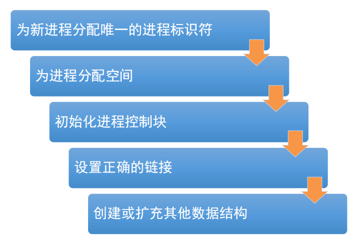
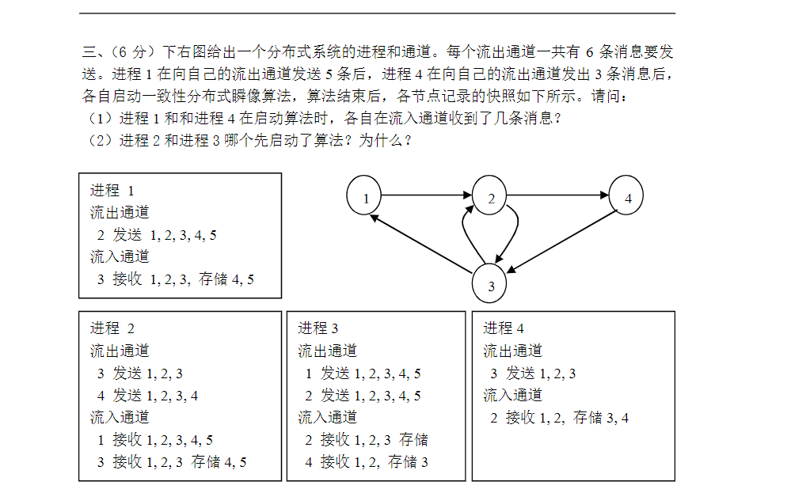

# 一、简答题
1. 一台计算机的四个主要结构化部件是什么？
处理器，内存，输入输出模块，系统总线

---

2. 除了创建或扩充其他数据结构，操作系统创建一个新的进程还需要进行哪些步骤？

---

3. 假设在一个单CPU系统中，若有N个用户进程（N>1）且当前CPU为用户态，则处于就绪状态的用户进程数最多为几个？最少为几个？处于阻塞态的用户进程数最多为几个？最少为几个？
就绪状态的用户进程数最多 $N-1$ 个（1个在运行），最少 $0$ 个（全被阻塞）；
阻塞态的用户进程数最多 $N$ 个，最少 $0$ 个。

---

4. 构成死锁的四个充分必要条件分别是什么？
互斥、占有且等待、不可抢占、循环等待

---

5. 线程可分为哪两大类？哪一类的时间开销比较小？为什么？
书103：用户级、内核级、用户级线程的创建、销毁和调度都不需要内核的介入，因此开销较小，效率较高。

---

6. 对于一般信号量，当信号量的值大于0时，其值代表什么含义？当小于0时，其绝对值代表什么含义？强信号量和弱信号 量有什么区别？
    1. 当信号量值大于0时，其值代表**当前可用资源的数量**；
    ​当信号量值小于0时，其绝对值代表等待**该资源的阻塞进程数量​**
    2. (书140)
    **强信号量**：按照先进先出（FIFO）策略，从队列里移出等待的进程。保证不会饥饿。
    **弱信号量**：没有规定进程从队列移出的顺序。无法保证不会饥饿。

---

7. 若内存中有4个进程，分别需要独占2、1、5、4个计算资源来计算，则计算机系统至少需要几个计算资源才能保证没有死锁的危险？请写出计算过程。
~~1+0+4+3=8？~~
1+0+4+3+1=9
(如果是8的话，因为所有进程都争最后一个资源而死锁了)

---

8. 计算机系统刚开机时处于什么地址模式？而后会切换到什么地址模式？
刚开机时实模式，之后保护模式。

---

9. 假设处理器使用两级存储器。第一级存储器的容量为1000字节，读取时间为0.15μs。第二级存储器的容量为100000字节，读取时间为1μs。假设80%的读取操作只需要在第一级存储器中进行。那么读取一个字节的平均时间是多少？给出计算过程。
0.8×0.15+0.2×1.15=0.35

---

10. 考虑到一个并发程序并发执行两个线程p和q，分别定义为void p(void) { A; B; C; D; E; }和void q(void) { F; G; H; I;}，其中，A、B、C、D、E、F、G、H和I是任意的原子语句，且因为同步的需要，要求I必须在D之后完成。请计算这两个线程所有可能的正确交替执行的顺序有多少种？并给出计算过程。
解：（我认为的答案）
先把I插入到ABCDE的D后面，有两种插法
    1. ABCDIE
    然后把FGH在保持顺序的情况下，插到I前的5个空，插法有 $ \binom{5+3-1}{3} = 35$ 种
    2. ABCDEI
    然后把FGH在保持顺序的情况下，插到I前的6个空，插法有 $ \binom{6+3-1}{3} = 56$ 种
    故一共有 $35+56=91$ 种

---

# 二、

---

# 三、

(1)进程1收到3条，4收到2条

(2)2先启动，3收到2发送的标识才启动