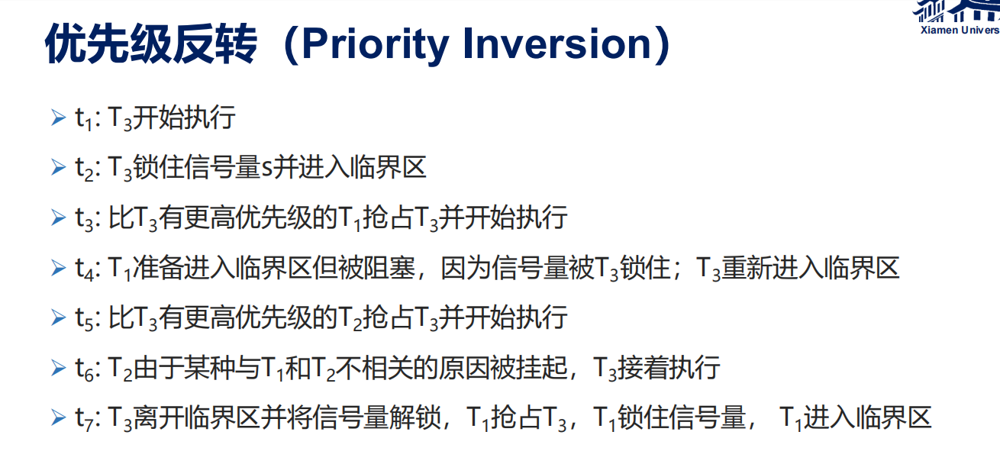
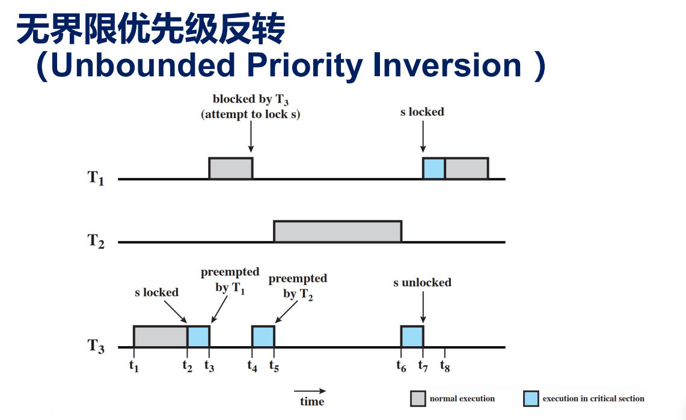
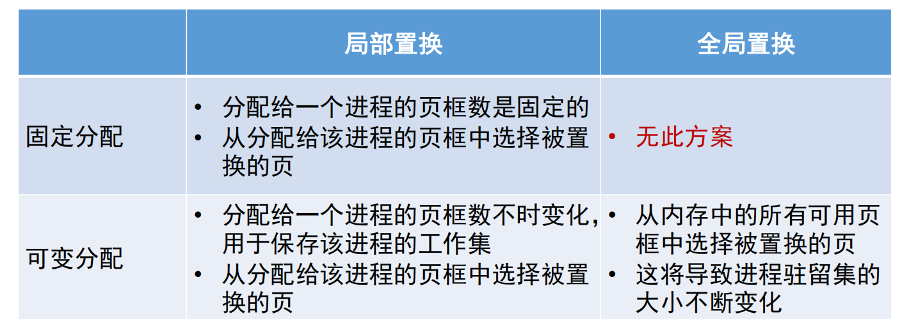

## 3、
简单分页内存管理与大小相等的固定分区的最主要区别是什么？虚拟分段与简单分段的最主要区别是
什么？（4 分）

简单分页内存管理与大小相等的固定分区：

| 特性分类         | 简单分页内存管理   | 大小相等的固定分区                      |
| ------------ | ---------- | ------------------------------ |
| **物理内存存放方式** | 物理存放地址可不连续 | 物理内存上连续存放                      |
| **虚拟地址连续性**  | 虚拟地址连续     | 虚拟地址连续 |

虚拟分段：不用所有的段都在内存中

## 4、
进程状态图中，从就绪态到运行态的转换，属于短程调度、中程调度、长程调度中的哪一种？
进程被换入内存，是属于哪一种调度？ （4 分）
1. 短程调度;
2. 中程调度

## 5、
RAID0、RAID1、RAID2、RAID3 中，哪一种通过汉明码实现冗余？哪一种不管磁盘阵列多大，都仅需要一个冗余磁盘？ （4 分）
汉明码：
RAID2
一个冗余磁盘：
RAID3

|RAID0|RAID1|RAID2|RAID3|RAID4|RAID5|RAID6|
|--|--|--|--|--|--|--|
|无冗余|镜像|汉明码|位交错奇偶校验|块级奇偶校验|块级分布式奇偶校验|不知道|
|n|1/2|n/n+3|n/n+1|n/n+1|n/n+1|n/n+2|

## 6、
6、请简要举例说明什么叫“无界限优先级反转”？避免该现象出现的两种方法分別是什么？（4 分）

以下来自kimi

“无界限优先级反转”是一种在计算机操作系统中可能出现的调度问题，通常发生在多任务环境中，尤其是在涉及共享资源和优先级调度的场景中。以下是对其的简要说明及举例：

### 定义
无界限优先级反转是指在多任务系统中，由于低优先级任务持有共享资源，导致高优先级任务被阻塞，而中间的中优先级任务不断抢占CPU资源，使得高优先级任务无法及时获得资源，从而导致高优先任务级的优先级反转，这种反转可能会持续很长时间，甚至没有明确的界限，因此称为“无界限优先级反转”。

### 举例说明
假设有一个系统中有三个任务：任务A、任务B和任务C，它们的优先级分别为高、中、低。任务C持有一个共享资源（例如一个互斥锁）。

1. **任务C运行**：任务C开始运行，并获取了共享资源。
2. **任务A就绪**：任务A被调度器准备好运行，但由于任务C持有共享资源，任务A无法获得资源，因此被阻塞。
3. **任务B就绪**：任务B也开始就绪，它的优先级高于任务C但低于任务A。
4. **任务B抢占CPU**：由于任务B的优先级高于任务C，调度器会将CPU分配给任务B，任务C被挂起。
5. **任务A持续阻塞**：任务B运行时，任务A仍然被阻塞，因为任务C持有资源，而任务C无法运行以释放资源。
6. **任务B持续运行**：任务B可能会持续运行较长时间，因为它的优先级高于任务C，调度器会优先调度任务B。
7. **任务A无法运行**：任务A的优先级虽然最高，但由于任务C持有资源，任务A无法获得资源，而任务B又不断抢占CPU，导致任务A无法运行。

在这种情况下，任务A的优先级虽然最高，但由于低优先级的任务C持有资源，而中优先级的任务B不断抢占CPU，任务A可能会被阻塞很长时间，甚至无法运行，这就是“无界限优先级反转”现象。

### 解决方法
为了解决无界限优先级反转问题，可以采用优先级继承或优先级天花板等机制。优先级继承机制允许低优先级任务在持有资源时继承高优先级任务的优先级，从而避免被中优先级任务抢占。优先级天花板机制则是为共享资源设置一个最高优先级，当任务持有资源时，它的优先级会被提升到这个天花板值，从而避免优先级反转问题。

**方法：优先级置顶、优先级继承**

## 8、
8、驻留集管理的分配策路有可变和固定两种，置换范围有局部和全局两种，其中分配策略与置换范围的
哪种组合是不可能的？工作集策略属于哪一种组合？ （4 分）

固定分配策略与全局置换范围的组合是不可能的。因为固定分配策略意味着每个进程的驻留集大小是固定的，而全局置换范围意味着可以将任何进程的页面置换出去，这与固定分配策略相矛盾。
工作集策略属于可变分配策略 + 局部置换范围的组合。工作集策略根据进程的页面访问情况动态调整其驻留集大小，因此是可变分配策略。同时，工作集策略只考虑置换当前进程的页面，因此是局部置换范围。

## 9、
堆文件、顺序文件和索引顺序文件三种文件组织结构中，最简单的文件组织形式是哪一个？访问单条
记录效率最高的又是哪一个？ （4 分）

P345
堆最简单

访问单条记录效率最高的文件组织形式是索引顺序文件。

## 10、
10、什么叫非一致性的全局状态？分布式快照算法对消息传送有什么假设条件？（4 分）
p476
如果一个进程已经记录了消息的接收情况，而相应的发送进程还没有记录改消息以及悲发送

假设消息传送按照他们发送的顺序，并且没有消息丢失
