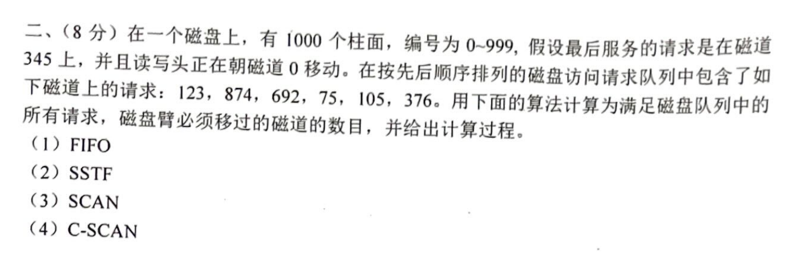
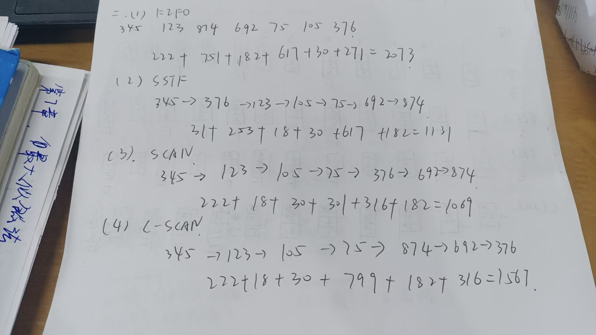
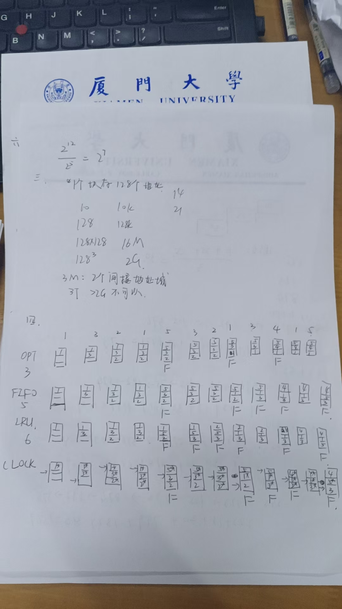
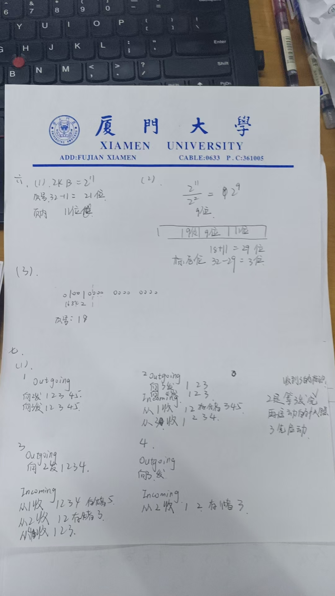
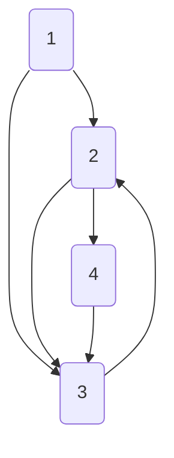

# 一、简答题（40分）
## 1. 
冯诺依曼架构的四个主要组成部分分别是？（4分）

处理器，内存，输入输出模块，系统总线

## 2. 
在单处理器系统中，若同时存在5个进程，则处于就绪队列中的进程最多有几个？同样的假设条件下，处于阻塞队列中的进程最多有几个？（4分）

就绪最多4个，阻塞最多5个
## 3. 

现在有三个同时到达的作业，它们的执行时间分别是10,30,15，系统按单道程序方式串行运行且采用短作业优先调度算法，则平均周转时间是多少？请给出计算过程。

10->15->30

t=(10+25+55)/3=30

## 4. 

设系统中可选的调度算法有：先来先服务调度、短作业优先调度、时间片轮转调度、多级反馈队列调度、抢占式优先级调度；若每个用户仅能建立一个进程，为了照顾短作业用户、紧急作业用户、和保障人机交互的响应速度，分别应该采用哪种调度算法？如果想平衡短作业、长作业和交互作业用户的感受，又应该采用哪种调度算法？（4分）

短作业用户：短作业优先调度

紧急作业用户：抢占式优先级调度

保障人机交互的响应速度：时间片轮转调度(kimi说的)

平衡短作业、长作业和交互作业用户的感受：多级反馈队列调度


## 5.
若系统中有n（n>2）个进程，每个进程均需要使用某临界资源3个，则至少要几个该类临界资源，使系统不会发生死锁？为什么？（4分）

~~（n-1）*3吗~~
2n+1
为避免死锁，需确保系统资源分配后，至少有一个进程能获得全部所需资源并完成运行，从而释放资源供其他进程使用

## 6.
 处理死锁主要有哪三类方法？银行家算法属于哪一类方法？（4分）
 
 死锁避免
 死锁预防
 死锁检测
 
 银行家属于死锁避免


## 7.
 发生缺页中断是否意味着本次内存访问过程TLB没有命中？为什么？（4分）

 缺页中断是由于页面不在内存中
即使TLB未命中，只要对应的页面在内存中，通过访问内存中的页表，仍然可以完成地址映射，不会产生缺页中断。


## 8. 
考虑下面的C程序，M和N是两个正整数常量，如果这个程序运行在一个页面大小为1KB的机器上，不考虑预取策略，那么M和N分别取什么值会使得for循环的每次执行都产生缺页错误？为什么？（4分）

```c
short X[N]; 
int step = M; 
for(int i= 0;i<N; i+= step) 
X[i]= X[i]+1;
```

图中的问题是关于在C程序中如何通过选择合适的M和N值来确保在每次for循环执行时都产生缺页错误。这个问题涉及到内存分页和缺页中断的概念。

首先，我们需要理解几个关键概念：
1. **页面大小**：题目中给出的页面大小为1KB（1024字节）。
2. **数组`X[N]`**：这是一个`short`类型的数组，每个元素占用2字节（假设`short`是2字节）。
3. **步长`step`**：在for循环中，`i`的增量是`step`，即M。

为了确保每次循环都产生缺页错误，我们需要让每次访问的数组元素位于不同的页面上。这意味着每次访问的元素之间的距离必须超过页面大小。

### 分析和解答：

1. **计算每页可以容纳的元素数量**：
   - 每页大小为1024字节，每个`short`类型元素占用2字节。
   - 因此，每页可以容纳 \( \frac{1024}{2} = 512 \) 个元素。

2. **选择合适的M和N**：
   - 为了让每次循环都产生缺页错误，我们需要确保每次访问的元素位于不同的页面上。
   - 这意味着`step`（即M）至少应该是512，因为这样每次访问的元素至少相隔512个元素，确保它们位于不同的页面上。
   - 对于N，我们需要确保数组足够大，以至于在循环中可以访问到多个页面。N应该至少为1024（即一个页面可以容纳的元素数量），但实际上，为了确保在循环中访问多个页面，N应该更大。

### 结论：

- **M的值**：至少为512，以确保每次访问的元素位于不同的页面上。
- **N的值**：应大于等于1024，以确保数组足够大，可以在循环中访问多个页面。

这样设置M和N可以确保在每次for循环的执行中都产生缺页错误，因为每次访问的元素都位于不同的页面上。


## 9.
 现有一个RAID磁盘阵列，它包含6个磁盘，每个磁盘大小都是100GB。RAID级分别为0、1、5、6时，请给出这个磁盘阵列的有效实际容量。（4分）

|0|100%|6|
|--|--|--|
|1|50%|3|
|5|n/n+1|5|
|6|n/n+2|4|


## 10.
 什么是客户-服务器中的高速缓存一致性问题？为什么会出现这种问题？（4分）

 书431

 使**本地**高速缓存副本与**远程**数据同步更新的问题

 为什么：客户修改也被其他客户机缓存的文件

 PS:解决方法：文件锁

 




第六题第（3）问有误？应该是(1001)=(9)位，问题不大

