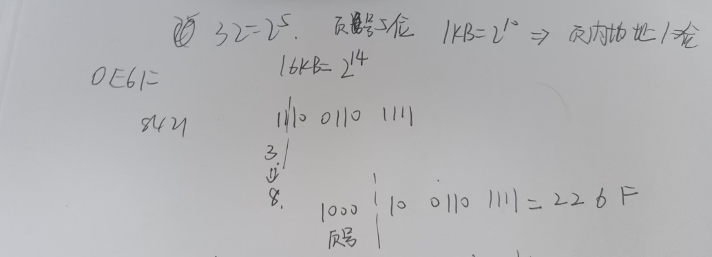

# 一
## 问题
1. 操作系统管理的计算机资源除了处理器还包含哪两个主要部分？除了资源管理，操作系统的另一个主要功能是什么？
2. 在单处理器的分时系统中，分配给进程 P 的时间片用完后，结果调度到的进程仍然是进程 P。上述情形有可能出现吗？如果有，请说明理由。
3. 在一个单处理器系统中，若有 N 个用户进程（N>1）且当前 CPU 为用户态，则处于就绪状态的用户进程数最多为几个？最少为几个？处于阻塞状态的用户进程最多为几个？
4. 若内存中有 3 个进程，分别需要独占 2、1、8 个计算资源来计算，则在计算机系统最多拥有几个计算资源情况下可能导致死锁？
5. 什么是强信号量和弱信号量？二值信号量与一般信号量等价吗？
6. 对于希望实现高数据传送率的应用，RAID0 的条带尺寸是大些好还是小些好？为什么？
7. 请列举动态分区内存管理中三种常见的放置算法。
8. 使用集群技术的优点有哪些？请列举其中的三个。
9. 某虚拟存储系统中用户空间共有 32 个页面，每页 1KB，物理内存容量为 16KB。假定某时刻系统为用户进程的第 0，1，2，3 页分别分配的物理帧号为 2，0，1，8。请问：虚拟地址 0E6F 对应的物理地址是什么？并对结果加以解释。
## 答案
1. 内存和IO。另一个主要功能：作为用户/计算机接口。（课本P31-33）
（存储器和输入输出设备）
2. 有可能。如果进程就绪队列只有P一个进程。或者因为优先级调度的规则。（课本没找到？）
如果进程 P 在时间片内没有完成其任务，它可能会再次被调度。
3. 处于就绪状态的用户进程最多(N-1)个，因为CPU用户态表示正在运行用户程序。处于就绪态的用户进程最少0个，例如除了正在运行
阻塞态同理。
4. (2-1)+(1-1)+(8-1)=8
5. 
+ **强信号量**：按照先进先出（FIFO）策略，从队列里移出等待的进程。
+ **弱信号量**：没有规定进程从队列移出的顺序。
+ 二值信号量与一般信号量不等价，二值信号量只能取 0 或 1。（不确定）
6. 小

| RAID 0 典型情况  | 条带大小    | 目的       | 效果|
| ------------ | ------- | -------- | -------------------------- |
| 实现高数据传送能力    | 小 | 更细致地分割数据 | 多块磁盘频繁共同参与数据传输，提升整体速度      |
| 实现高速 I/O 请求率 | 大 | 减少磁盘切换频率 | 单块磁盘连续处理较大块数据请求，提高 I/O 请求率 |

7. 首次适应算法、最佳适应算法、下次适应算法
8. 集群技术的优点：P437绝对可伸缩性，增加可伸缩性，高可用性，高性价比
9. 
10. 解：（我认为的答案）
先把I插入到ABCDE的D后面，有两种插法
    1. ABCDIE
    然后把FGH在保持顺序的情况下，插到I前的5个空，插法有 $ \binom{5}{1}+2\times\binom{5}{2}+\binom{5}{3}=\binom{5+3-1}{3} = 35$ 种
    2. ABCDEI
    然后把FGH在保持顺序的情况下，插到I前的6个空，插法有 $ \binom{6}{1}+2\times\binom{6}{2}+\binom{6}{3}=\binom{6+3-1}{3} = 56$ 种
    故一共有 $35+56=91$ 种
