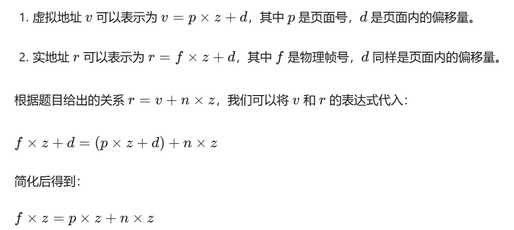
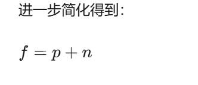
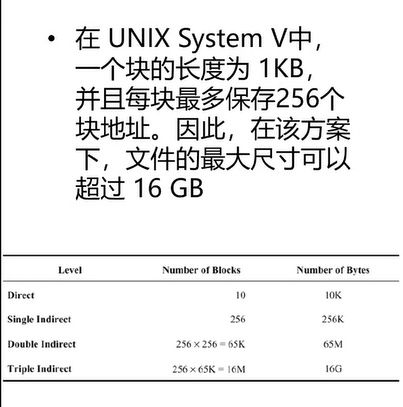
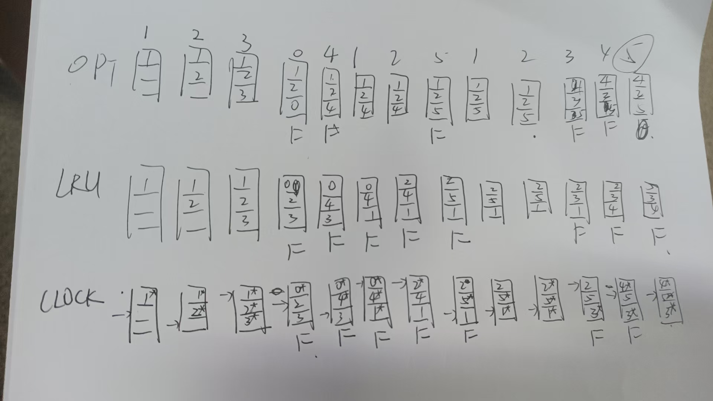

# 一、
## 1、
速率调度算法的充分和必要条件

1. **必要条件**：

2. **充分条件**

## 2、
若一个进程的虚地址v和实地址r之间满足关系r=v+n*z，其中z为页面大小，n为自然数。请给
出该进程物理帧号f与页面号p之间的关系。

这道题目涉及到操作系统中进程管理和内存管理的概念。题目问的是，在同一个进程中进行线程切换时，是否会对以下三个方面产生影响：

## 3、
同一个进程中线程的切换，会导致TLB全部失效吗？会导致页表更换吗？会引起堆栈切换吗？
【参考答案】不会，不会，会
1. **TLB（Translation Lookaside Buffer，翻译后备缓冲区）**：TLB 是 CPU 中用于缓存虚拟地址到物理地址映射关系的一个高速缓存。当发生线程切换时，如果线程属于同一个进程，那么它们的虚拟地址空间是相同的，因此 TLB 中的映射关系仍然有效，不需要全部失效。

2. **页表**：页表是操作系统用来存储虚拟内存到物理内存映射关系的表格。对于同一个进程中的线程切换，页表通常不需要更换，因为所有线程共享相同的虚拟地址空间和页表。

3. **堆栈切换**：每个线程都有自己的堆栈空间，用于存储函数调用时的局部变量、参数和返回地址等。当线程切换时，需要保存当前线程的堆栈状态，并加载下一个线程的堆栈状态，这称为堆栈切换。

题目给出的参考答案是：
- 不会导致 TLB 全部失效（因为虚拟地址空间没有变化）。
- 不会导致页表更换（因为所有线程共享相同的页表）。
- 会引起堆栈切换（因为每个线程有自己的堆栈空间）。

所以，答案是：不会，不会，会。

## 4、
9、在Lamport 的分布式互斥算法中,如果消息(Request,T:,j)和(Release,T2,i)的时间戳满足条件T1<T2那么进程P，是否必须向进程P发送Reply消息？为什么？

【参考答案】不必。发送的Reply消息的时问戳必定大于Release消息,因此发送或不发送Reply 对进程
P的Request 的消息排序都不会有影响。

PS:

(Request, T1, j)：表示进程 Pj发送了一个请求消息，请求访问共享资源，其中 T1 是发送请求的时间戳，j 是请求的标识。

(Release, T2, i)：表示进程 Pi 发送了一个释放消息，释放对共享资源的访问，其中 T2 是发送释放消息的时间戳，i 是释放的标识。

题目中提到的条件T1<T2表示进程Pj发送请求消息的时间早于进程Pi发送释放消息的时间。

## 5、
动态内存分配与分页内存分配的主要缺点是什么？如何解决？

书208页：compaction:压缩

## 6、
进程共享9台磁带机。每个进程每次只申请或释放1台磁带机,并且在运行时最多需要3台磁带机.
问：在保证不死锁的前提下，最多允许多少个进程同时运行?
【参考答案】4个。

(3-1)*n+1<=9

n=4

9/3+1吗

## 7、
当进程执行系统调用时,需要改变这个进程的执行模式吗?
【参考答案】需要。
用户态改成内核态？

## 8
15、在事务型应用(即存在多个并发的I/O,每次1/O的数据量不大)中,RAID0的条块尺寸是大些好还
是小些好?对于大数据传输呢?

【参考答案】事务型应用:大些好。大数据传输:小些好
看不懂：有人看懂了吗

## 一、事务型应用（条块尺寸大些好）
1. **事务型应用的特点**
   - 事务型应用通常涉及多个并发的I/O操作，每次I/O的数据量不大。例如，在一个在线交易系统中，可能同时有多个用户进行查询余额、转账等操作，每次操作的数据量可能只是几KB（如账户信息、交易金额等）。
2. **RAID 0条块尺寸大的优势**
   - **减少磁盘寻道次数**：在RAID 0中，数据被分散存储在多个磁盘上。如果条块尺寸较大，那么对于每次小数据量的I/O操作，系统可以将更多的数据作为一个整体分配到磁盘上。这样，当有多个并发I/O操作时，磁盘的寻道次数相对较少。因为寻道操作是磁盘操作中最耗时的部分之一，减少寻道次数可以提高整体性能。例如，假设条块尺寸为64KB，每次I/O操作的数据量为4KB，那么一个条块可以容纳16次这样的I/O操作数据。磁盘只需要在处理这16次操作时进行较少的寻道操作，而不是频繁地在磁盘的不同位置之间切换。
   - **提高数据存储的连续性**：较大的条块尺寸使得数据在磁盘上的存储更加连续。对于事务型应用，虽然每次操作的数据量小，但多个操作的数据组合在一起可以更好地利用磁盘的连续存储空间。这种连续性有利于提高磁盘的读写性能，因为磁盘在读写连续的数据块时，数据传输速率会更高。比如，当一个事务操作需要读取多个小数据块时，如果这些数据块在磁盘上是连续存储的，磁盘的读取操作可以更高效地进行。

## 二、大数据传输（条块尺寸小些好）
1. **大数据传输的特点**
   - 大数据传输通常涉及大量数据的连续读写操作。例如，在数据中心之间的数据备份、大规模视频文件的传输等场景，每次I/O操作的数据量可能达到MB甚至GB级别。
2. **RAID 0条块尺寸小的优势**
   - **提高数据分散性**：小的条块尺寸可以让数据在多个磁盘上更均匀地分散。对于大数据传输，这意味着数据可以同时在多个磁盘上进行读写操作。由于数据被分割成较小的块，每个磁盘可以并行地处理这些小块数据，从而充分利用多个磁盘的带宽。例如，假设条块尺寸为4KB，对于一个1MB的数据块，它可以被分割成256个小的4KB块。这些小块可以同时在多个磁盘上进行读写，大大提高了数据传输的速度。
   - **更好的容错性（相对而言）**：虽然RAID 0本身没有冗余，但在大数据传输过程中，小条块尺寸可以让数据在磁盘上的分布更加分散。如果某个磁盘出现故障，虽然数据会丢失，但由于数据是分散存储的，单个磁盘故障对整个数据传输的影响相对较小。例如，对于一个1GB的数据文件，如果条块尺寸小，它被分散存储在多个磁盘上，即使一个磁盘损坏，丢失的数据只是文件的一部分，而不是整个文件。

# 二、
在一个UNIX类操作系统的文件系统中,i-结点有10个直接地址域和3个间接地址域(3级间接地址):
一个逻辑块的容量是1K字节:磁盘块指针为4个字节,其中3个字节存放磁盘块的地址。间:如果文件
长度为512KB且文件中不存在空洞,则需要用到几级间接地址?如果磁盘容量足够大，这个文件系统是否
可以存储一个16GB+32KB大小的文件？为什么？
【参考答案】2个；不可以：2?4*1KB=1GB<16GB。

1K/4=2^8=256，所以每个快保存256个地址

256K<512K
所以要两个间接地址

第二问不知道

# 三、
三、有一个64位CPU,使用TLB和Cache,地址位数是39位,页表项的长度为8字节,页面大小为8K
字节，使用2级页表。
（1)存取一个字节，最多要访问几次内存？最少呢？
（2)如果根页表（一级页表）恰好存放在一个页面里(没有空余),那么存储全部2级页表需要多少内存?
【参考答案】（1）0次，3次(2）2^10*2^16*8B=512MB

(1)
我猜的：0次：命中Cache

---
3次：访问1级页表（1次），2级页表（2次），拿着物理地址去访问内存（3次）

---

（2）8K/8=1K=2^10，

所以一级地址为10位

8k=2^13,页内地址13位

二级地址：39-10-13=16位

|10位|16位|13位|
|--|--|--|
|一级地址|二级地址|页内地址|

# 五、

