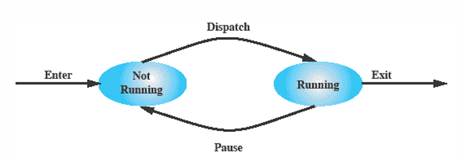
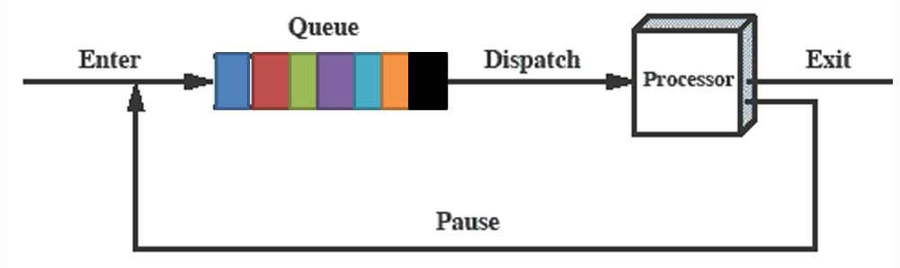
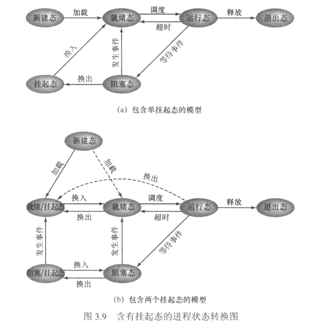

[toc]

# 进程
## 进程的概念
进程的几个定义
+ 一个正在执行的程序
+ 一个正在计算机上执行的程序实例
+ 能分配给处理器并由处理器执行的实体
+ 由一组执行的指令、一个当前状态和一组相关的系统结构表征的活动单元
+ 系统进行**资源分配**的基本单位
+ 操作系统的基础
+ 线程的容器


进程的两个基本元素
+ **程序代码**（prognam code）：可能被执行相同程序的其他进程共享
+ 与代码相关的**数据集**（set of data）：当处理器开始执行一个程序，我们把这个执行实体称为一个**进程**

进程元素
+ 标识符
+ 状态
+ 优先级
+ 程序计数器
+ 内存指针
+ 上下文数据
+ I/O状态信息
+ 记账信息（审计信息）

以上列表信息存在一个称为**进程控制块**（process control block，PCB）的数据结构中。

## 进程与程序

### 进程与程序之间的关系
+ 进程是运行的程序在操作系统中的抽象。
	+ 程序=文件(静态可执行文件)
	+ 进程=运行程序=**程序**+**运行状态**  
+ 一个被多次执行的程序可能对应于多个进程。  
+ 进程执行需要比程序更多的资源
	+ 存储指令和数据的**存储器**。
	+ 执行指令的**CPU**
	+ 以及其他资源
### 进程和程序之间的区别
<table>
	<tr>
		<td></td>
		<th>进程</th>	
		<th>程序</th>	
	</tr>
	<tr>
		<td rowspan="2">主动性</td>
		<td>主动</td>	
		<td>被动</td>	
	</tr>
	<tr>
		<td>一组有序的代码</td>	
		<td>正在执行的程序</td>	
	</tr>
	<tr>
		<td>时间</td>
		<td>短期，动态，不断变化并很快结束的过程</td>	
		<td>长期，静态，可长时间保存</td>	
	</tr>
	<tr>
		<td rowspan="2">成分</td>
		<td colspan="2">进程=程序+数据+PCB</td>	
	</tr>
	<tr>
		<td colspan="2">一个程序可对应多个进程；通过调用，一个进程可包括多个程序</td>
	</tr>
</table>

## 进程的状态与转换
### 进程轨迹和分派器(调度器)
**轨迹**
+ 列出为进程而执行的指令序列，可描述单个进程的行为
+ 给出各个进程轨迹的交替方，就可描述处理器的行为

**分派器/调度器**
+ 使处理器切换进程，调度程序

### 两状态进程模型
进程的两种状态
+ 运行态
+ 未运行态




### 五状态进程模型

+ 就绪态：进程已在内存中并可以执行
+ 阻塞态：进程已在内存中并等待一个事件
+ 阻塞/挂起态：进程已在外存中并等待一个事件
+ 就绪/挂起态：进程已在外存中，但只要载入内存就可执行

### 被挂起的进程
<details>
在我们使用ctrl+z强制进程挂起时，是怎么让操作系统认为该进程需要挂起的？
为什么再次执行该程序会有xxx busy的报错？
进程挂起后恢复，之前的数据如何恢复
进程在挂起状态是否仍在执行，为何进程在挂起状态仍然会占用总线
</details>

#### 挂起进程的特征
+ 不能立即被执行
+ 为阻止进程执行，可以通过代理把这个进程置于挂起态
  + 代理可以是进程本身，也可以是父进程或操作系统。
+ 进程可能在或者不在等待事件
+ 除非代理显式地命令系统进行状态转换，否则进程无法从这一状态中转移。

#### 进程挂起的原因
p81

|事件|说明|
|-|-|
|交换||
|其他OS原因||
|交互式用户请求||
|定时||
|父进程请求||

##### 交换
+ 涉及将整个进程的一部分从主内存移动到磁盘
+ 当主内存中没有一个进程处于就绪状态时，操作系统会将其中一个被阻塞的进程交换到磁盘上的挂起队列中

## 进程描述

## 进程控制
**原语**
+ 定义：进程控制用的程序段
+ 特点：执行期间不允许中断，是一个不可分割的

### 进程创建
#### 父进程与子进程
允许一个进程创建另一个进程
**父进程**：创建者
**子进程**：被创建的进程

+ 子进程可以继承父进程所拥有的资源
+ 子进程被撤销时，应将其从父进程那里获得的资源还给父进程
+ 撤销父进程时，同时撤销所有的子进程

#### 导致创建进程的操作
+ 终端用户登录系统
+ 作业调度
+ 系统提供服务
+ 用户程序的应用请求

#### 创建原语
1. 为新进程分配一个唯一的进程标识号，并申请一个空白的PCB（PCB有限）。若PCB申请失败，则创建失败
2. 为进程分配其运行所需的资源（内存、文件、I/O设备、CPU时间等），从操作系统或者父进程获得。
	若资源不足，处于**创建态**，等待内存资源
3. 初始化PCB
4. 若进程就绪队列能够接纳新进程，则将新进程插入就绪队列，等待被调度运行

### 进程终止
+ 一个进程必须有一种方法来表明它的完成
+ 批处理作业中应该包含一个Halt 指令或一个操作系统显式服务调用用于终止
+ 对交互式应用程序，用户的行为将指出何时进程完成，(例如，退出登录, 退出应用程序)
+ 当进程终止的时候，操作系统要回收这个进程占用的内存。

#### 导致终止进程的操作
+ 正常结束
+ 异常结束：存储区越界、保护错、非法指令、特权指令错、运行超时、算数运算错、I/O故障等
+ 外界干预：操作员或操作系统干预、父进程请求和父进程终止

#### 终止原语
1. 根据被终止进程的标识符，检索出该进程的PCB，从中读出该进程的状态
2. 若被终止进程处于运行状态，立即终止该进程的执行，将CPU资源分配给其他进程
3. 若该进程还有子孙进程，则**通常**需将其所有子孙进程终止
4. 将该进程所拥有的全部资源，或归还给其父进程，或归还给操作系统
5. 将该PCB从所在队列（链表）中删除

#### 进程派生

# 线程
## 进程与线程
**进程与线程的对比**

|特性|进程|线程|
|-|-|-|
|目的|多道程序并发执行，提高资源利用率和系统吞吐量|减小程序在并发执行时所符出的时空开销，提高操作系统的并发性能|
|单位|拥有资源和独立调度的基本单位|不拥有系统资源访问隶属进程的系统资源，独立调度的基本单位，实际运作单位|
|开销|分配回收PCB及其他资源，开销大|保存设置少量寄存器的内容，开销小|
|并发性|不同进程并发、一个进程的多个线程并发|不同进程的线程并发|
|独立性|地址空间和资源独立而不准其它进程访问（除了共享全局变量）|共享进程的地址空间和资源|
|多处理器|单线程进程只能运行在1个CPU上|多线程进程可以运行在多个CPU上|

# 并发：互斥和同步
## 信号量机制
### 整型信号量
1. **公有信号量**：实现进程的互斥，初始为1或者资源的数目
2. **私有信号量**：实现进程间的同步，初值为0或者某个正整数

**信号量S的物理意义**
+ `S>=0`:对应资源的可用数
+ `S<0`:绝对值表示阻塞队列中等待该资源的进程数

### PV操作

**P操作**：申请一个资源

```pascal
Precedure P(Var S:Semphore);
Begin
	S:=S-1;
	If S<0 then W(S) {执行P操作的进程插入等待队列}
End;
```

**V操作**：释放一个资源

```pascal
Precedure V(Var S:Semphore);
Begin
	S:=S+1;
	If S<=0 then R(S) {从阻塞队列中唤醒一个进程}
End;
```
### PV操作实现进程的互斥
```cpp
P(mutex)
临界区
V(mutex)
```
### PV操作实现进程的同步
协调进程之间相互制约的关系
# 实战经验
## Unix-C
## Python
## Unity
