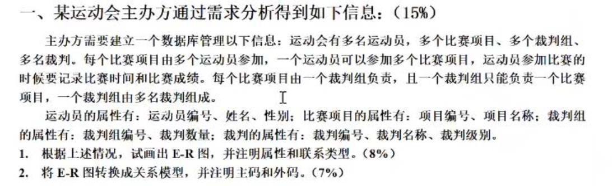
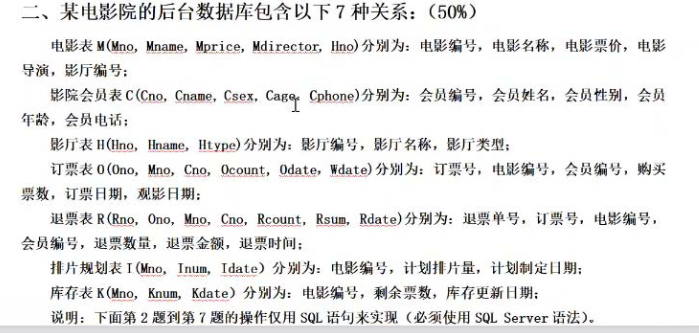
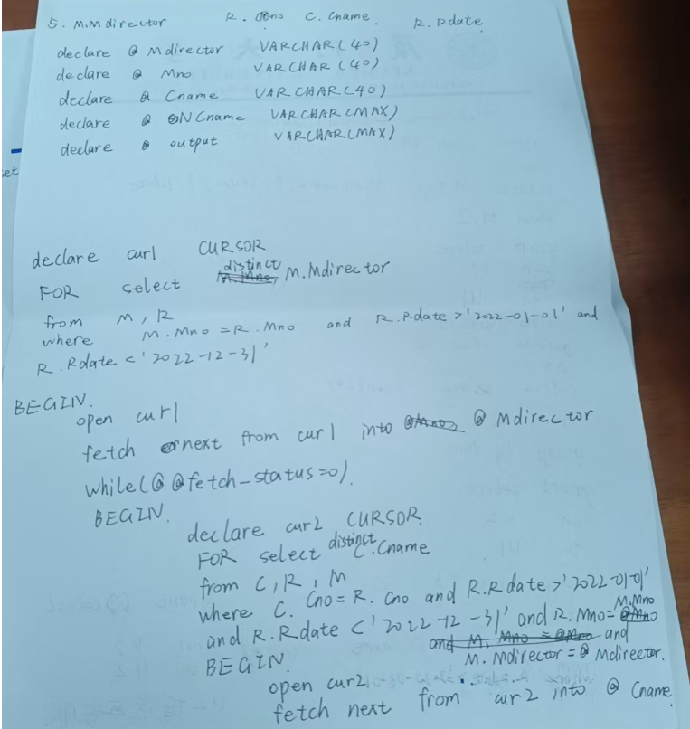

1.
(8%)分别用关系代数和SQL语句两种方式实现本题操作：查找观影日期在五一假期期间（2023年
4月29日至2023年5月3日），并且购买了所有影厅类型为IMAX的电影票的男性会员姓名。

2. (7%)查询订票数量达到所有电影订票数量40%且计划排片量大于2000的电影信息,包括电影编号、
电影名称、电影导演。

3. (7%)在该电影院票价高于20的电影中，将2023年5月22日(含)到2023年5月25日(含)期间退票数量前3高的电影票价格下调百分之十(若退票数量相同，则优先选取电影编号较小的电影)

4. (7%)该影院有“市场经理”与“营运客服”两名管理人员，(假设数据库中已经存在用这两个名称作为用户名的用户)，用SQL语言设计一个授权策略，保证“市场经理”能够查看电影的排片信息(电影编号，电影名称，计划排片量，计划制定日期)和售票情况(电编号，电影票销售总额)(备注:可以为“市场经理”构建2个视图)。“营运客服”能够查看2022年6月1日(含)后的会员退票的信息(会员编号，会员姓名，退票总数)。

5. (6%)影院想要进行退票详细信息统计，需要输出在2022年(2022-01-01到2022-12-31)期问每名导演旗下电影的退票情况，输出格式为“电影导演，退票明细:(退票会员姓名1，退票会员姓名 2,...)”，多个会员之间用逗号分隔，相同会员退票多次名字不重复。

6.（8%）分别对电影院订票表和退票表添加触发器，每当使用一条insert语句向订票表中一次性插入
多条数据时，对于每条数据，在库存表K中减少相应票数，并把“库存更新日期”设置为当前日
期（假设当前日期是2023年6月27日）。每当使用一条insert语句向退票表中一次性插入多条
数据时，对于每条数据，若电影对应影厅为“IMAX”则在排片计划表1中减少该电影5%计划排片
量，并把排片计划表1的“计划制定日期”设置为当前日期（假设当前日期是2023年6月27日）。

7.（7%编写一个存储过程，输入“电影导演”与“期望销量总额”，根据电影票价和期望销售总额更
改电影导演对应电影的票价：
（1）如果订票销售总额小于期望总额且电影票价>20，则降低5%电影票价：
（2）如果订票销售总额大于期望总额且电影票价<25，则增加5%电影票价：
（3）如果订票销售总额等于期望总额，电影票价不变：
并且打印出“电影编号一原票价一修改后票价”。

