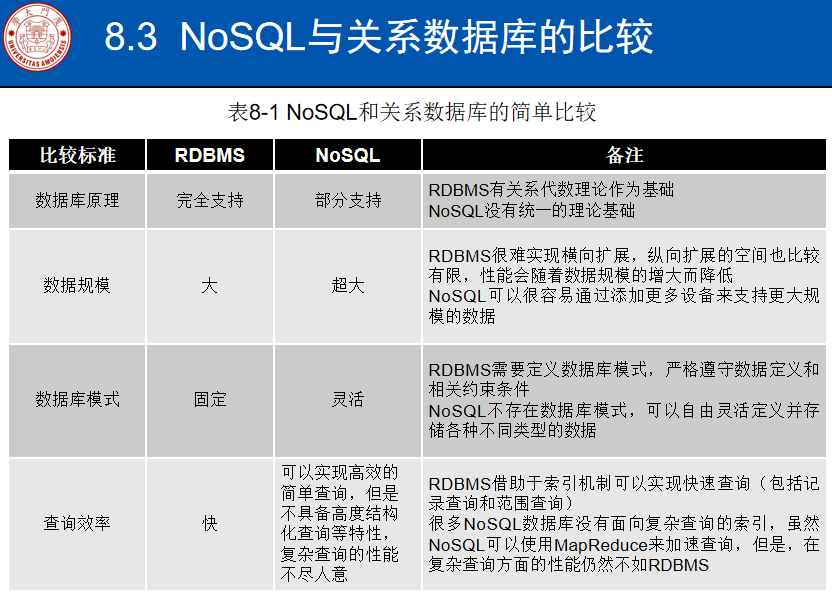
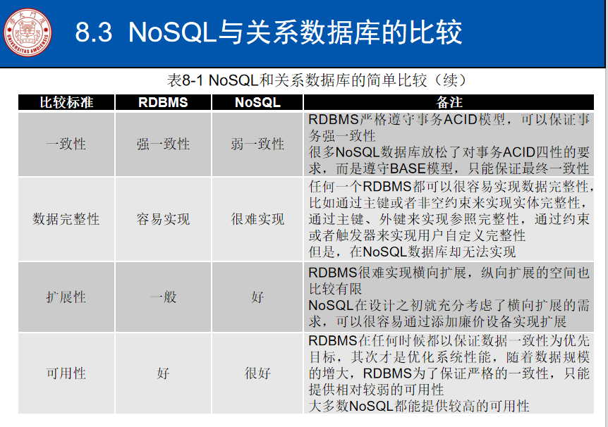
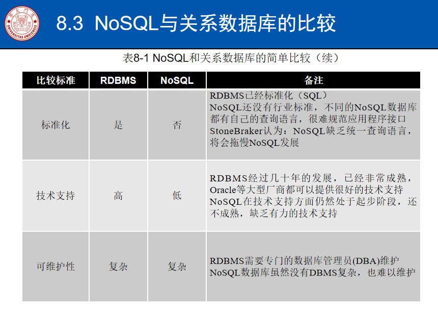

## 1. 如何准确理解NoSQL的含义？

NoSQL是一种不同于关系数据库的DBMS设计方式，非关系数据库的统称，采用非传统关系数据库的关系模型，类似键值、列族、文档等非关系模型

## 2. 试述关系数据库在哪些方面无法满足Web 2.0的需求。

(1)无法满足海量数据的管理需求

(2)无法满足数据高并发的需求

(3)无法满足高可扩展性和高可用性的需求

## 3. 为什么说关系数据库的一些关键特性在“Web 2.0时代”成为“鸡肋”？

(1)Web2.0网站系统通常不要求严格的数据库事务

(2)Web2.0不要求严格的读写实时性

(3)Web 2.0通常不包含大量复杂的SQL查询

## 4. 请比较NoSQL数据库和关系数据库的优缺点。

总结

（1）关系数据库
优势：以完善的关系代数理论作为基础，有严格的标准，支持事务ACID四性，借助索引机制可以实现高效的查询，技术成熟，有专业公司的技术支持
劣势：可扩展性较差，无法较好支持海量数据存储，数据模型过于死板、无法较好支持Web2.0应用，事务机制影响了系统的整体性能等

（2）NoSQL数据库
优势：可以支持超大规模数据存储，灵活的数据模型可以很好地支持Web2.0应用，具有强大的横向扩展能力等
劣势：缺乏数学理论基础，复杂查询性能不高，大都不能实现事务强一致性，很难实现数据完整性，技术尚不成熟，缺乏专业团队的技术支持，维护较困难等

## 5. 试述NoSQL数据库的四大类型。
键值数据库、列族数据库、文档数据库和图数据库

## 6. 试述键值数据库、列族数据库、文档数据库和图数据库的适用场合和优缺点。
|名称|键值数据库|列族数据库|文档数据库|图数据库
|--|--|--|--|--|
|应用场合|内容缓存，如会话、配置文件、参数、购物车|分布式数据存储于管理|面向文档的数据|图结构场合，社交网络、推荐系统|
|优点|大量写操作性能好，扩展性、灵活性好|查找速度快，利于分布式扩展，扩展性好|数据结构灵活，性能好，灵活性高，复杂性低|支持图算法|
|缺点|无法存储结构化信息、条件查询效率低|功能少，不支持强事务一致性|缺乏统一查询方法|只能支持一定的数据规模|
## 7. 试述CAP理论的具体含义。

C（Consistency）:一致性，（所有节点在同一时间具有相同的数据）

A（Availability）：可用性，（是指快速获取数据，可以在确定的时间内返回操作结果，保证每个请求不管成功或者失败都有响应）

P（Tolerance of Network Partition）：分区容忍性，当出现网络分区的情况时（即系统中的一部分节点无法和其他节点进行通信），分离的系统也能够正常运行
## 8. 请举例说明不同产品在设计时是如何运用CAP理论的。

### （1）CA：传统的关系数据库
也就是强调一致性（C）和可用性（A），放弃分区容忍性（P），最简单的做法是把所有与事务相关的内容都放到同一台机器上。很显然，这种做法会严重影响系统的可扩展性。传统的关系数据库（MySQL、SQL Server和PostgreSQL），都采用了这种设计原则，因此，扩展性都比较差
### （2）CP：Neo4J,BigTable,HBase等NoSQL
也就是强调一致性（C）和分区容忍性（P），放弃可用性（A），当出现网络分区的情况时，受影响的服务需要等待数据一致，因此在等待期间就无法对外提供服务

### （3）AP：Web2.0的网站；Dynamo,Riak,CouchDB,Cassandra等NoSQL数据库
也就是强调可用性（A）和分区容忍性（P），放弃一致性（C），允许系统返回不一致的数据

## 9. 试述数据库的ACID特性的含义。
A:原子性

C:一致性

I:隔离性

D:持久性

## 10. 试述BASE的具体含义。
基本可用（Basically Availble）

软状态（Soft-state）

最终一致性（Eventual consistency）

## 11. 试述软状态、硬状态的具体含义。

“硬状态”：可以保证数据一致性，即保证数据一直是正确的。

“软状态”：指状态可以有一段时间不同步，具有一定的滞后性

## 12. 什么是最终一致性？

最终一致性：经过一段时间后能够访问到更新后的数据

## 13. 试述不一致性窗口的含义。

不一致性窗口：从操作OP完成到后续访问可以最终读取到操作OP写入的最新值的时间间隔

## 14. 最终一致性根据更新数据后各进程访问到数据的时间和方式的不同，又可以分为哪些不同类型？

（1）**因果一致性**：如果进程A通知进程B它已更新了一个数据项，那么进程B的后续访问将获得A写入的最新值。而与进程A无因果关系的进程C的访问，仍然遵守一般的最终一致性规则

（2）**“读己之所写”一致性**：可以视为因果一致性的一个特例。当进程A自己执行一个更新操作之后，它自己总是可以访问到更新过的值，绝不会看到旧值
（3）
**单调读一致性**：如果进程已经看到过数据对象的某个值，那么任何后续访问都不会返回在那个值之前的值

（4）
**会话一致性**：它把访问存储系统的进程放到会话（session）的上下文中，只要会话还存在，系统就保证“读己之所写”一致性。如果由于某些失败情形令会话终止，就要建立新的会话，而且系统保证不会延续到新的会话
（5）
**单调写一致性**：系统保证来自同一个进程的写操作顺序执行。系统必须保证这种程度的一致性，否则就非常难以编程了

## 15. 什么是NewSQL数据库？
NewSQL 是一种新型的数据库技术，它结合了传统关系型数据库（SQL）和新兴的 NoSQL 数据库的优点。NewSQL 数据库旨在提供高性能、高可扩展性（类似于 NoSQL），同时保留关系型数据库的事务一致性（ACID）和结构化查询语言（SQL）的支持。
## 16. 试述NewSQL数据库与传统的关系数据库、NoSQL数据库的区别。
以下来自kimi
当然可以！以下是将 NewSQL 数据库与传统关系数据库和 NoSQL 数据库的区别整理成表格的形式：

| 特性/数据库类型 | 传统关系数据库 (SQL) | NoSQL 数据库 | NewSQL 数据库 |
|-----------------|----------------------|--------------|---------------|
| **数据一致性**  | 强一致性（ACID）     | 最终一致性（部分支持 ACID） | 强一致性（ACID） |
| **查询语言**    | 支持 SQL，复杂查询能力强 | 大多数不支持 SQL，查询功能有限 | 支持 SQL，复杂查询能力强 |
| **数据模型**    | 关系模型（表、行、列） | 多种模型（键值、文档、列族、图） | 关系模型（表、行、列） |
| **可扩展性**    | 垂直扩展（Scale-Up） | 水平扩展（Scale-Out） | 水平扩展（Scale-Out） |
| **性能**        | 在大规模数据和高并发下性能受限 | 高性能，适合大规模数据 | 高性能，适合大规模数据 |
| **架构**        | 集中式架构           | 分布式架构           | 分布式架构           |
| **适用场景**    | 数据量较小、一致性要求高、复杂查询 | 数据量大、扩展性要求高、简单查询 | 数据量大、一致性要求高、复杂查询 |
| **典型代表**    | MySQL、Oracle、SQL Server | MongoDB、Cassandra、Redis | Google Spanner、CockroachDB、TiDB |
