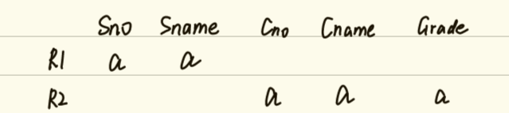
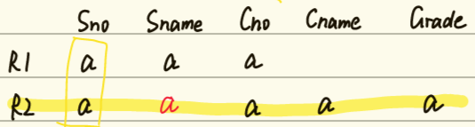

## 数据库规范化设计理论 
#### 数据库实体完整性  
1)主属性(码的属性)不能为空    2)码不能重复
#### 设计数据库碰到问题：
```
思考 
1）为什么不设计成一张表 提高性能、简化查询？
2）设计成几张表才是合理的？
3）如何判定设计的表是合理的？

select s.Sno,Sname,c.Cno,Cname,Grade into MySt from 
Student as s join SC on s.Sno=SC.Sno join Course as c on c.Cno=SC.Cno

select * from Student  F={Sno->Sname,Sno->Ssex,Sno->Sage,Sno->Sdept}
L类属性 : Sno
R类属性 : Sname,Ssex,Sage,Sdept
LR类属性 ：空
N类属性：空
码： Sno

新成立一个系  不能插入      插入异常
系学生全部毕业 系不存在了 删除异常
新增一个学生 如果没有选课 Cno为空  不能插入这个学生的信息
删除所有选课记录的时候 学生信息也整个被删除了
```
1)插入异常 2)删除异常 3)数据冗余 4)更新复杂

产生的原因：码和属性间 不合理关系 造成的

#### 关系模式  R(U,F)  U-属性集   F-属性间关系集合   属性间函数依赖(决定)关系的集合
属性集关系： 决定关系(依赖关系)
函数依赖： ->      
X->Y    Y函数依赖于X    X函数决定Y     
1、如果Y包含于X   X->Y 平凡的函数依赖(总是成立的)     
2、X->Y 成立, 存在X的真子集  X` ->Y,    X-p>Y 部分函数依赖   
否则 X-f>Y 是完全函数依赖

### 处理步骤
#### 1、找出关系模式的依赖集F={?}  根据需求语义来找  将F化简为Fmin

#### 2、根据Fmin找到关系模式的码  K-f>U  

**通过启发式规则找码**  
码是L+N+  LR(?) 能够决定U 

1)L类属性 仅在函数依赖左边出现的属性

2)R类属性 仅在函数依赖右边出现的属性

3)LR类属性 在函数依赖左右同时出现的属性

4)N类属性 不在函数依赖出现的属性

**结论**  L和N 一定是主属性   LR有可能是主属性,通过 属性的闭包进一步判断

#### 3、判断关系模式  规范化理论  nNF  第n范式

1) **1NF**  满足关系模式R(U,F)  就是第一范式

2) **2NF** 不存在非主属性对码的部分函数依赖  不存在码 X-p> Y(非主属性)  非主属性完全函数依赖于码

    推论： 单属性码 一定满足 2NF

3) **3NF** 不存在非主属性对码的传递函数依赖, 不存在码X, 非主属性Z, X->Y,Y->Z,Y-/>X

4) **BCNF** 非平凡函数依赖左边必包含码   任意函数依赖 X->Y   Y不包含于X 则X必含码

#### 4、范式的证明 采用反证法
1)假设R不属于nNF 
2)构造不属于nNF的条件 
3)根据构造条件和已知条件判断 
4)推出矛盾 证明结论

#### 5、数据依赖的公理 ArmStrong公理   R(U,F)    成立=F逻辑蕴含
1) A1自反律 如果Y包含于X  则X->Y          
   平凡函数依赖一定成立

2) A2增广律 如果X->Y  则XZ->YZ            
   函数依赖两边可以同时新增属性

3) A3传递率 如果X->Y ,Y->Z,  则 X->Z     
   函数依赖是可以传递的    不同于3NF非主属性对码传递依赖判断
##### 推论
1) X->Y,X->Z 则 X->YZ
   函数依赖右侧可以合并  用A2和A3证明

2) X->Y,YW->Z  则 XW->Z   
   伪传递  用A2和A3证明
3) X->YZ, 则 X->Y,X->Z 
   函数依赖的右侧可以分解  用A1和A3证明

##### 引理  函数依赖的右侧可以任意分解与合并
X->B1B2B3...Bk 的充分必要条件是  X->Bi(i=1,2,3,...k)

#### 6、函数依赖的闭包 F+   
R(U,F)中所有 正确(成立)的函数依赖的集合 F+

基础F 通过A1A2A3 等价扩展到最全的函数依赖F+

F+  通过A1A2A3等价收缩一个最小函数依赖集 Fmin       
F+  =  Fmin+

#### 7、属性闭包 X+ 所有能由X所决定的属性集合(通过公理推到出来的关系)
##### 属性闭包性质  X->Y 成立的充分必要条件：  Y 包含于 X+
**求属性X闭包的算法** :   
1) 加入X  
2) 找出当前属性能够决定属性再加入 
3) 判断是否有变化进行迭代 

           时间复杂度 :  |U| - |X| + 1

#### 8、Fmin最小函数依赖集(最小覆盖、极小函数依赖集)  

任意F都可以通过A1A2A3等价收缩一个最小函数依赖集 Fmin

Fmin : 
1) 右侧单属性  
2) 不存在传递函数依赖 
3) 不存在部分函数依赖 
4) 不存在相同函数依赖
	
求Fmin算法 :  
1) 分右  
2) 去传                         
3) 去部                        
4) 去重

#### 9、模式分解 
**将低级(范式)关系模式 分解成 高级(范式) 关系模式** 
**消除4个异常  码相同的关系模式合并**

属性关系   U =U1UU2UU3...   分解后属性并集是原来的属性

判断标准
1) 保持无损连接  正确  分解后的关系模式 通过自然连接 和原关系模式等价(能够恢复到原来的关系)  
分解后自然连接元组可能会变多,如果和原来元组数量相等则保持无损连接
  
  判断算法 :  

  (1)构造矩阵 属性为列  分解为行 有 属性的地方填a

  (2)矩阵变换 对于原关系模式的每个函数依赖,判断左边是否有相同符合的行(a),如果有且右侧包含a,则将这个函数依赖右侧所有属性行都变为a

  (3)如果有一行全为a,则分解保持无损连接算法终止, 否则 继续根据函数依赖迭代变换 直到矩阵无变化
  ```
select * from MySt
U=(Sno,Sname,Cno,Cname,Grade)
Fmin={Sno->Sname,Cno->Cname,(Sno,Cno)->Grade}
  ```
```
R1(Sno,Sname)
R2(Cno,Cname,Grade)
```


```
R1(Sno,Sname,Cno) F1={Sno->Sname}
R2(Cno,Cname,Grade) F2={Cno->Cname}
```

```
R1(Sno,Sname)
R2(Sno,Cno,Cname,Grade)
```


```
MyStInfo(Sno,Sname,Sage,Sdept,SdeptInfo,SdeptAddress) 
不符合3NF，存在非主属性对码的传递依赖
Fmin={Sno->Sname,Sno->Sage,Sno->Sdept,Sdept->SdeptInfo,Sdept->SdeptAddress}

分解：
R1(Sno,Sname,Sage，Sdept) 
R2(Sdept,SdeptInfo,SdeptAddress)
```


码Sno 所在行全填a

2) 保持函数依赖  好   分解后的关系模式的函数依赖并集和原来关系模式的函数依赖等价,原来关系模式的所有函数依赖在分解后的关系模式均有所体现
分解后  合并的函数依赖可能变少,如果和原来函数依赖相同 则保持函数依赖

判断 :  
        Fmin=(F1minUF2minUF3minU...UFnmin) 
	    Fmin+=(F1minUF2minUF3minU...UFnmin)+ 

#### 10、分解为符合3NF的保持函数依赖并且保持无损链接算法
 1) 最小化处理 求Fmin a)分右  b)去传 c)去部 d)去重   

 2) 根据Fmin 按照函数依赖左部相同的原则来进行分解，分解是保持函数依赖 达到3NF 

 3) 分解后的关系模式如果没有包含原关系的码,则加入原关系的码作为一个分解 保持无损链接


### 后面的这些例子是他上课边讲边写的，我已经想不起来是什么东西了，他写得太乱了
```
学生 Student 在 公司 Company 实习 
StCo(Sno,Sname,Cno,Cname,PTime,PSalary)   
F={Sno->Sname,Cno->Cname}  码(Sno,Cno,PTime,PSalary)
Fmin={Sno->Sname,Cno->Cname}
R1(Sno,Sname)  码 Sno  3NF
R2(Cno,Cname)  码 Cno  3NF
R3(Sno,Cno,PTime,PSalary)   码(Sno,Cno,PTime,PSalary)  3NF
```

```
select * from MySt   不满足2NF
Fmin={Sno->Sname,Cno->Cname,(Sno,Cno)->Grade}  码 (Sno,Cno)
R1(Sno,Sname)
R2(Cno,Cname)
R3(Sno,Cno,Grade)
```
```
U=(Sno,Sname,Cno,Cname,Grade)
R1(Sno,Sname,Cno)               Fmin1={Sno->Sname}   
L:Sno
N:Cno
码 (Sno,Cno) -p> Sname
```

```
R2(Cno,Cname,Grade,Sno)     Fmin2={Cno->Cname,(Sno,Cno)->Grade}
select distinct Sno,Sname,Cno into R1a from MySt;
select distinct Cno,Cname,Grade,Sno into R2a from MySt;
select * from R1a join R2a on R1a.Sno = R2a.Sno and R1a.Cno=R2a.Cno
正确的   好的
```

```
R1(Sno,Sname,Cno)   Fmin1={Sno->Sname}
R2(Cno,Cname,Grade)  Fmin2={Cno->Grade}
drop table R1;drop table R2;
select distinct Sno,Sname,Cno into R1 from MySt
select distinct Cno,Cname,Grade into R2 from MySt
select * from R1   
select * from R2
select * from R1 join R2 on R1.Cno=R2.Cno
不正确   不好
没有保持无损链接   没有保持函数依赖
```

```
U(Sno,Sname, Cno,Cname,Grade)
R1(Sno,Sname)
R2(Cno,Cname,Grade) 
错误的 

Fmin={Sno->Sname,Cno->Cname,(Sno,Cno)->Grade}
R1(Sno,Sname,Cno)  F1={Sno->Sname}
R2(Cno,Cname,Grade)     F2={Cno->Cname}  

Fm1UFm2={Sno->Sname,Cno->Cname}
Fm={Sno->Sname,Cno->Cname,(Sno,Cno)->Grade}  分解没有保持函数依赖 不好
```

```
MySt 不满足2NF 如何变为满足3NF   
R1(Sno,Sname)
R2(Cno,Cname,Grade)

F={Sno->Sname,(Sname,Cname)->Sname,(Sno,Cno)->Cname,Cno->Cname,(Sno,Cno)->Grade,Sno->(Sno,Sname)}

求Fmin
1)分右
{Sno->Sname,(Sname,Cname)->Sname,(Sno,Cno)->Cname,Cno->Cname,(Sno,Cno)->Grade,Sno->Sno,Sno->Sname}
2)去传
3)去部
{Sno->Sname,Sname->Sname,Cno->Cname,Cno->Cname,(Sno,Cno)->Grade,Sno->Sno,Sno->Sname}
4)去重
Fmin={Sno->Sname,Cno->Cname,(Sno,Cno)->Grade}
L:Sno,Cno   码(Sno,Cno)    存在非主属性 Sname 对码的部分函数依赖  (Sno,Cno) -p> Sname 不满足2NF
```

```
St(Sno,Sname,Sdept,SdeptInfo)  模式分解
 St1,St2,St3
F={Sno->(Sname,Sdept,SdeptInfo),Sdept->SdeptInfo,(Sno,Sdept)->Sname}

1)分右
F={Sno->Sname,Sno->Sdept,Sno->SdeptInfo,Sdept->SdeptInfo,(Sno,Sdept)->Sname}
2)去传
F={Sno->Sname,Sno->Sdept,Sdept->SdeptInfo,(Sno,Sdept)->Sname}
3)去部
F={Sno->Sname,Sno->Sdept,Sdept->SdeptInfo,Sno->Sname}
4)去重
Fmin={Sno->Sname,Sno->Sdept,Sdept->SdeptInfo}

码
L:Sno
LR:Sdept

Sno+=(Sno)
           (Sno,Sname,Sdept)
		   (Sno,Sname,Sdept,Sdept)
Sno+=U  码Sno
Sdept+=(Sdept,SdeptInfo)
Sno  -f>  U
(Sno,Sdept)

```


```
St(Sno,Sname,Sage,Ssex) 
假设不允许重名   
码(候选码)   Sno 或 Sname   
主属性  Sno,Sname 
非主属性 Sage,Ssex
F={Sno->Sname,Sno->Sage,Sno->Ssex,Sname->Sage,Sname->Ssex,Sname->Sno}
Sno->Sname, Sname->Sage   Sname->Sno    Sno->Sage 

St(Sno,Sdept,Sdeptinfo)
F={Sno->Sdept,Sdept->SdeptInfo, Sno->SdeptInfo}
Fmin={Sno->Sdept,Sdept->SdeptInfo}
X->U

Sno->Sname, Sname->Sage  (是不是传递依赖?) 不是传递
Sno->Dept,  Dept ->DeptInfo, Dept-/>Sno   是传递依赖  
```
```
练习   
学生借书信息包括  Sno ,Sname, Bno,Bname(书名),PressName(出版社名) 
写出  F={？}  并判断关系的码
F={Sno->Sname,Bno->Bname,Bno->PressName}
L:(Sno,Bno)
码 (Sno,Bno)
学生借书信息 (Sno,Bno,BTime)
F=空
L:空
R:空
LR:空
N:Sno,Bno,BTime
码 (Sno,Bno,BTime)  全码
(Sno,Bno,BTime) -p> Sno

R(Sno,Bno)  码 (Sno,Bno) -p>Sno  不会出现4个异常
```

```
MyStInfo(Sno,Sname,Sage,Sdept,SdeptInfo,SdeptAddress) 不符合3NF  
原来码 Sno
F={Sno->Sname,Sno->Sage,Sno->Sdept,Sdept->SdeptInfo,Sdept->SdeptAddress,Sno->SdeptInfo}
Fmin={Sno->Sname,Sno->Sage,Sno->Sdept,Sdept->SdeptInfo,Sdept->SdeptAddress}

St(Sno,Sname,Sage,Sdept)         码 Sno    符合3NF    
Dept(Sdept,SdeptInfo,SdeptAddress) 码Sdept  符合3NF
保持函数依赖  好
保持无损链接  对
 (2)矩阵变换 对于原关系模式的每个函数依赖,判断左边是否有相同符合的行(a),如果有且右侧包含a,则将这个函数
  依赖右侧所有属性行都变为a


R1(Sno,Sname,Sage,Sdept) 码Sno
R2(Sdept,SdeptInfo,SdeptAddress) 码Sdept
码相同的关系模式合并

```

```
查询学生 学号、姓名、课程号、课程名、成绩
select * from MySt    
F={Sno->Sname,Cno->Cname,(Sno,Cno)->Grade}  
L: Sno,Cno
码 (Sno,Cno)   
主属性  Sno,Cno  主属性非空  
码和非主属性  (Sno,Cno) -p>  Sname  会出现 4个异常
存在非主属性  (Sno,Cno) -p> Cname
MySt 不属于2NF 一定存在 4个异常
St(Sno,Sname)   码 Sno  满足2NF
Co(Cno,Cname)  码 Cno  满足2NF
StC(Sno,Cno,Grade)  码(Sno,Cno)    
    非主属性  Grade      (Sno,Cno)-f>Grade 
不存在非主属性对码 部分函数依赖  满足 2NF  
    (Sno,Cno) -p> Sno
```


```
 St(Sno,Sname,Dept,DeptInfo,DeptAddress)
  F={Sno->Sname,Sno->Dept,Sno->DeptInfo,Dept->DeptInfo,Dept->DeptAddress}
  码 Sno  单属性码  满足2NF  
  新成立的系 不能插入  系的学生毕业了 系也会被删除了  4个异常都存在
  原因 Sno->Dept, Dept->DeptInfo, 码Sno 决定 非主属性 DeptInfo 是 传递过来的
```
```
学生 Student 在 公司 Company 实习 
StCo(Sno,Sname,Cno,Cname,PTime,PSalary)   
F={Sno->Sname,Cno->Cname}
Fmin={Sno->Sname,Cno->Cname}
R1(Sno,Sname)
R2(Cno,Cname)
R3(PTime,PSalary)

 如果允许一个学生在同一个公司实习多次
  F={Sno->Sname,Cno->Cname}
  L: Sno,Cno
  R:Sname,Cname
  LR:空
  N:PTime,PSalary
  码 (Sno,Cno,PTime,PSalary)
      
  (Sno,Cno,PTime,PSalary) -p> Sname
  R1(Sno,Sname) 满足2NF  码是单属性 Sno
  R2(Cno,Cname) 满足2NF 码是单属性 Cno
  R3(Sno,Cno,PTime,PSalary) 满足2NF 没有非主属性

  如果一个学生 只能实习一次 
  F={Sno->Sname,Cno->Cname,Sno->PTime,Sno->PSalary,Sno->Cno}
  L:Sno
  LR:Cno
  码 Sno  单属性码  满足2NF
  新的公司 不能插入  存在插入异常
  4个异常的原因    码 Sno->Cno , Cno->Cname,  Sno->Cname
```


