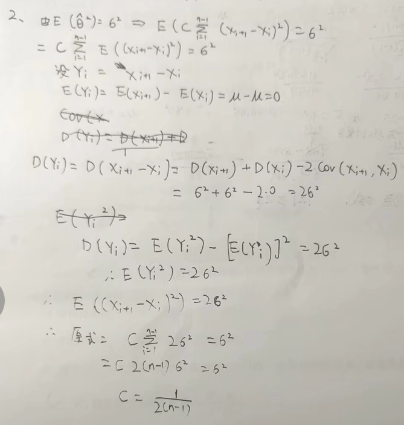
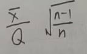
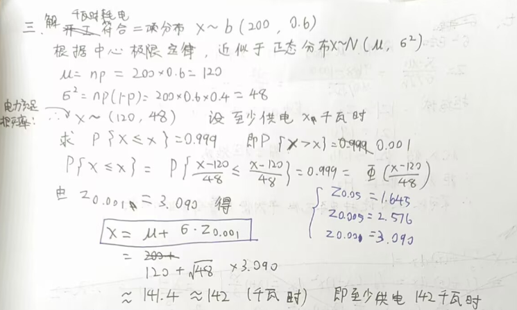
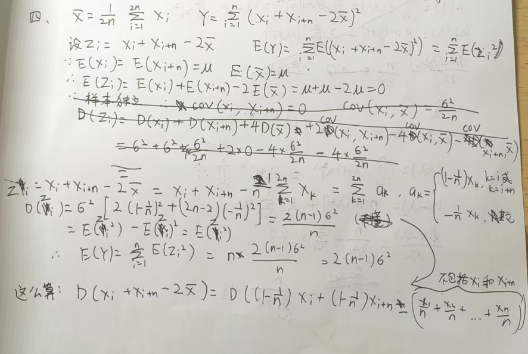
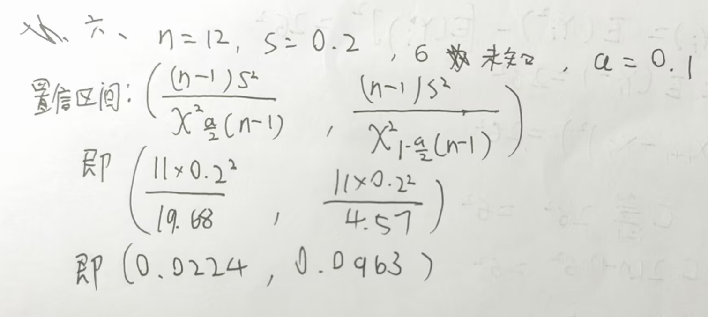
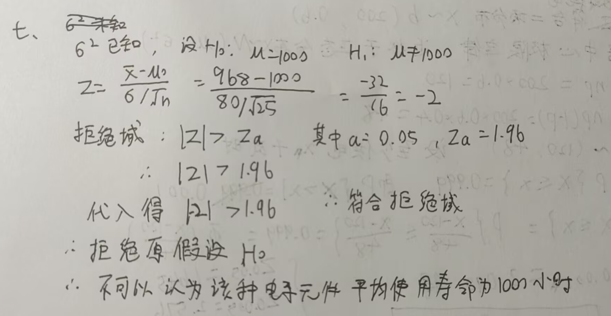
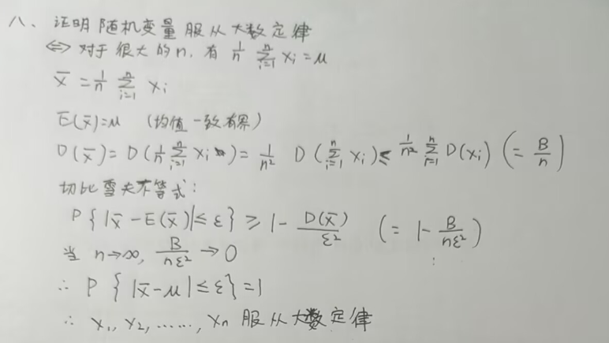

## 一、选择题
ACACDC

### 选择题过程
#### 2.
设 $ X_1, X_2, \ldots, X_n $是取自总体 $ X $的一个随机样本，$ E(X) = \mu $，$ D(X) = \sigma^2 $，$ \hat{\theta}^2 = C \sum_{i=1}^{n-1} (X_{i+1} - X_i)^2 $为 $ \sigma^2 $的无偏估计，则 $ C = $（ ）

#### 3. 
对正态总体的数学期望 $ \mu $进行假设检验，如果在显著性水平 0.05 下接受 $ H_0: \mu = \mu_0 $，那么在显著性水平 0.01 下，下列结论中正确的是（ ）

显著性水平 $ \alpha $减小（从 0.05 到 0.01），拒绝域变小。如果在 $ \alpha = 0.05 $下接受 $ H_0 $，意味着检验统计量未落入拒绝域；当 $ \alpha = 0.01 $时，拒绝域更小，因此检验统计量更不可能落入拒绝域，必须接受 $ H_0 $。选项A正确。

#### 6. 
设随机变量 $ X_1, X_2, \ldots, X_n $相互独立分布，$ S_n = X_1 + X_2 + \ldots + X_n $，根据中心极限定理，当 $ n $充分大，$ S_n $近似服从正态分布，只要 $ X_1, X_2, \ldots, X_n $（ ）

中心极限定理要求随机变量独立同分布，且方差有限。
选项C（服从同一指数分布）满足此条件，因为指数分布有有限方差。
选项A（有相同的数学期望）和B（有相同的方差）不充分（分布可能不同或方差无限）；
选项D（服从同一离散型分布）不一定正确，因为离散型分布可能方差无限。

## 二、填空题
1. (4.804, 5.196)  
2. 
3. 增加样本容量 $n$ 
4. 统计量：$\dfrac{\bar{X} - \mu_0}{S / \sqrt{n}}$；分布：$t(n-1)$ 
5. $\dfrac{\sigma^4}{10}$ 
6. $F(m-1, n-1)$

## 三、

## 四、

## 五、
题目出错了：
设随机变量 \( X \) 的密度函数为  
\[
f(x) = \begin{cases} 
(\lambda + 1)x^\lambda, & 0 < x < 1 \\
0, & \text{其他}
\end{cases}
\]  
求 \( \lambda \) 的极大似然估计。  

## 六、

## 七、

## 八、

