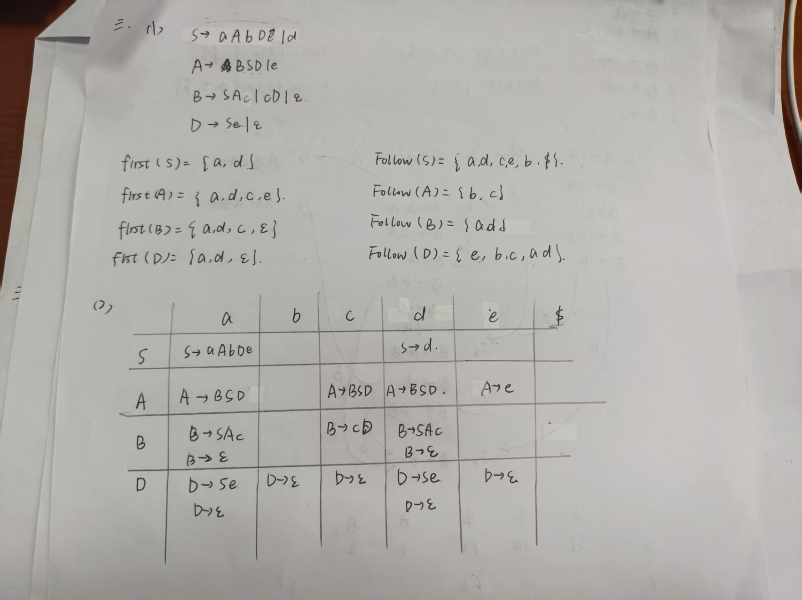
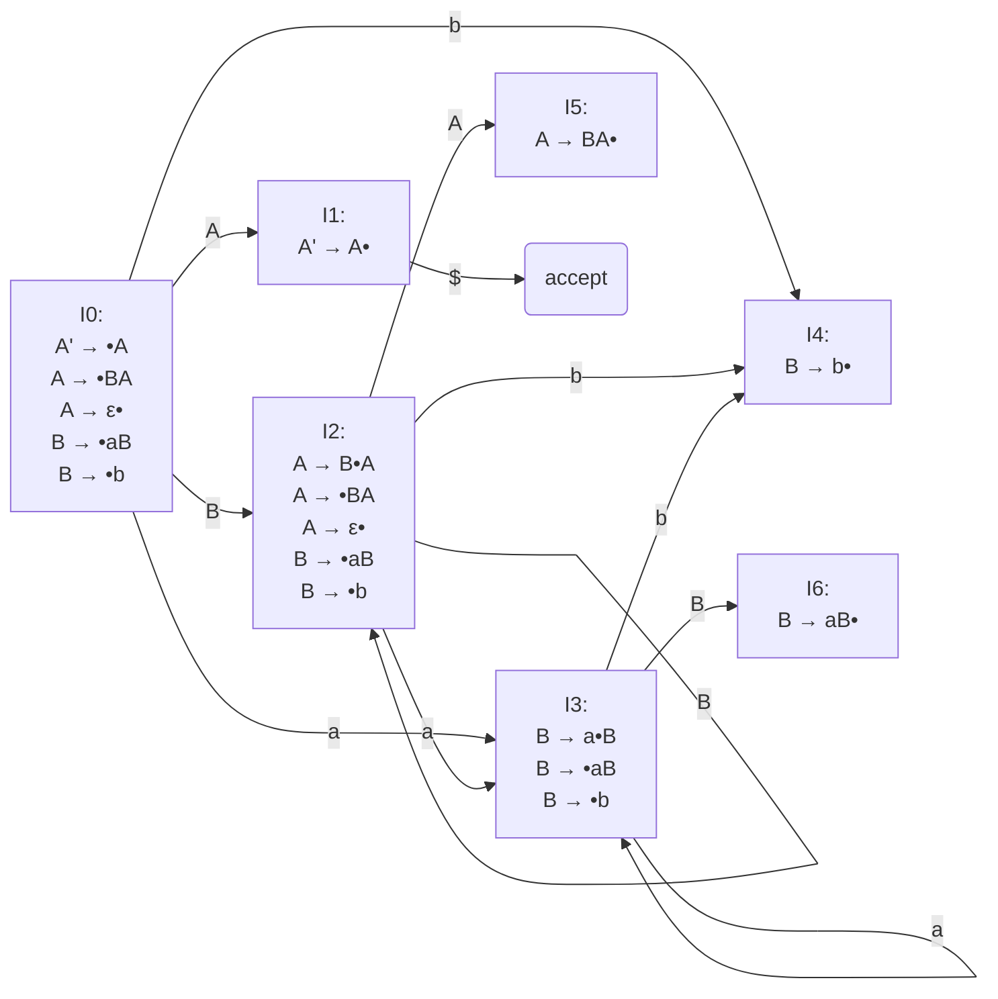
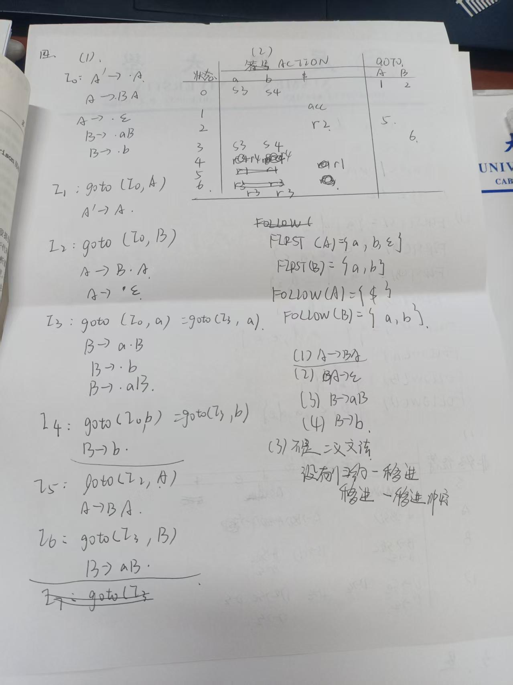
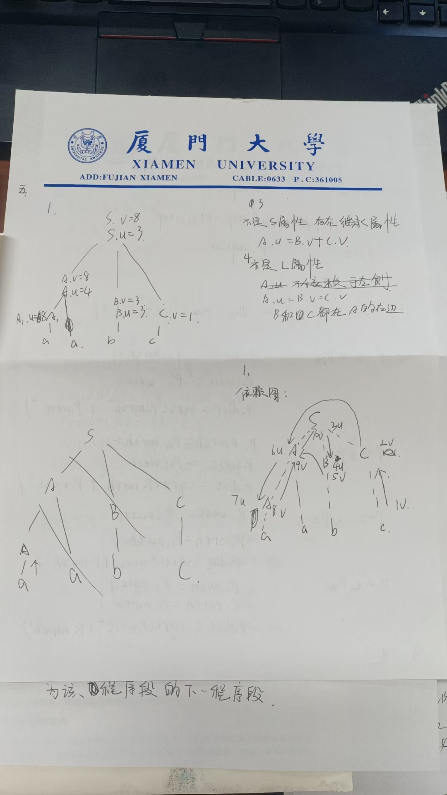
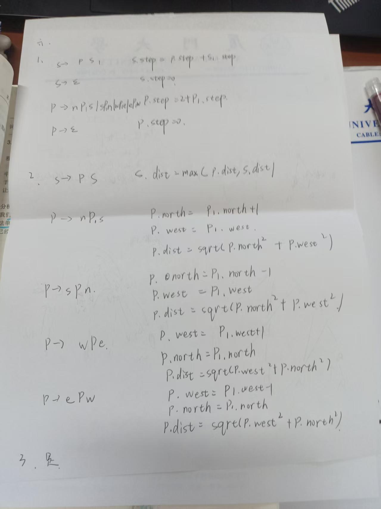
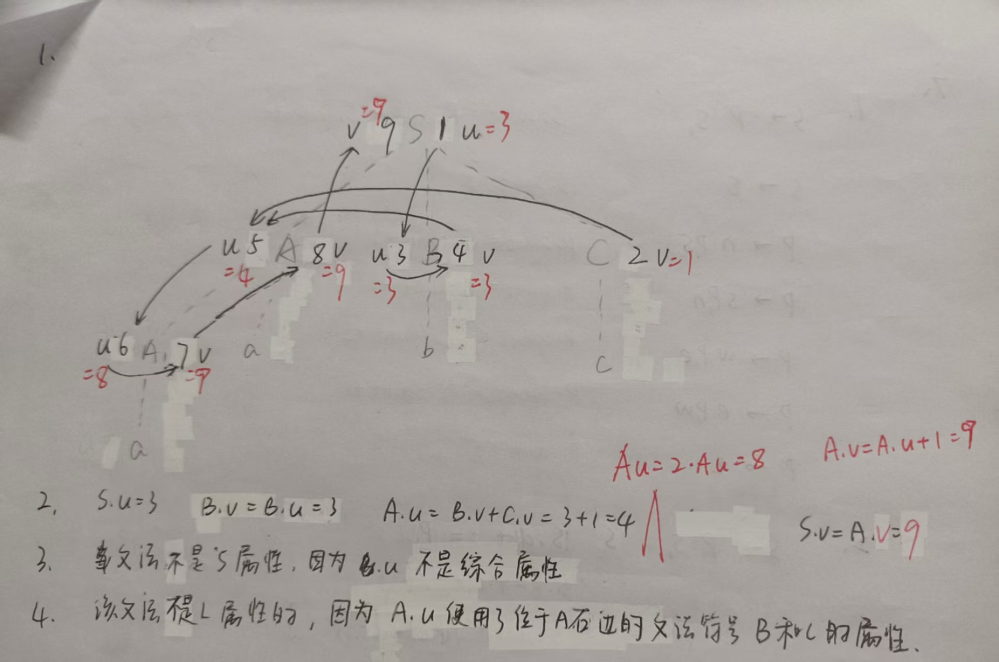
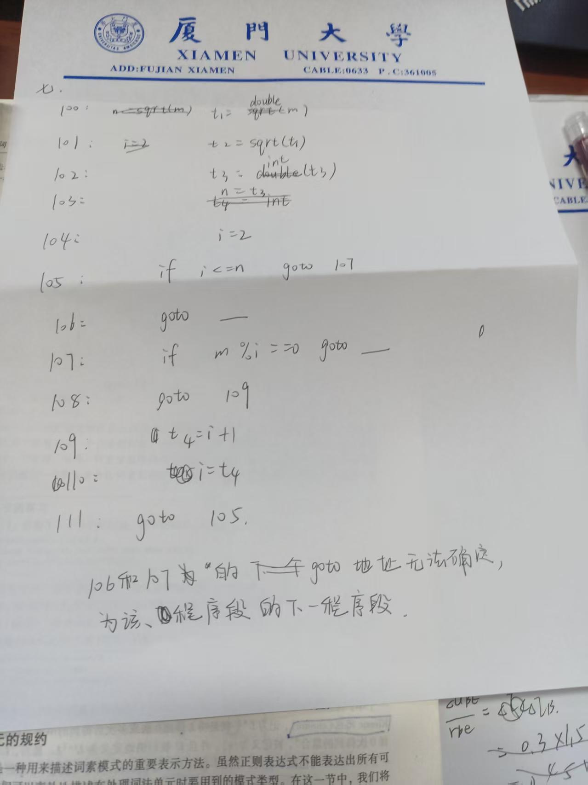

# 三
对下面文法GS:  
S->aAbDe | d  
A->BSD | e  
B->SAc | cD | epsilon  
D->Se | epsilon  

（1）分别求出文法中每一个非终结符的First和Follow集；
（2）构造该文法的LL(1)分析表。

备注：不要带latex公式，否则影响AI答题。  

答：
以下是针对文法 G[S] 的完整解答：

### **（1）非终结符的 First 集和 Follow 集计算**  
#### **First 集计算规则**  
- **终结符**：`First(a) = {a}`  
- **非终结符**：若产生式右部首符号为终结符或 ε，直接加入；若为非终结符，递归加入其 First 集，并处理 ε 传递。  
- **ε 处理**：若产生式可推空（如 `B→ε`），则 `ε ∈ First(B)`。  

#### **Follow 集计算规则**  
- **开始符号**：`Follow(S)` 包含 `$`（输入结束符）。  
- **右部跟随**：若存在 `A→αBβ`，则 `First(β) - {ε} ⊆ Follow(B)`；若 `β→ε` 或 `β` 为空，则 `Follow(A) ⊆ Follow(B)`。  

---

### **分步计算结果**  
#### **First 集**  
| 非终结符 | 产生式              | First 集计算过程                          | First 集结果   |  
|----------|---------------------|------------------------------------------|---------------|  
| **S**    | `S→aAbDe`           | `First(a) = {a}`                         | `{a, d}`      |  
|          | `S→d`               | `First(d) = {d}`                         |               |  
| **A**    | `A→BSD`             | `First(B)` 含 `{c, ε}`，传递 `First(S)={a,d}` | `{a, d, c, e}`|  
|          | `A→e`               | `First(e) = {e}`                         |               |  
| **B**    | `B→SAc`             | `First(S) = {a,d}`                       | `{a, d, c, ε}`|  
|          | `B→cD`              | `First(c) = {c}`                         |               |  
|          | `B→ε`               | `ε ∈ First(B)`                           |               |  
| **D**    | `D→Se`              | `First(S) = {a,d}`                       | `{a, d, ε}`   |  
|          | `D→ε`               | `ε ∈ First(D)`                           |               |  

> **关键推导**：  
> - `First(A)`：因 `A→BSD` 且 `B` 可能为 ε，需考虑 `S` 的 First 集（`{a,d}`）。  
> - `First(B)`：`B→SAc` 中 `S` 的 First 集为 `{a,d}`，`B→cD` 加入 `{c}`，且 `ε` 来自 `B→ε`。  

---

#### **Follow 集**  
| 非终结符 | Follow 集计算过程                                                                 | Follow 集结果   |  
|----------|----------------------------------------------------------------------------------|----------------|  
| **S**    | 开始符号 → 加入 `$`；`A→BSD` → `First(D) - {ε} = {a,d}` 加入；`D→Se` → `First(e)={e}` 加入 | `{a, d, e, $}` |  
| **A**    | `S→aAbDe` → `First(b)={b}` 加入；`B→SAc` → `First(c)={c}` 加入                           | `{b, c}`       |  
| **B**    | `A→BSD` → `First(S)={a,d}` 加入；若 `S→ε` 则 `Follow(A)⊆Follow(B)` → 加入 `{b,c}`       | `{a, d, b, c}` |  
| **D**    | `A→BSD` → 若 `B→ε` 则 `Follow(A)⊆Follow(D)` → 加入 `{b,c}`；`B→cD` → `Follow(B)⊆Follow(D)` | `{b, c, $}`    |  

> **关键推导**：
> - `Follow(B)`：`A→BSD` 中，`D` 的 First 集含 `{a,d}`（非空），故加入；若 `S→ε`（实际 `S` 不推空），但 `B` 本身可推空，因此需加入 `Follow(A)={b,c}`。  
> - `Follow(D)`：`A→BSD` 中，若 `B→ε`，则 `D` 后紧跟 `Follow(A)={b,c}`；`B→cD` 中 `D` 后无符号，故加入 `Follow(B)`。  

---

### **（2）LL(1) 分析表构造**  
#### **Select 集计算规则**  
- **非 ε 产生式**：`Select(A→α) = First(α)`  
- **ε 产生式**：`Select(A→ε) = Follow(A)`  

#### **Select 集结果**  
| 产生式          | Select 集计算过程                     | Select 集        |  
|-----------------|--------------------------------------|------------------|  
| `S→aAbDe`      | `First(aAbDe) = {a}`                 | `{a}`            |  
| `S→d`          | `First(d) = {d}`                     | `{d}`            |  
| `A→BSD`        | `First(BSD) = First(B)` 含 `{a,d,c}` | `{a, d, c}`      |  
| `A→e`          | `First(e) = {e}`                     | `{e}`            |  
| `B→SAc`        | `First(SAc) = First(S) = {a,d}`      | `{a, d}`         |  
| `B→cD`         | `First(cD) = {c}`                    | `{c}`            |  
| `B→ε`          | `Follow(B) = {a,d,b,c}`              | `{a, d, b, c}`   |  
| `D→Se`         | `First(Se) = First(S) = {a,d}`       | `{a, d}`         |  
| `D→ε`          | `Follow(D) = {b,c,$}`                | `{b, c, $}`      |  

#### **LL(1) 分析表**  
| 非终结符 | **a**       | **b**       | **c**       | **d**       | **e**   | **$**      |  
|----------|-------------|-------------|-------------|-------------|---------|------------|  
| **S**    | `S→aAbDe`   | –           | –           | `S→d`       | –       | –          |  
| **A**    | `A→BSD`     | –           | `A→BSD`     | `A→BSD`     | `A→e`   | –          |  
| **B**    | `B→SAc` 或 `B→ε` | `B→ε`     | `B→cD` 或 `B→ε` | `B→SAc` 或 `B→ε` | –       | –          |  
| **D**    | `D→Se`      | `D→ε`       | `D→ε`       | `D→Se`      | –       | `D→ε`      |  

> **冲突说明**：  
> - **B 行冲突**：`a/d` 列同时存在 `B→SAc` 和 `B→ε`（因 `Select(B→ε)` 含 `{a,d}`），**非 LL(1) 文法**。  
> - **解决方案**：需改写文法（如消除左递归或提取左公因子）。  

---

### **总结**  
1. **First/Follow 集** 计算需注意 ε 传递和 Follow 集的多层依赖（如 `B` 和 `D` 的关联）。  
2. **LL(1) 冲突**：因 `B→ε` 的 Select 集与 `B→SAc` 重叠，导致分析表存在多重入口，需文法优化。  
> 注：构造过程参考了 First/Follow 集定义 和 LL(1) 表构建规则。

这里follow(S)要包含follow(A),因为D的first集含有空串

# 四、
$$
A\rightarrow BA|\varepsilon\\
B\rightarrow aB|b
$$

（2）  
先解第二问：  
先构造规范项集族：  
|$I_0$|$I_1$|$I_2$|$I_3$|$I_4$|$I_5$|$I_6$|
|-|-|-|-|-|-|-|
|$A' \rightarrow \cdot A$|$A' \rightarrow A \cdot$|$A \rightarrow B \cdot A$|$B \rightarrow a \cdot B$|$B \rightarrow b \cdot$|$A \rightarrow BA \cdot$|$B \rightarrow aB \cdot$|
|----|----|----|----|----|----|----|
|$A \rightarrow \cdot BA$|-|$A \rightarrow \cdot B A$|$B \rightarrow \cdot a B$|-|-|-|
|$A \rightarrow \epsilon \cdot$|-|$A \rightarrow \epsilon \cdot$|$B \rightarrow \cdot b$|-|-|-|
|$B \rightarrow \cdot a B$|-|$B \rightarrow \cdot a B$|-|-|-|-|
|$B \rightarrow \cdot b$|-|$B \rightarrow \cdot b$|-|-|-|-|

然后，计算FIRST和FOLLOW集合。
+ 显然$\text{FIRST(A)} = \{\epsilon, a, b\}$，$\text{FIRST(B) = \{a, b\}}$。
+ 关于FOLLOW集合，由$A' \rightarrow A$得，$\text{FOLLOW(A) = } \{ \$ \}$。
+ 由$A \rightarrow B A$（不考虑A等于$\epsilon$时）得， $\text{FOLLOW（B）} = \text{FIRST(A)} = \{a, b\}$。
+ 由$A \rightarrow B A$ （A等于$\epsilon$时）得，将 $\text{FOLLOW(A)}$ 加入到 $\text{FOLLOW(B)}$ 中，
$\text{FOLLOW（B）}.append(\text{FOLLOW(A)})$。
最终$\text{FOLLOW（B）} = \{\$, a,b\}。$  

*注意：上方的append含义是为了避免自然语言中“A加入B”/“A都在B中”的歧义。*

然后，计算SLR（1）分析表，初始空表如下（请勿删除）：  
|状态|ACTION a|ACTION b|ACTION \$|GOTO A|GOTO B|
|-|-|-|-|-|-|
|0|-|-|-|-|-|
|1|-|-|-|-|-|
|2|-|-|-|-|-|
|3|-|-|-|-|-|
|4|-|-|-|-|-|
|5|-|-|-|-|-|
|6|-|-|-|-|-|

首先，处理根据“如果$[A \rightarrow \alpha \cdot a \beta]$在$I_i$中且$\text{GOTO}(I_i, a) = I_j$,那么$\text{ACTION}[i, a]$设置为“移入j”：  
|状态|ACTION a|ACTION b|ACTION \$|GOTO A|GOTO B|
|-|-|-|-|-|-|
|0|s3|s4|-|-|-|
|1|-|-|-|-|-|m
|2|s3|s4|-|-|-|
|3|s3|s4|-|-|-|
|4|-|-|-|-|-|
|5|-|-|-|-|-|
|6|-|-|-|-|-|

接下来，处理根据“如果$[A \rightarrow \alpha \cdot]$在$I_i$中，那么对于FOLLOW(A)中的所有a，将ACTION[i, a]设置为‘规约$A \rightarrow \alpha$ ’，这里A不等于$S'$ ”
|状态|ACTION a|ACTION b|ACTION \$|GOTO A|GOTO B|
|-|-|-|-|-|-|
|0|s3|s4|-|-|-|
|1|-|-|-|-|-|
|2|s3|s4|-|-|-|
|3|s3|s4|-|-|-|
|4|r4|r4|r4|-|-|
|5|-|-|r1|-|-|
|6|r3|r3|r3|-|-|

接下来，处理根据“如果$[S' \rightarrow S \cdot]$在$I_i$中，那么将$\text{ACTION}[i, \$]$ 设置为“接受”
|状态|ACTION a|ACTION b|ACTION \$|GOTO A|GOTO B|
|-|-|-|-|-|-|
|0|s3|s4|-|-|-|
|1|-|-|acc|-|-|
|2|s3|s4|-|-|-|
|3|s3|s4|-|-|-|
|4|r4|r4|r4|-|-|
|5|-|-|r1|-|-|
|6|r3|r3|r3|-|-|

最后，处理根据“对于各个非终结符号A，如果$\text{GOTO}(I_i, A) = I_j$，那么$\text{GOTO[i, A] = j}$”
|状态|ACTION a|ACTION b|ACTION \$|GOTO A|GOTO B|
|-|-|-|-|-|-|
|0|s3|s4|-|1|2|
|1|-|-|acc|-|-|
|2|s3|s4|-|5|2|
|3|s3|s4|-|-|6|
|4|r4|r4|-|-|-|
|5|-|-|r1|-|-|
|6|r3|r3|-|-|-|

（3）  
不是二义文法
因为没有移进/规约冲突或者规约/规约冲突

（1）LR(0)自动机
（一些markdown渲染器可能支持不了mermaid）

# 五
<!--  -->

<!--  -->
这里我看课本P188的定义，感觉应该不是L属性

（1）  
|产生式|语义规则|
|-|-|
|$S \rightarrow P S_1$|$S.step = P.step + S_1.step$|
|$S \rightarrow \epsilon$|$S.step = 0$|
|$P \rightarrow n P_1 s$|$P.step = P_1 . step +2$|
|$P \rightarrow s P_1 n$|$P.step = P_1 . step +2$|
|$P \rightarrow w P_1 e$|$P.step = P_1 . step +2$|
|$P \rightarrow e P_1 w$|$P.step = P_1 . step +2$|
|$P \rightarrow \epsilon$|$P.step = 0$|

（2）
|产生式|语义规则|
|-|-|
|$S \rightarrow P S_1$|$S.dist = max(P.dist, S_1 . dist);$|
|$S \rightarrow \epsilon$|$S.dist = 0;$|
|$P \rightarrow n P_1 s$|$P.y = P_1 .y +1;$   $P.x = P_1 . x;$    $P.dist = max(P_1.dist, \sqrt{(P.x)^2 + (P.y)^2});$|
|$P \rightarrow s P_1 n$|$P.y = P_1 .y -1;$   $P.x = P_1 . x;$    $P.dist = max(P_1.dist, \sqrt{(P.x)^2 + (P.y)^2});$|
|$P \rightarrow w P_1 e$|$P.y = P_1 .y ;$   $P.x = P_1 . x - 1;$    $P.dist = max(P_1.dist, \sqrt{(P.x)^2 + (P.y)^2});$|
|$P \rightarrow e P_1 w$|$P.y = P_1 .y ;$   $P.x = P_1 . x + 1;$    $P.dist = max(P_1.dist, \sqrt{(P.x)^2 + (P.y)^2});$|
|$P \rightarrow \epsilon$|$P.x = 0;$   $P.y = 0;$   $P.dist = 0;$|

