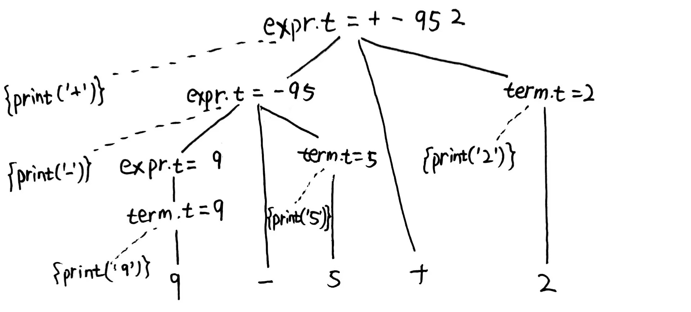

# 编译原理
期中考试范围
第一章 1.1~1.5
第二章 2.1，2.2，2.4
第三章 都要
第四章 4.1~4.4，其中4.1.4和4.4.5不考
题型：作业题、大题
[TOC]
# 第一章 引论

# 第二章 一个简单的语法制导器
语法：描述某程序设计语言的正确形式
语义：定义程序的含义
## 上下文无关文法
四个元素

1. 终结符号集合/词法单元
2. 非终结符号集合/语法变量
3. 产生式集合，包括
   1. 被称为<i>产生式头/左部</i> 的非终结符号
   2. 箭头
   3. 被称为<i>产生式体/右部</i> 的，由终结符号和非终结符号组成的序列
4. 开始符号（要是非终结符号）

例：加减法表达式
```
list -> list+digit |list-digit |digit
digit-> 0|1|2|3|4|5|6|7|8|9
```
例：乘除法表达式
```
factor -> digit | ( expr ) 
term   -> term * factor 
        | term / factor 
        | factor 
expr   -> expr + term 
        | expr – term 
        | term
```

## 分析树和语法分析树
性质：
+ 根结点是开始符号Start Symbol 
+ 叶子结点是终结符或ε
+ 内部结点是一个非终结符 Non-Terminal 
+ 如果有产生式  $A \rightarrow x_1x_2…x_n$,  那么A是一个非终结符; 
$x_1x_2…x_n$ 是A 的孩子，是终结符或非终结符
一个文法生成的语言是它的某个分析树生成的串的集合。
为给定的符号串找到一棵分析树的过程称为串的语法分析(parsing)。
<!-- $\varepsilon$ -->

## 二义性
文法是否具有二义性？如果能构造出至少两棵不同的语法树，则文法是二义性的。构造一个左的和一个右的

## 下面的各个文法生成什么语言？
p31 ex2.2.2
常见答案：以x为变量，xx为二元操作符的x缀表达式的集合，注意都要加上<mark>集合</mark>二字

$$S\rightarrow aSbS|bSaS|\varepsilon$$

由相同数目的a和b组成的字符串的集合，或者空串

$$S\rightarrow a|S+S|SS|S*|(S)$$

以a为变量，包括+，连接，*和括号四种运算的表达
式的集合

## 语法制导方案与注释分析树
p37 ex2.3.1
构建一个语法制导翻译方案，该方案把算术表达式从**中缀**表示方式翻译成运算符在运算分量之前的**前缀**表示方式。例如，‐xy是表达式x‐y的前缀表示法。
给出输入9‐5+2和9‐5*2的注释分析树。

产生式
```
expr -> expr + term
      | expr - term
      | term
term -> term * factor
      | term / factor
      | factor
factor -> digit | (expr)
```
语法制导翻译方案
```
expr  -> {print("+")} expr + term
       | {print("-")} expr - term
       | term
term  -> {print("*")} term * factor
       | {print("/")} term / factor
       | factor
factor-> digit {print(digit)}
       | (expr)
```

9-5+2的注释分析树

## 递归下降语法分析器
为下列文法构造递归下降语法分析器。
(1)

$$S\rightarrow+ SS | ‐SS |a$$

```c
S()
{
    if(lookahead=='+'){
        match('+');S();S();
    }
    else if(lookahead=='-'){
        match('-');S();S();
    }
    else if(lookahead=='a'){
        match('a');
    }
    else error();
}
```

(3)

$$S\rightarrow 0S1|01$$

```c
S()
{
    if(lookahead=='0'){
        match('0');
        if(lookahead=='0'){//第一个字符还是0，说明还是调用S()
            S();match('1');
        }
        else if(lookahead=='1'){
            match('1');
        }
        else error();
    }
    else error();
}
```

# 第三章 词法分析
## 正则表达式
给出$\sum=\{0, 1\}$上的正则表达式

仅包含两个1
`0*10*10*`

不包含连续的0
`(1|01)*(ε|0)`

包含偶数个0
`(1*01*01*)*1*` 或者 `1*(1*01*01*)*1*`

## 正则表达式和状态转换图
P76 ex3.2.2 && P84 ex3.3.1

用自然语言表达该正则表达式的含义，画出状态转换图

注意点：1.xx的集合 2. 是否包括空串

1. `a(a|b)*a`以a开头和结尾且至少包含两个字符的a,b字符串的集合
2. `((ε|a)b*)*`由a和b组成的任意字符串的集合（包括ε）
3. `(a|b)*a(a|b)(a|b)`倒数第三个字符为a的任意的a,b字符串的集合
4. `a*ba*ba*ba`包含3个b的a,b字符串的集合
5. `(aa|bb)*((ab|ba)(aa|bb)*(ab|ba)(aa|bb)*)*`包含偶数个a和偶数个b的a,b字符串的集合

---

P76 ex3.2.5 && P93 ex3.5.1

列出下列语言的正则定义，设计DFA或者NFA
1. 包含5个元音的所有小写字母串，这些串中的元音按顺序出现。
2. 所有由按词典递增序排列的小写字母组成的串
3. 注释，即`/*`和`*/`之间的串，且串中没有不在双引号(`"`)中的`*/`
4. 所有由a和b组成且不含**子串**abb的串。
5. 所有由a和b组成且不含**子序列**abb的串。

3、
意思是，如果注释中中有`*/`，那必须括在双引号中，例如`/*注释里由/*和"*/"组成*/` 

答案：
```regex
\/\*([^"*]|\"[^"]*\"|(\*)+[^/*"]|(\*)+\"[^"]*\")*(\*)+\/
```


以下是根据图片内容提取的Markdown表格：

|表达式|匹配描述|例子|
|-|-|-|
|`c`|单个非运算符字符`c`|`a`|
|`\c`|字符`c`的字面值|`\*`|
|`"s"`|串`s`的字面值|`"**"`|
|`.`|除换行符以外的任何字符|`a.*b`|
|`^`ctrl+6|一行的开始|`^abc`|
|`$`|行的结尾|`abc$`|
|`[s]`|字符串`s`中的任何一个字符|`[abc]`|
|`[^s]`|不在字符串`s`中的任何一个字符|`[^abc]`|
|`r*`|和`r`匹配的零个或多个串连接成的串|`a*`|
|`r+`|和`r`匹配的一个或多个串连接成的串|`a+`|
|`r?`|零个或一个`r`|`a?`|
|`r{m,n}`|最少`m`个，最多`n`个`r`的重复出现|`a{1,5}`|
|`r1r2`|`r1`后加上`r2`|`ab`|
|`r1\|r2`|`r1`或`r2`|`a|b`|
|`(r)`|与`r`相同|`(a|b)`|
|`r1/r2`|后面跟有`r2`时的`r1`|`abc/123`|

如果还有其他需求或需要进一步调整，请告诉我！

4、5题都可以先画出“包含”的DFA状态图，然后反转非终态与终态，去掉死状态，就可以得到不包含的DFA状态图。所以可以先画图再推正则表达式。<mark>但是只有DFA能这样，NFA不可以，因为NFA没有唯一路径</mark>

## 有穷自动机：NFA和DFA

分为**不确定的有穷自动机（NFA）**和**确定的有穷自动机（DFA）**

**NFA**的组成：
1. 状态集合$S$
2. 输入符号集合$\sum$
3. 转移函数
4. 开始状态$s_0$
5. 接受(终止)状态集合：子集$F$

**状态表**：NFA的转移函数可用状态表表示。第一行是输入符号和$\varepsilon$，第一列是各个状态。

**DFA**是NFA的一个特例，DFA的性质
1. 没有输入$\varepsilon$上的转换
2. 对每个状态$s$和输入符号$a$，至多只有1条标记为$a$的边离开$s$

## 从NFA到DFA的子集构造法

首先由正则表达式构造出带有很多ε的NFA。
|操作|描述|
|-|-|
|ε-closure(s)|状态s通过ε到达的集合|
|ε-closure(T)|集合T中的状态s通过ε到达的集合|
|move(T,a)|集合T中的状态s通过a到达的集合|

<!-- 随便选代码块语言 -->

```csharp
一开始,  ε-closure(s0) 是 Dstates中的唯一状态，且它未加标记
while 在 Dstates 中有一个未标记状态:
     给 T加上标记
     foreach 输入符号a:
        U = ε-closure(move(T,a))
        if U 不在 Dstates  中
            将U 加入到 Dstates且不加标记；
            Dtran[T,a] = U
```

# 第四章 语法分析
