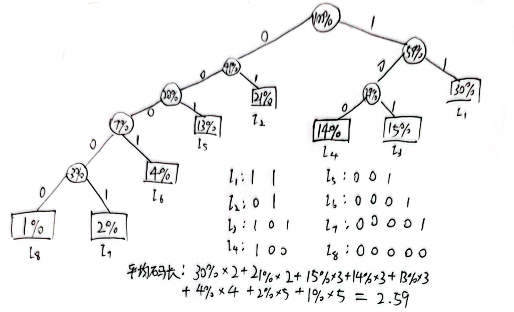
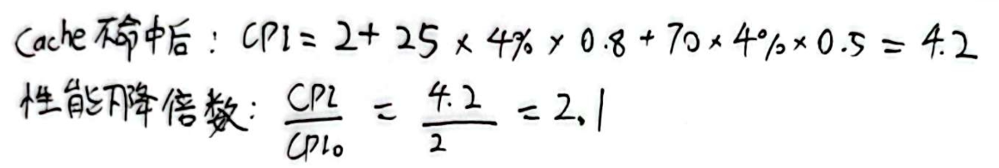
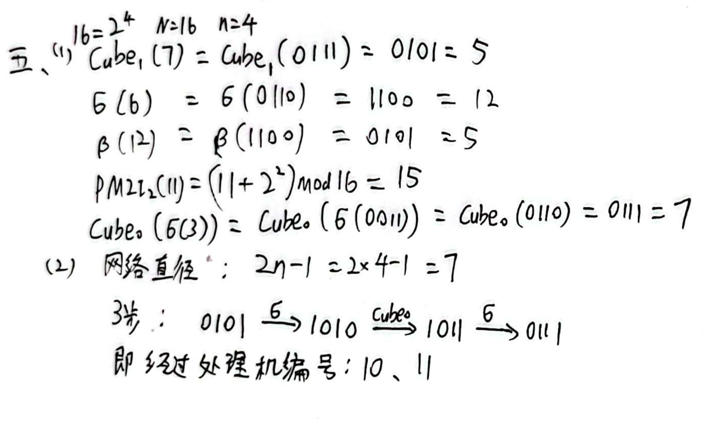

### 一、回答下列问题：（30 分）
1、简述什么是计算机系统结构？按照 Flynn 分类法可以把计算机系统的结构分为哪 4 类？（第1章PPT）（课本p4）
计算机系统的软、硬件的界面
SISD、SIMD、MISD、MIMD

2、什么是 CISC 和 RISC？简述 CISC 指令集结构存在的问题。（第2章PPT）
CISC:复杂指令集计算机
RISC:精简指令集计算机
问题：
   * 各种指令的使用频度相差悬殊，许多指令很少用。
   * 指令系统庞大，指令条数很多，许多指令的功能又很复杂，使得控制器硬件非常复杂。
   * 操作繁杂，其CPI值比较大，执行速度慢
   * 指令功能复杂，规整性不好，不利于采用流水技术来提高性能。

3、什么是指令的静态调度和动态调度？记分牌动态调度方法中记分牌中记录包括哪 3 个部分信息？（课本p114、118）
**静态调度**：不是在程序执行的过程中，而是在编译期间进行代码调度和优化的
**动态调度**：在程序的执行过程中，依靠专门硬件对代码进行调度
3个部分：指令状态表、功能部件状态表、结果寄存器状态表Result

4、什么是多处理机的 Cache 一致性问题？MIMD 计算机的两类机器分别采用哪种 Cache 一致性协议，并做简单描述？

书304


对称式共享存储器多处理机：监听

分布式存储器多处理机：目录

5、根据 Cache 性能公式，可以从哪些方面改进 Cache 的性能？针对每个改进方向，列举其中的 2 种 Cache 优化技术。

6、磁盘阵列的组成可以根据哪两个特征区分？假设每个磁盘的容量为 10GB，根据 RAID 的相关知识填写下表中的空格①～⑧。（第8章）

| 级别     | 磁盘个数 | 磁盘阵列容量（GB） | 存储效率       |
|----------|----------|--------------------|----------------|
| RAID0    | ①        | 50                 | ②              |
| RAID1    | 4        | ③                  | ④              |
| RAID5    | ⑤        | ⑥                  | 87.5%          |
| RAID6    | ⑦        | 40                 | ⑧              |

①②③④⑤⑥⑦⑧
①5
②100%
③20
④50%
⑤8
⑥70
⑦6
⑧66.6%

假设数据盘为8个时：
| RAID 级别 | 可容忍故障磁盘数 | 检测盘数 | 优点        | 缺点              | 公司产品         |
| ------- | -------- | ------------- | --------- | --------------- | ------------ |
| 0非冗余，条带存放       | 0        | 0             | 无空间开销     | 无纠错能力           | 广泛应用         |
| 1镜像       | 1        | 8             | 数据恢复快，读写快 | 空间开销大           | EMC, HP, IBM |
| 2存储器式ECC       | 1        | 4             | 自诊断能力强    | 空间开销较高          | 无            |
| 3位交叉奇偶校验       | 1        | 1             | 空间开销小，带宽高 | 小规模读写支持弱        | 外存概念         |
| 4块交叉奇偶校验       | 1        | 1             | 读操作带宽高    | 小规模写瓶颈          | 网络设备         |
| 5块交叉分布奇偶校验       | 1        | 1             | 读写带宽高     | 小规模写需4次访问       | 广泛应用         |
| 6P+Q 双奇偶校验       | 2        | 2             | 容忍2个故障    | 小规模写需6次访问，空间开销大 | 网络设备         |


RAID0:N块盘组成，逻辑容量为N块盘容量之和；
RAID1:两块盘组成，逻辑容量为一块盘容量；
RAID3:N+1块盘组成，逻辑容量为N块盘容量之和；
RAID5:N块盘组成，逻辑容量为N-1块盘容量之和；
RAID6:N块盘组成，逻辑容量为N-2块盘容量之和；
RAID10:2N块盘组成，逻辑容量为N块盘容量之和；
RAID50：假每个RAID5由N块盘组成，共有M个RAID5组成该RAID50，则逻辑容量为（N-1）*M块盘容量之和。

### 二、
用 GCD 测试法判断下面的循环中是否存在循环携带的真数据相关。（5 分）（课本p177）
```c
for(i=0; i<100; i++) {
    A[i] = B[2*i];
    B[4*i+5] = A[i];
}
```

$$
a=4,b=5,c=2,d=0\\
d-b=0-5=-5\\
gcd(a,c)=gcd(4,2)=2\\
|d-b|\div |gcd(a,c)| = 5\div 2 = 2\cdots1
$$

gcd(a,c)不能整除(d-b)，一定没有存储别名存在

### 三、
假设一台模型机共有 8 条指令，各指令的使用频度分别为 30%（I₁）、21%（I₂）、15%（I₃）、14%（I₄）、13%（I₅）、4%（I₆）、2%（I₇）、1%（I₈）；设计这 8 条指令操作码的哈夫曼编码（包括哈夫曼树和哈夫曼编码），并计算操作码的平均码长。（10 分）

### 四、
假设 Cache 读不命中开销为 25 个时钟周期，写不命中开销为 70 个时钟周期，当不考虑存储器停顿时，所有指令的执行时间都是 2.0 个时钟周期，Cache 的读不命中率和写不命中率均为 4%，平均每条指令读存储器 0.8 次，写存储器 0.5 次。试分析考虑 Cache 的不命中后，Cache 对性能的影响。（10 分）

### 五、
设函数的自变量是十进制数表示的处理机编号。现有 16 台处理机，其编号为 0，1，2，…，15。

1、分别计算下列互连函数
   - Cube₁(7)
   - σ(6)
   - β(12)
   - PM2I₂(11)
   - Cube₀(σ(3))

2、用 Cube₀ 和 σ 构成均匀洗牌交换网（每步只能使用 Cube₀ 或 σ 一次），网络直径是多少？从 5 号处理机发送数据到 7 号处理机，最短路径要经过几步？请列出经过的处理机编号。（10 分）

### 六、
流水线计算题（15 分）
有一条动态多功能流水线由 6 段组成（如图所示），加法用 1、2、3、6 段，乘法用 1、4、5、6 段，各段耗时分别为 Δt、Δt、Δt、2Δt、Δt 和 Δt，而且流水线的输出可以直接返回输入端或暂存于相应的流水寄存器中。若在该流水线上计算 ∏₄(A_i+B_i)，试计算其吞吐率、加速比和效率（要求必须画出时空图）。


### 七、
四段非线性流水线处理机题（20 分）
在一个四段的非线性流水线处理机上，各段执行时间均为 Δt，需经 7Δt 才能完成一个任务，其预约表如下表所示：

| 时间段号 | 1 | 2 | 3 | 4 | 5 | 6 | 7 |
|----------|---|---|---|---|---|---|---|
| S₁       | ✓ |-| -  | ✓ | -  | -  | ✓ |
| S₂       | - | ✓ | - | - | ✓ | - | - |
| S₃       | - | ✓ | - | - | - | ✓ | - |
| S₄       | - | - | ✓ | - | - | - | - |

1、分别写出禁止向量 F、冲突向量 C；
2、画出流水线状态转移图，并列出不发生争用冲突的调度策略以及平均延迟时间；
3、求流水线的最优调度策略和流水线的最大吞吐率；
4、按最优调度策略连续输入 10 个任务，求实际吞吐率和加速比。