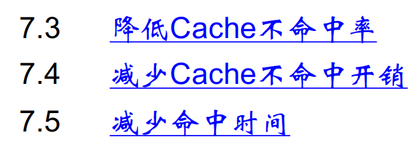
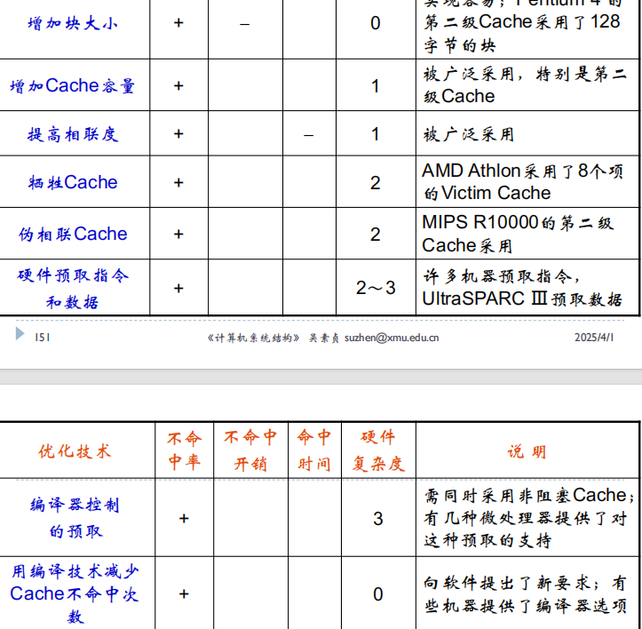
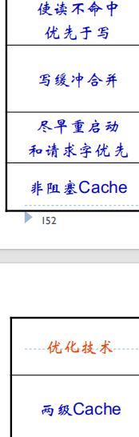
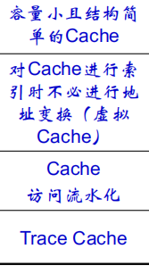
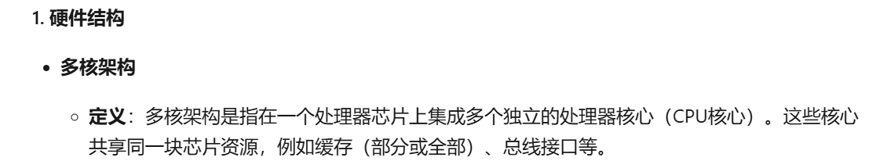
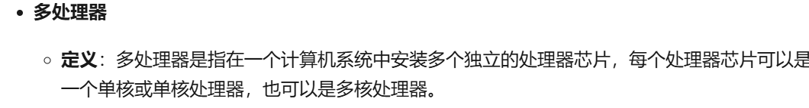

# 一、
1、运算器

2、复杂指令集计算机、精减指令集计算机

3、预测分支成功、预测分支失败、延迟分支

4、写回法、写直达法

5、写作废协议、写更新协议

6、MTTF,MTTR

1、传统机器程序员所看到的计算机属性，即概念性结构与功能特性。

单指令流单数据流

单-多

多-单

多-多

2、书114

静态调度的流水线：

依靠编译器对代码进行静态调度，以减少相关和冲突

动态调度

在程序的执行过程中，依靠专门硬件对代码进行调度；

指令执行状态
结果寄存器状态
功能部件状态

3、
PS:几种不命中：强制性不命中、容量不命中、冲突不命中

1、不命中率

2、不命中开销

3、减少命中时间

容量小且结构简单的cache

虚拟cache

4、kimi:

