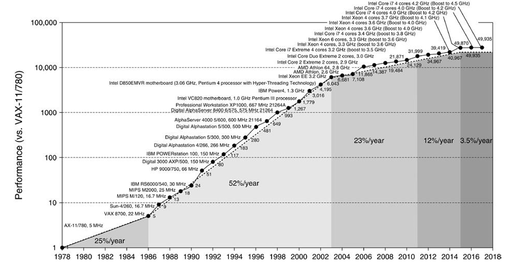
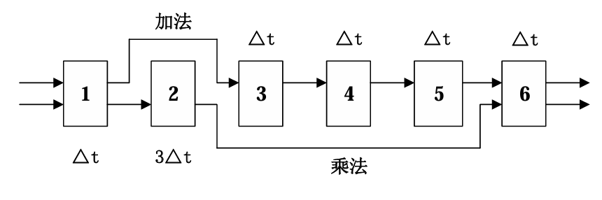

# 2017级
不保证对
### 一、填空题（15 分）

1、2017 年 ACM 图灵奖授予了斯坦福大学前校长 John L、Hennessy 和加州大学伯克利分校退休教授 David A. Patterson，以表彰他们在__________方面取得的成就，其中，Patterson 的另外一个很重要的贡献是提出了__________，提高了存储系统的性能和可靠性。
* **答案** ：RISC，第二个空：RAID。

2、2020 年单价 4000 元一部的手机，它的性能不亚于 1993 年售价 5000 万美元的全球最快的电脑。电脑性能快速发展的主要原因来自于两个方面：__________ 和 __________：
<!-- * **答案** ：第一个空：摩尔定律（集成电路集成度每隔 18 - 24 个月翻一番），第二个空：体系结构的不断改进（或类似表述，如计算机体系结构创新等）。 -->

3、典型的动态调度算法包括__________和 Tomasulo 算法，前者硬件中记录的信息由三部分构成，即__________、__________ 和 __________。
* **答案** ：第一个空：记分牌算法，第二个空：指令执行状态表，第三个空：功能部件状态表，第四个空：结果寄存器状态表。（p118）

4、开发循环级并行性的常用方法是__________，限制循环结构并行性开发的一个重要因素是__________。
* **答案** ：第一个空：循环展开，第二个空：循环-携带相关。

5、实现并行查找的方法有两种：（1）用__________实现；（2）用单体多字的按地址访问的存储器和比较器来实现。
* **答案** ：相联存储器。

6、现有的 MIMD 计算机分为两类，即对称式共享存储器多处理机和分布式共享存储器多处理机，分别采用的 Cache 一致性协议是__________和__________。（p299）
* **答案** ：第一个空：目录式协议，第二个空：监听式协议。

7、假设每个磁盘的容量为 1TB，根据 RAID 的相关知识填写下表中的空格①～⑧。（2 分）

| 级别     | 磁盘个数 | 磁盘阵列容量（TB） | 存储效率       |
|----------|----------|--------------------|----------------|
| RAID0    | 7        | ①                  | ②              |
| RAID1    | ③        | 5                  | ④              |
| RAID5    | ⑤        | ⑥                  | 87.5%          |
| RAID6    | 6        | ⑦                  | ⑧              |

* **答案** ：

* ① 7
* ② 100%
* ③ 10
* ④ 50%
* ⑤ 8
* ⑥ 7
* ⑦ 4
* ⑧ 66.7%
### 二.
下图是SPEC整数测试工具的相对性能的年度变化曲线。试分析每个阶段的性能增长情况及其主要原因。
（啥意思？）


### 三
（5分）用GCD测试法判断下面的循环中是否存在循环携带的真数据相关。 
```c
for(i=0;i<100;i+=2){ 
    A[i]=B[i]; 
    B[2*i+5]=A[i]; 
} 
```

解：
```c
令i=2*j;
for(j=0;j<50;j++){ 
    A[2*j]=B[2*j]; 
    B[4*j+5]=A[2*j]; 
} 
```

$$
a=4,b=5,c=2,d=0\\
d-b=0-5=-5\\
gcd(a,c)=gcd(4,2)=2\\
$$

$d-b$ 不能整除 $gcd(a,c)$，没有存储别名存在

### 四.
（10分）假设一台模型机共有 8 条指令，各指令的使用频度分别为 30%（I₁）、21%（I₂）、15%（I₃）、14%（I₄）、13%（I₅）、4%（I₆）、2%（I₇）、1%（I₈）；设计这 8 条指令操作码的哈夫曼编码（包括哈夫曼树和哈夫曼编码），并计算操作码的平均码长。


### 五
（10分）给定以下假设，试计算直接映像Cache和两路组相联Cache的平均访问时间及CPU的性能。
由计算结果能得出什么结论？ 
（1） 理想Cache情况下的CPI为1.6，时钟周期时间0.35ns，平均每条指令访存1.4次； 
（2） 两者Cache的容量均为128KB，块大小都是64字节； 
（3） 组相联Cache中的多路选择器使CPU的时钟周期增加了35%； 
（4） 这两种Cache的不命中开销都是65ns； 
（5） 命中时间为1个时钟周期； 
（6） 128KB直接映像Cache的不命中率为2.1%，128KB两路组相联Cache的不命中率为1.9%。

$$
\begin{aligned}
平均访存时间&=命中时间+失效率\times失效开销\\
平均访存时间_{1-路}&=\overset{(1)}{0.35}+\overset{(6)}{2.1}\%\times \overset{(4)}{65}=1.715ns\\
平均访存时间_{2-路}&=\overset{(1)}{0.35}\times(1+\overset{(3)}{35\%})+\overset{(6)}{1.9}\%\times \overset{(4)}{65}=1.702ns\\
CPU_{time}&=(CPU_{执行}+存储等待周期)\times 时钟周期\\
&=IC(CPI_{执行}+\frac{总失效次数}{指令总数} \times 失败开销)\times 时钟周期\\
&=IC(CPI_{执行}\times 时钟周期+每条指令的访存次数\times 失效率\times 失败开销\times 时钟周期)\\
CPU_{time~1-way}&=IC(\overset{(1)}{1.6}\times \overset{(1)}{0.35}+\overset{(1)}{1.4}\times \overset{(6)}{2.1\%}\times \overset{(4)}{65})=2.471IC\\
CPU_{time~2-way}&=IC(\overset{(1)}{1.6}\times \overset{(3)}{135\%}\times \overset{(1)}{0.35}+\overset{(1)}{1.4}\times \overset{(6)}{1.9\%}\times \overset{(4)}{65})=2.485IC\\
相对性能比&=\frac{2.485}{2.471}\approx 1.006\
\end{aligned}
$$

### 六.
（10分）设函数的自变量是十进制数表示的处理机编号。现有32台处理机，其编号为0，1，…，31。 
（1）分别计算下列互连函数 
$Cube_2(7)~~~σ(8)~~~  β(10)~~~  PM2I_{+3}(18)~~~  Cube_0(σ(3))$

解：
$
\begin{aligned}
N&=32, n=log_232=5\\
Cube_2(7)&=Cube_2(00111)=00011=3\\
σ(8)&=\sigma(01000)=10000=16\\
β(10)&=\beta(01010)=01010=10\\
PM2I_{+3}(18)&=(18+2^3)\bmod 32=26\\
Cube_0(σ(3))&=Cube_0(σ(00011))=Cube_0(00110)=00111=7
\end{aligned}
$

（2）用 $Cube_0$ 和 $σ$ 构成均匀洗牌交换网（每步只能使用 $Cube_0$ 或 $σ$ 一次），网络直径是多少？从4号处理机发送数据到7号处理机，最短路径要经过几步？请列出经过的处理机编号。

网络直径：$2n-1=2\times 5-1=9$
最短路径要经过5步：$00100\xrightarrow{\sigma}01000\xrightarrow{Cube_0}01001\xrightarrow{\sigma}10010\xrightarrow{Cube_0}10011\xrightarrow{\sigma}00111$

经过的处理机编号：8、9、18、19

# 七、
（12 分）有一条动态多功能流水线由 6 段组成（如图所示），加法用 1、3、4、5、6 段，乘法用 1、2、6 段，各段耗时分别为 Δt、3Δt、Δt、Δt、Δt 和 Δt，而且流水线的输出可以直接返回输入端或暂存于相应的流水寄存器中。若在该流水线上计算 \(\sum_{i=1}^{5} (A_i \times B_i)\)，试计算其吞吐率、加速比和效率。



# 八、
（18 分）在一个五段的非线性流水线处理机上需经 7 拍才能完成一个任务，其预约表如下表所示：

| 时间段号 | 1 | 2 | 3 | 4 | 5 | 6 | 7 |
|----------|---|---|---|---|---|---|---|
| \(S_1\)  | ✓ | - | - | - | - | - | ✓ |
| \(S_2\)  | - | ✓ | - | - | ✓ | - | - |
| \(S_3\)  | - | - | ✓ | ✓ | - | - | - |
| \(S_4\)  | - | - | - | - | ✓ | - | ✓ |
| \(S_5\)  | - | - | - | - | - | ✓ | ✓ |

1. 分别写出禁止向量 F、冲突向量 C；
2. 画出流水线状态转移图，并列出不发生争用冲突的调度策略以及平均延迟时间；
3. 求流水线的最优调度策略和流水线的最大吞吐率；
4. 按最优调度策略连续输入 12 个任务，求实际吞吐率和加速比。
