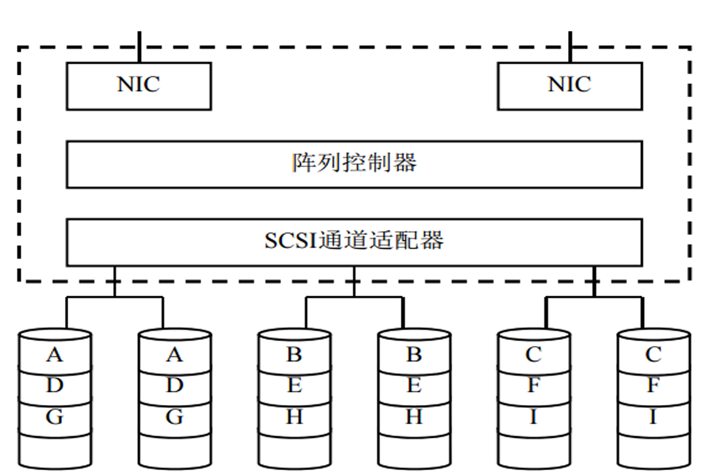
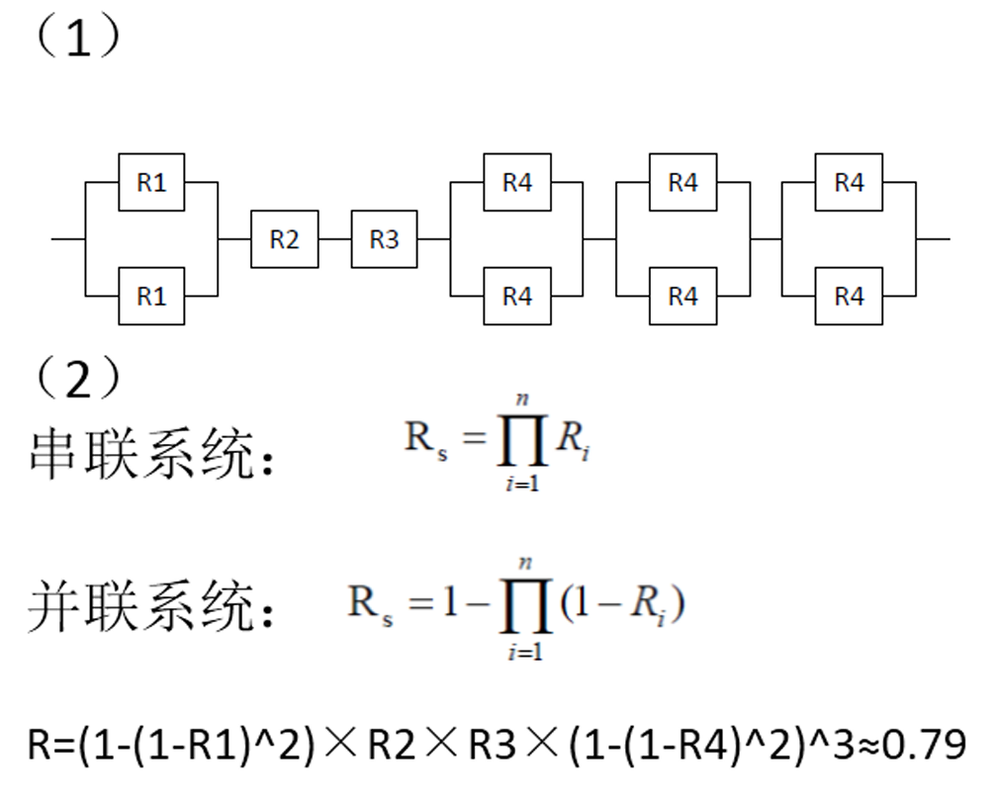

## 7.11
在伪相联中，假设在直接映象位置没有发现匹配，而在另一个位置才找到数据（伪命中）时，不对这两个位置的数据进行交换。这时只需要1个额外的周期。假设失效开销为50个时钟周期，2KB直接映象Cache的失效率为9.8%，2路组相联的失效率为7.6%；128KB直接映象Cache的失效率为1.0%，2路组相联的失效率为0.7%。
(1)推导出平均访存时间的公式；
(2)利用（1）中得到的公式，对于2KB Cache和128KB Cache，计算伪相联的平均访存时间。

### 问题（1）：平均访存时间公式推导  
伪相联缓存的平均访存时间公式推导如下：  
- **伪命中率** = 命中率₂路 − 命中率₁路 = (1 − 失效率₂路) − (1 − 失效率₁路) = **失效率₁路 − 失效率₂路**  
- **平均访存时间** = 直接映射命中时间（1路） + 伪命中率 × 额外周期（1周期） + 失效率₂路 × 失效开销  
即：  
\[
\text{平均访存时间} = \text{命中时间}_{1路} + (\text{失效率}_{1路} - \text{失效率}_{2路}) \times 1 + \text{失效率}_{2路} \times \text{失效开销}
\]  

### 问题（2）：计算伪相联平均访存时间  
#### 1. 2KB Cache 计算  
- 直接映射失效率（1路）：9.8% = 0.098  
- 2路组相联失效率（2路）：7.6% = 0.076  
- 失效开销：50周期  
- 命中时间₁路：假设为1周期  

代入公式：  
\[
\text{平均访存时间} = 1 + (0.098 - 0.076) \times 1 + 0.076 \times 50 = 1 + 0.022 + 3.8 = 4.822 \text{周期}
\]  

#### 2. 128KB Cache 计算  
- 直接映射失效率（1路）：1.0% = 0.010  
- 2路组相联失效率（2路）：0.7% = 0.007  
- 失效开销：50周期  
- 命中时间₁路：假设为1周期  

代入公式：  
\[
\text{平均访存时间} = 1 + (0.010 - 0.007) \times 1 + 0.007 \times 50 = 1 + 0.003 + 0.35 = 1.353 \text{周期}
\]  

### 结论  
- **2KB伪相联Cache**：平均访存时间为 **4.822周期**  
- **128KB伪相联Cache**：平均访存时间为 **1.353周期**  
由于128KB伪相联Cache的失效率显著更低，其性能优于2KB伪相联Cache。
## 8.11
假设在一个计算机系统中：
(1)每页为32KB，Cache块大小为128字节；
(2)对应新页的地址不在Cache中，CPU不访问新页中的任何数据
(3)Cache中95%的被替换块将再次被读取，并引起一次失效；
(4)Cache使用写回方法，平均60%的块被修改过；
(5)I/O系统缓冲能够存储一个完整的Cache块；
(6)访问或失效在所有Cache块中均匀分布；
(7)在CPU和I/O之间，没有其它访问Cache的干扰；
(8)无I/O时，每100万个时钟周期内有18000次失效；
(9)失效开销是40个时钟周期。如果被替换的块被修改过，则再加上30个周期用于写回主存；
(10)假设计算机平均每200万个周期处理一页。
试分析I/O对于性能的影响有多大？

### 分析过程 

#### 1. 基础计算
- **每页块数**：32KB/128B=256块  
（一页由256个Cache块组成）

#### 2. I/O替换代价
- **修改块写回时间**：  
替换时60%的块被修改过 → 256×60% = 153.6块  
每块写回需30周期 → 153.6×30 = **4,608周期**

- **二次失效代价**：  
被替换块中95%会再被访问 → 256×95% = 243.2次失效
新页数据来自I/O且未被CPU访问 → 所有块视为修改过（需40周期失效+30周期写回） → 243.2×70 = **17,080周期**

#### 3. 无I/O时的基准性能
- **原始失效开销**：  
每200万周期有36,000次失效（100万周期18,000次 ×2）  
未修改块（40%）处理时间：36,000×40%×40 = 576,000周期  
修改块（60%）处理时间：36,000×60%×70 = 1,512,000周期  
**总开销**：576k+1,512k = **2,088,000周期**

#### 4. 性能影响比例
- **I/O额外开销**：4,608+17,080 = **21,688周期**  
- **总处理周期**：200万（CPU）+2,088,000（Cache失效）= **4,088,000周期**  
- **影响比例**：21,688/4,088,000 ≈ **0.53%**

## 8.12
假设某网络型RAID包括6个SCSI系统，采用RAID1+0结构，对给定时间t，各部分的可靠度为：网络接口通道NIC R1=0.9,阵列控制器 R2=0.95，SCSI通道适配器R3=0.95,磁盘R4=0.8

(1)系统的可靠性框图
(2)系统可靠性R的表达式，计算R的值

(3)增加系统可靠性的若干建议
答：采用双控制器、双SCSI适配器、提高数据冗余度、网路通道冗余度、提高各部分器件可靠度。