# 3.2流水线技术的特点

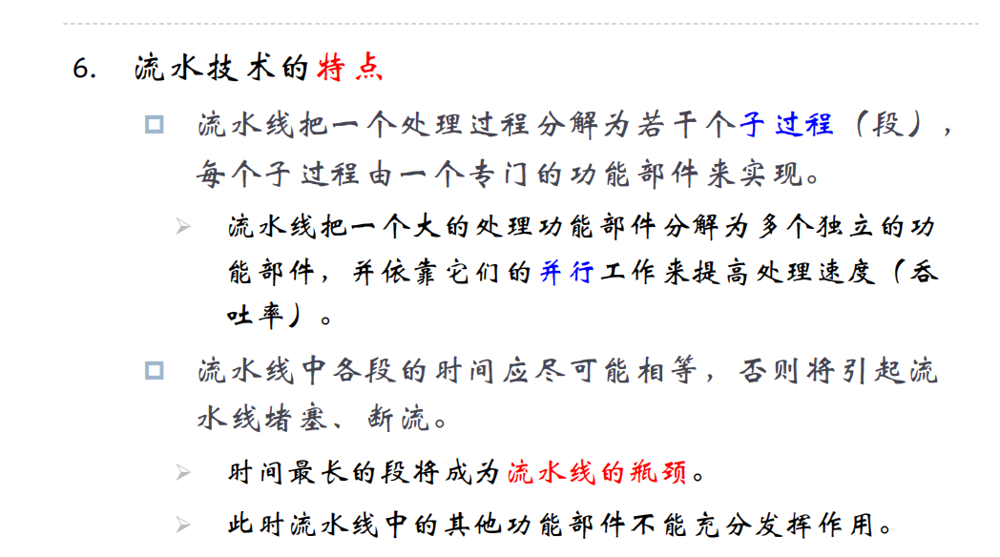
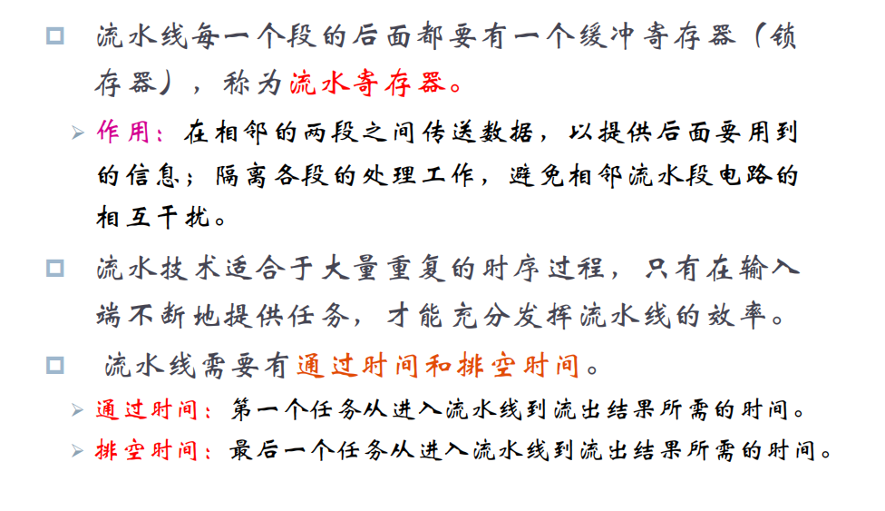

# 3.3减少分支延迟的三种方法，共同特点
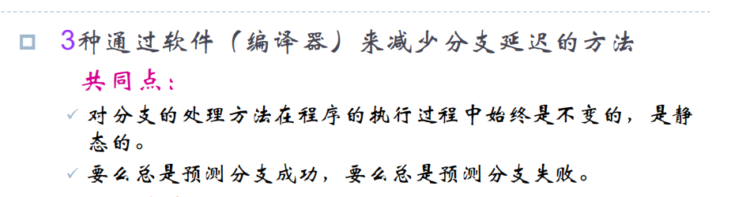
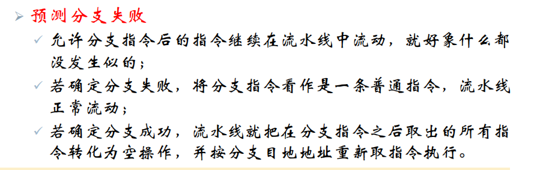
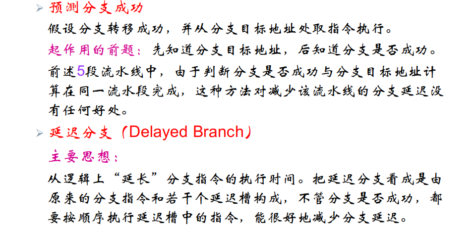
# 3.4延迟分支方法中的三种调度策略的优缺点

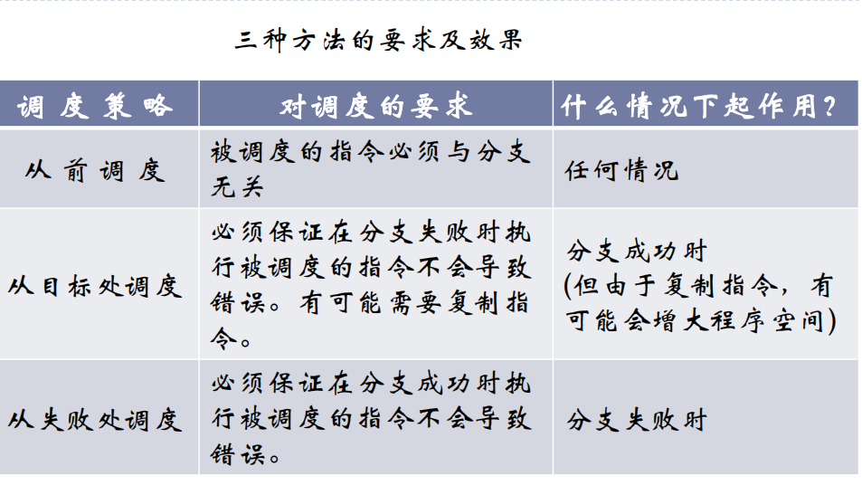

# 6.1
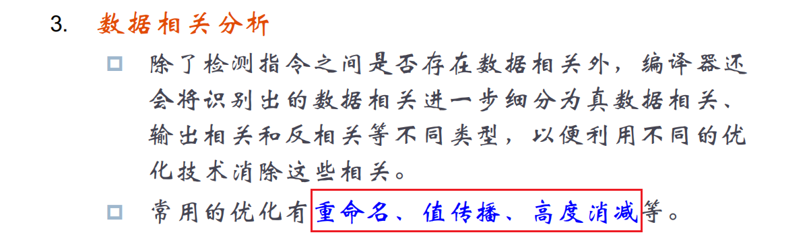

# 1、替换算法哪几种及优缺点：随机法、先进先出法、最近最少使用法
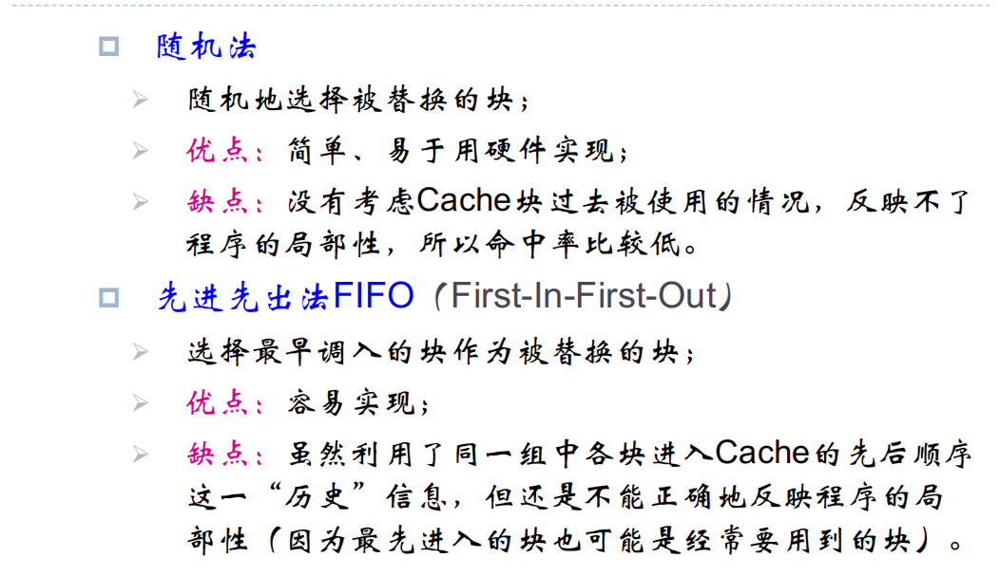
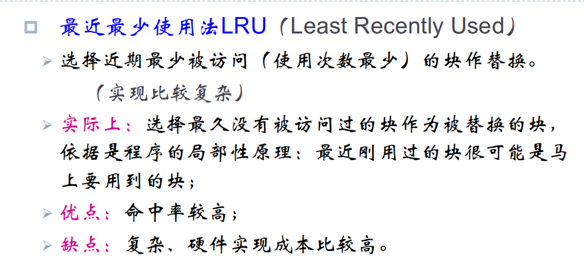

# 2、cache-主存/主存-辅存
速度不足-容量不足

# 3、组相联性能高吗？
增大n,实现复杂度和成本增加

# 4、
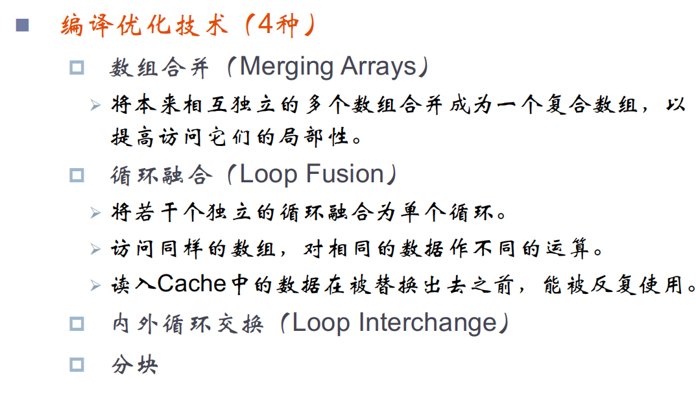

# 5、虚拟索引-物理标识
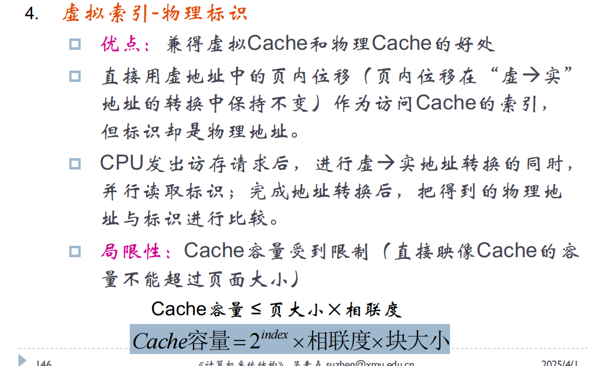

# 6、同步总线和异步总线
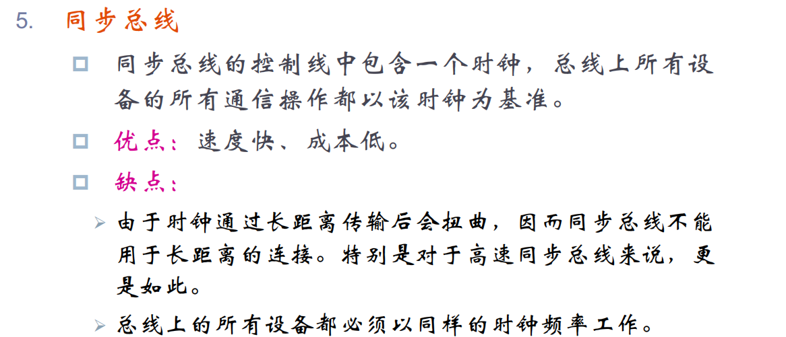
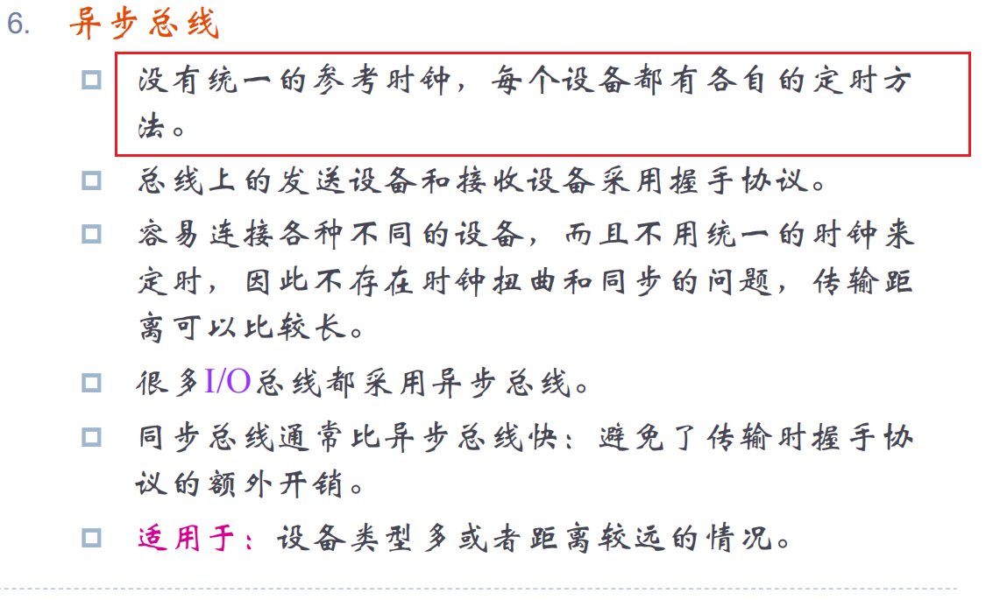