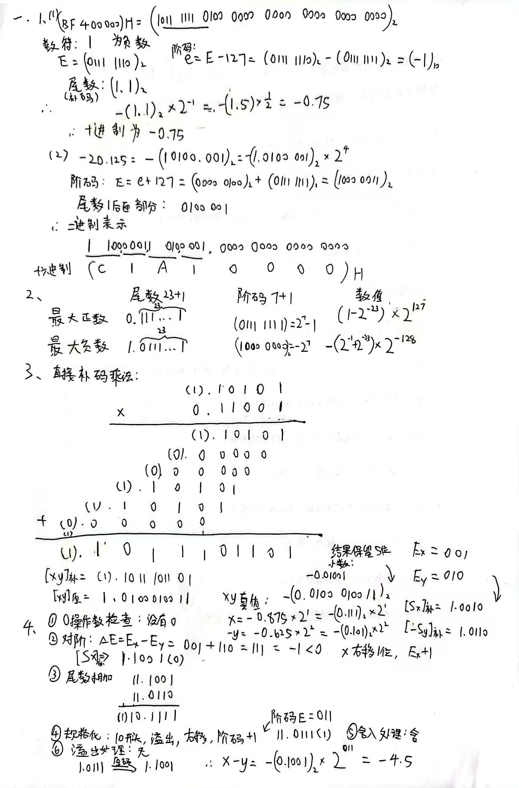

# 2122期中

## 一、计算题

## 五、
1、
（1）变形补码，01上溢，10下溢
（2）单符号位法：最高有效位和符号位进位情况不同
2、
3、
4、
主存存储量不能满足需求，利用外部存储器作为辅存，主存-辅存系统成为虚拟存储器

5、双译码结构，减少译码线数目，适用于大容量的存储器

6、得到原码，原码相乘

7、
交叉存储模式是一种通过将存储器分为多个模块，并在这些模块之间交错存储数据的方式来提高存储器带宽的技术。以下是交叉存储模式的一些优点和缺点：
优点：多模块流水线并行存取，提高存储器带宽
缺点：设计复杂性，成本较高，可能的冲突问题。

8、
段式管理：按照逻辑结构划分为多个相对独立的段。将主存按段分配的管理方式称为段式管理。段的大小取决于程序的逻辑结构，可长可短。

段的逻辑独立性使它易于管理、修改和保护。由于段长不固定，给主存空间的分配带来麻烦，容易形成碎片。

页式管理：把主存空间划分成长度固定的页。

优点是页的起点和终点地址固定，给造页表带来方便，对主存空间的浪费小。
由于页不是逻辑上独立的实体，处理、保护和共享都不如段式管理方便。

段页式管理：是将分段和分页结合起来，程序按模块分段，段内再分页。用段表和页表进行两级定位管理。