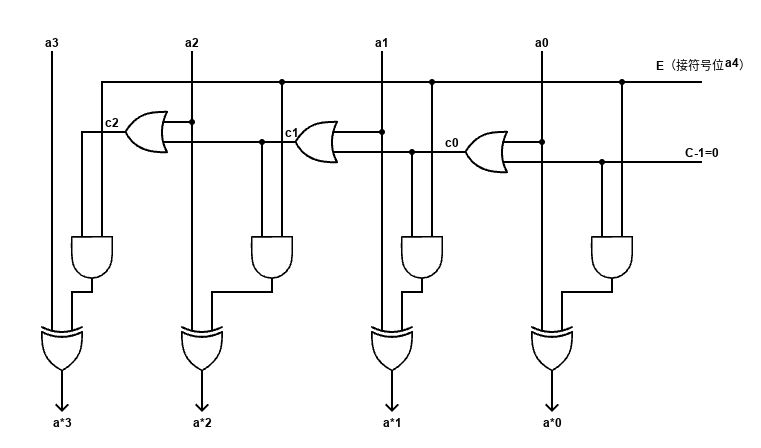

# 计算机组成原理 — 简答与要点（精炼版）

[toc]

> 说明：在不改变原意的前提下，统一名词、理顺层级、修正个别术语（如“级相连”→“组相联”、“相连存储器”→“相联存储器”），并对排版做了规整。原有证明与例题保留为可折叠区块。

---

## 第二章（数据的表示与运算）

### 小阶向大阶对齐的原因

- **目的：** 减小舍入误差，保证对齐后参与运算的数有效位对齐。

### 补码加法恒等式

- **命题：** \([x]_补 + [y]_补 = [x+y]_补 \pmod{2}\)（在不溢出的前提下）

证明思路（定点小数，|x|<1, |y|<1, |x+y|<1）

1) x>0, y>0：正数补码即原码，直得。

2) x>0, y<0：分 x+y≥0 与 x+y<0 两类，利用 y 的补码 \(2+y\) 代入并对 2 取模。

3) x<0, y>0：同 2)。

4) x<0, y<0：两者补码均为 \(2+数值\)，进位 2 被丢弃后等价于 \([x+y]_补\)。

### 什么是溢出（Overflow）？

- **定义：** 运算结果**超出机器可表示范围**（按选定的字长与编码体系）的现象。
- **提示：** 有符号与无符号的溢出判据不同；补码加法常用**同号相加异号得负**作为快速判定。

### 全加器（Full Adder）

- **和位：** \( S = A \oplus B \oplus C_{in} \)
- **进位：** \( C_{out} = AB + B C_{in} + A C_{in} \)
- **延迟：** 关键路径包含异或/与/或门级联；串行进位的关键瓶颈是**进位链**。

### 行波进位补码加法器中的“m 控制”

- **约定：** 令控制位 \(m=0\) 做加法，\(m=1\) 做减法。
- **原因：** 补码减法 \(x-y = x + (\overline{y}) + 1\)。在硬件中以 \(m\) 控制对 B 端取反（\(B\oplus m\)）并把初始进位设为 \(C_{in}=m\)，统一为一次加法器操作。

### 对 2 求补电路

- **思路：** 逐位取反 + 加 1。
- **参考图：** 

### 阵列乘/除法器要点

- **直接补码阵列乘法器：** 最高位权值为 \(-1\)。
- **间接补码阵列乘法器：**
  - *算前求补：* 将补码还原为原码参与部分积计算（便于符号分离）。
  - *算后求补：* 结果由原码还原为补码以便存储。
- **原码除法：** 符号位单独处理；商符号 = 被除数符号 \(\oplus\) 除数符号。
- **阵列除法器（CAS）：** 典型采用**加减交替**法实现试商与复原/不复原逻辑。

### ALU 与先行进位

- **ALU：** 提供算术/逻辑等基本运算的组合电路，可通过控制字选择功能。
- **先行进位（CLA）：** 通过生成/传递信号 \(G_i,P_i\) 计算各位进位，**并行化**进位路径以缩短加法延迟。

### 流水线特点

- **并行重叠执行**各阶段，提高吞吐率；单任务时延不一定下降，但**整体速度**提升显著。

---

## 第三章（存储系统）

### Cache 的目的

- **桥接速度鸿沟：** 使**平均访存时间**接近高速的小容量存储（Cache），与 CPU 运算速率匹配。

### 双译码结构的优点

- **减少连线数**、便于扩展：行列分离译码，降低译码器规模与布线复杂度。

### DRAM 相关

- **刷新粒度：** 以**行（Row）**为单位刷新。
- **地址复用：** 行/列地址复用以减少引脚数（RAS/CAS）。
- **CDRAM：** 在 DRAM 阵列旁集成一小块 **SRAM** 作为行缓冲/缓存（读出期间可并行刷新）。
- **SDRAM：** 同步 DRAM，与系统时钟同步，可流水/突发传输；CPU 发起后可并行处理其他事务。
- **DDR SDRAM：** 上升沿与下降沿**双沿**传输数据，提高带宽。

### SRAM vs. DRAM

| 项目 | SRAM | DRAM |
|---|---|---|
| 存储容量 | 小 | 大 |
| 速度 | 快 | 慢 |
| 成本 | 高 | 低 |
| 是否刷新 | **不需要** | **需要** |
| 典型用途 | Cache/寄存器 | 主存 |

### 缓解 CPU–主存速度差的途径

- 增加**通用寄存器**数量
- 在 CPU 与主存之间加入 **Cache**
- 采用**并行**存储器（如双端口存储器、交叉存取）
- 提高主存速度或**加宽字长/突发**访问

### 相联存储器（CAM）

- **按内容访问**的存储器，常用于保存 **Cache 行标签** 以实现快速匹配。

### 程序局部性

- **时间局部性：** 近期访问的项很可能**很快再次访问**（循环/迭代）。
- **空间局部性：** 访问一个地址后，**邻近地址**也可能被访问（顺序代码、数组/向量）。

### 主存–Cache 的地址映射（p.94）

设主存共有 \(2^{s+w}\) 个**字**，块/行大小为 \(2^w\) 字，则主存块数为 \(2^s\)。

| 项目 | **全相联** | **直接映射** | **组相联** |
|---|---|---|---|
| 主存地址长度 | \((s+w)\) 位 | 同左 | 同左 |
| 块内地址（偏移） | \(w\) 位 | \(w\) 位 | \(w\) 位 |
| 主存块数 | \(2^s\) | \(2^s\) | \(2^s\) |
| Cache 行数 | 由实现决定 | \(m=2^r\) | \(m=u\,v\) |
| 组数 u | — | — | \(u=2^d\) |
| 每组路数 v | — | — | \(v\) |
| 组/行索引 | — | 行号：\(r\) 位 | 组号：\(d\) 位 |
| 标记位（Tag） | \(s\) 位 | \(s-r\) 位 | \(s-d\) 位 |
| 主存区内块号 | — | 对应 Cache 行号 | 对应 Cache 组号 |

### Cache 替换策略（p.100）

- **LRU：** 最近最少使用
- **LFU：** 最不经常使用
- **随机（RAND）：** 硬件简单、抖动场景下有时更稳

PPT 例题（组相联）

> 四路组相联 Cache 共 64 行，主存 8192 块，每块 32 字。求：主存块标记位、组号位、块内地址位。

- 已知：\(v=4\)，\(m=64=uv\Rightarrow u=16\Rightarrow d=4\)；\(2^w=32\Rightarrow w=5\)；\(2^s=8192=2^{13}\Rightarrow s=13\)。
- 答：**Tag = 9 位**（\(s-d=13-4\)），**组号 = 4 位**（\(d\)），**块内地址 = 5 位**（\(w\)）。

PPT 例题（全相联）

> 某 8 位机主存 1MB，分 512 块；Cache 8 行，采用**全相联**。问：
>
> 1) Cache 容量？ 2) 页内（块内）地址位数？ 3) 标记位数？

- \(2^{s+w}=2^{20}\Rightarrow s+w=20\)；主存块数 \(2^s=512\Rightarrow s=9\)；故 \(w=11\)。
- 1) **容量**：\(2^w\times 8 = 2^{11}\times 8 = 2^{14}=16\,KB\)
- 2) **块内地址**：\(w=11\) 位
- 3) **标记**：\(s=9\) 位

---

## 第四章（指令系统）

### RISC vs. CISC（要点）

- **CISC：** 指令系统复杂、单条指令功能强、长度可变、微程序控制居多。
- **RISC：** 指令种类少、格式规整、**单周期/流水线友好**、大量通用寄存器、强调**编译器优化**。

### 不同指令执行为何不同？

- **根因：** 操作码（OP 字段）不同 → 取值、访存、运算、分支等微操作序列不同。

---

## 第五章（中央处理器）

### CPU 的功能（p.145）

- **指令控制、操作控制、时间控制、数据加工**。

### 同步/异步控制

- **同步：** 用统一时钟协调各部件时序；**异步：** 以握手/请求应答等协议协调。

### 取指与 PC 自增

- **PC+1：** 指向**下一条指令**（顺序流）。
- **方框图中首个方框可复用：** 首个周期为**取指周期**，通用于所有指令；随后执行阶段因指令而异。
- **判定/菱形框：** 指令译码与条件判定，依据 OP/条件码等控制后续微操作。

### 微指令与微程序

- **微指令：** 在一个 CPU 周期内并行触发的一组微命令。
- **微程序：** 一条机器指令对应的一段**微指令序列**。
- **周期关系：** 1 个 CPU 周期 ≈ 1 条微指令；1 个指令周期 ≥ 2 个 CPU 周期（至少**取指**与**执行**）。
- **“软件控制硬件”的本质：** 不同 OP 触发不同微程序路径（控制存储器中的微代码）。

### RISC 特点（回顾）

- 指令精简规整、寄存器多、流水线优化、硬布线控制常见。

---

## 第六章（总线与 I/O）

### 总线分类（p.189）

- **内部总线：** CPU 内部寄存器/运算部件之间
- **系统总线：** CPU 与主存/高速外设
- **I/O 总线：** 中低速外设之间

### 总线带宽公式

- **带宽 = 位宽 × 工作频率**
  - 位宽：一次并行传送的比特数
  - 频率：控制总线周期的时钟频率

### 结构与仲裁

- **单总线：** 结构简单、易扩展；但 CPU 常为唯一主控，耦合度高。
- **双总线/多总线：** 分担带宽与负载（参见 PPT#7）。
- **仲裁（p.198）：** 在多个主设备间选择**下一个主方**。
  - **集中式仲裁：** 设备以 BR 线请求，仲裁器以 BG 授权；**查询链**中靠近仲裁器者优先级更高。
  - **分布式仲裁：** 设备间协商，不依赖中心仲裁器。
- **同步总线：** 必须以**最慢模块**为准设计全局时钟参数。

### 传送方式（p.195）

- 串行 / 并行 / 分时

### DMA（直接存储器访问）

- 外设绕过 CPU 与主存**直接数据交换**。当外设给出的地址命中主存单元时，主存应答并在二者之间传送数据。

---

## 附录：名词小纠正

- “**组相联**”而非“级相连”。
- “**相联存储器**（CAM, Content-Addressable Memory）”而非“相连存储器”。
- Cache 专有名词大小写统一为 **Cache**。
