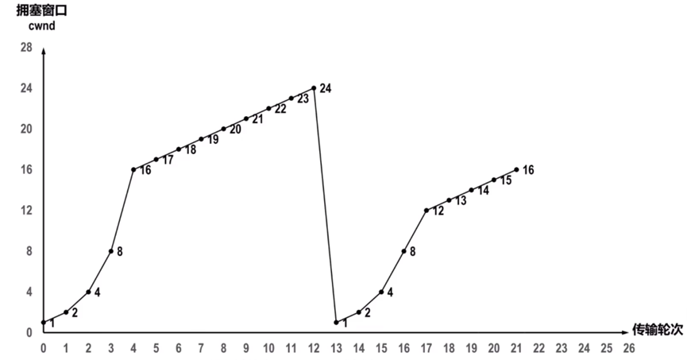

题型与期中一致：填空题、简答题、计算题（大题）

# 一、填空题

记得的：

（1~2与平时计网实验相关，因此可以注意下实验内容。）

1、根据功能写出**常用网络命令**，如ipconfig、ping、nslookup 

2、根据功能写出**socket编程常用函数**，考了bind和listen

3、教材**5个层次**的各自名称

4、5个10M端口的集线器、以太网交换机的总带宽各自可达多少？（同24年计网期中的T8）

5、若主机甲与主机乙建立TCP连接时发送的SYN段中的序号为1000，在断开连接时，甲发送给乙的FIN段中的序号为5001，则在无任何重传的情况下，甲向乙已经发送的应用层数据的字节数为？（同2020年408的T39）

6、**防火墙**。涉及具体IP能不能进（？）

7、Google的QUIC涉及的运输层协议（？）

8、HTTP加入什么变为HTTPS（？）

9、要实现安全传输，可以用到什么技术（网络安全的）

……

# 二、简答题

记得的：

1、说出3个认识的路由选择协议？哪些属于IGP、EGP？并简述内容。

2、结合隐蔽站问题说明RTS/CTS作用？它们是必选还是可选？

3、IPv4向IPv6升级过程中，如何实现二者共用？（也即IPv6向IPv4过渡的两种方法）

……

# 三、计算题

## 1、RIP算法

给定了图和相邻路由器的距离。

（1）写最终收敛的路由表

（2）若一对相邻的路由器距离更新（距离变大），采用毒性逆转，最后需要几个周期收敛

## 2、TCP的四种拥塞控制的方法

给定了拥塞窗口随传播轮次变化的图，类似下图。

给了9问左右，需要非常了解TCP的四种拥塞控制的方法的具体过程，cwnd、ssthresh的变化情况。

似乎涉及到了这个：

*也有的快恢复实现是把快恢复开始时的cwnd值再增大一些，即cwnd=新ssthresh+3。*

这样看来，试卷给的图其实是对的，但是考试时如果不记得知识点只会觉得图画错了。。。

## 3、浏览器访问网页涉及过程：DHCP、ARP、DNS、HTTP协议
用户在主机A的浏览器输入url：www.xmu.edu.cn 到访问到http页面，（主机A是新接入的设备，什么配置都没有），对DHCP、ARP、DNS、HTTP协议的出现过程排序，并说出排序原因和它们各自用来解决的问题。

## 4、网络安全
Alice和Bob进行几种情形的不同需求的安全通信，涉及的安全内容，如消息认证码（MAC）、数字签名、数字证书。要求写出完整协议名等、传输过程的报文内容等。

4种情况：

（1）只要求传输报文内容不被窃听

（2）要求报文不被篡改、伪造

（3）要求发送方事后无法否认发送

（4）Alice发送前希望确认对方身份是Bob，需要提前做什么准备
