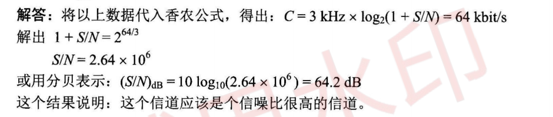
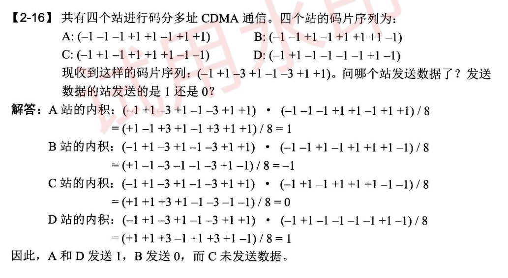
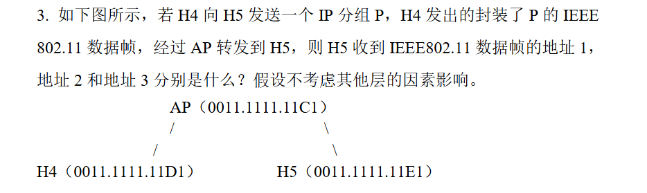
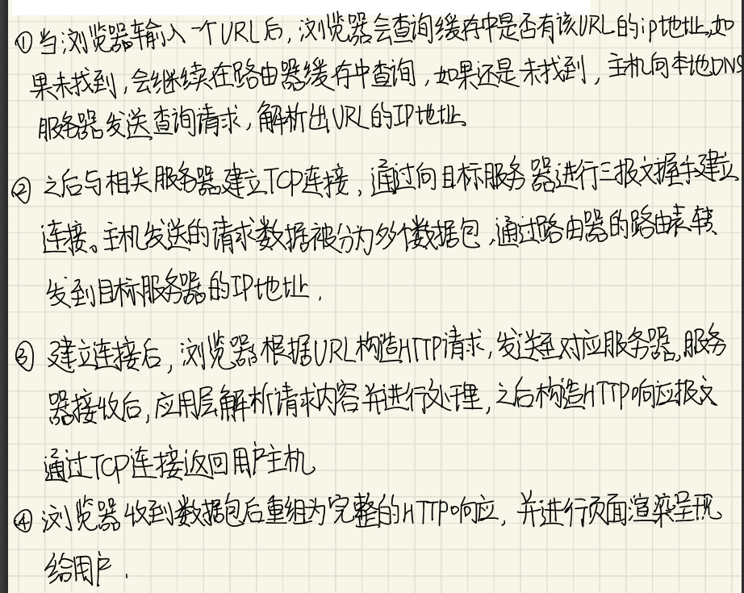
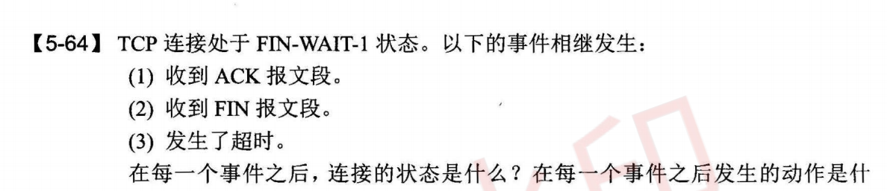
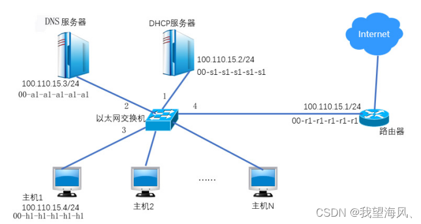

## 4.物理层以及香农
1.假定要用 kHz 带宽的电话信道传送 64 kbit/s 的数据（无差错传输），试问这个信道应具有多高的信噪比（分别用比值和分贝来表示） ？这个结果说明什么问题？

2.
为什么要使用信道复用技术？常用的信道复用技术有哪些？
许多用户共享信道进行通信
时分、频分、波分、码分

3.**注意B是发送0**


## 5.作业题错的地方（802.11无线网络，HTTP)
题1


题2

当用户在浏览器中输入一个URL时，会在几秒钟内得到相应网页。请简要描述用户主机、相关服务器以及中间路由器会发生的事情。

## 6.CSMA/CD协议
假设局域网使用集线器构建网络，链路带宽为10Mbps，请问在某结点连续第4次冲突后，按二进制指数退避算法，选择r=4的概率是多少？
```
K=4，站点将在（0，24-1）集合中随机选取一个数r来设置重传推后时间（即r倍的争用期），那么选择r=4的概率是1/16,即0.0625。
```
## 7.数据链路层
1.分析交换机和路由器的特点与应用场景。

交换机是数据链路层设备，它能够根据帧的目的地址与自己的MAC地址表进行比较，然后将帧转发至合适的接口，交换机主要应用在局域网中主机之间的互联；路由器是网络层设备，它的主要功能是根据数据报的目的IP地址与自己的路由表进行比较，然后将数据报转发至合适的端口，路由器主要应用于不同网络之间的互联。

2.网络适配器

进行数据的串行和并行传输的转换，对数据进行缓存，安装以太网协议，安装设备驱动程序

工作在哪一层：物理层和数据链路层

3.数据链路层三个基本问题：封装成帧透明传输差错控制

4.PPP协议

一个将IP数据报封装到串行链路的方法，链路控制协议LCP，网络控制协议NCP

特点：封装成帧、透明传输、简单、支持多种网络层协议和多种类型的链路

为什么不支持编号：编号是为了差错重传，PPP不支持可靠传输不需要

适合情况：适合链路状态较好的情况

工作状态：无链接-物理链路-LCP链路-已鉴别的LCP链路-已鉴别的LCP和NCP链路

5.以太网使用的 CSMA/CD 协议是以争用方式接入到共享信道的，这与传统的时分复用TDM 相比有何优缺点？

解答：

网络上的负荷较轻时， CSMA/CD 协议很灵活，哪个站想发送就可以发送，而且发生碰撞概率小

负荷重用TDM
## 8.IP和ARP
例1：
若主机192.168.1.10向互联网发送一个标识符为6789、总长度为1500B、DF=0的IP分组时，路由器需要将该IP分组分为几片（每片尽可能封装为最大片，假定IP分组使用固定长度首部）？请写出每个分片的片偏移的取值。
```
(512-20)/8×8」=488；n=「(1500-20)/488=4 因为 (1500-20）= 3×（512-20）+4 故初步判断可以分为4片； 又因(512-20) =61×8+4，故每片最大61×8=488字节， (1500-20）=3×488+16 故路由器需要将该IP分组分为4片。
```


2.至少举出两种不需要发送 ARP 请求分组的情况（即不需要请求将某个目的IP 地址解析为相应的 MAC 地址）。

（1）高速缓存中已经有了

（2）源主机是广播发送

（3）源主机和目的主机是点对点链路

3.多播路由协议

隧道技术、洪泛与剪除、基于核心的发现技术

4-18

(1)
接口m0
(2)
R2
(3)
R4
(4)
R3
(5)
R4

4-20
一个数据报长度为 4000 字节（固定首部长度）。现在经过一个网络传送，但此网络能够传送的最大数据长度为 1500 字节 试问应当划分为几个短些的数据报片？各数据报片的数据字段长度、片偏移字段和 MF 标志应为何数值？
4000-20=3980
1500-20=1480
3980-1480=2500
2500-1480=1020
1480/8=185
185*2=
1020+20=1040
|长度|片偏移字段|MF|
|---|---|---|
|1480| 0|1
|1480|185|1
|1020|370|0

4-22
132=1000 0100
133=1000 0101
134=1000 0110
135=1000 0111
16+6=22
132/22

4-25

118=0111 0110
lan3:30.138.118/24 
lan2:30.138.119/25
30.138.119.1000 0000
30.138.119.1001 1111

30.138.119.1010 0000
30.138.119.1010 0111

30.138.119.1011 0000
30.138.119.1011 0111

1100 1000
|网络|主机数|位数|前缀|网络号|广播号
|---|---|---|---|--|---|
|lan1| 3|3|30.138.119.176/29|30.138.119.176|30.138.119.183|
|lan2| 91|7|30.138.119.0/25|30.138.119.0|30.138.119.127|
|lan3 |150|8|30.138.118.0/24|30.138.118.0|30.138.118.255
|lan4| 3|3|30.138.119.160/29|30.138.119.160|30.138.119.167
|lan5 |15|4|30.138.119.128/27|30.138.119.128|30.138.119.159|

4-31

已知地址块中的一个地址是 140.120.84.24/20 。试求这个地址块中的最小地址和最大地址。地址掩码是什么？地址块中共有多少个地址？相当于多少个C类地址？

140.120.0101 0100.24
140.120.0101 0000.0000 0000=140.120.80.0
140.120.0101 1111.1111 1111=140.120.95.255
地址掩码255.255.240.0
4096
2^8
2^12/2^8=2^4=16个地址

4-36
RIP 使用 UDP, OSPF 使用 IP, BGP 使用 TCP 。这样做有何优点？为什么 RIP周期性地和邻站交换路由信息而 BGP 却不这样做？

RIP周期性地和邻站交换信息，UDP不提供可靠交付但是开销小

OSPF，洪泛法，直接使用IP，灵活性好开销小

BGP要交换路由表以及更新，TCP提供可靠交付，减少带宽

RIP使用不可靠交付所以需要反复发送，BGP用可靠交付不需要


## 9.TCPUDP
1.伪首部的作用：不是真的首部，只是计算检验和时，临时加在数据前面，不向上递交也不向下传送

2.在计算加权平均RTTS时，只要报文重传，就不采用其往返时间样本

5-61
2kb*1024=2048字节
(1)
发送窗口：0-2047字节,1024-2047字节
(2)
发送窗口：0-2047,无可用窗口
(3)
1001+2048=3049
整个发送窗口从1001-3048，可用窗口2048-3048字节
(4)
2048+850
整个发送窗口从1001-3048，可用窗口2898-3048字节
(5)
迟到报文，无影响
发送窗口：1001-3048，可用窗口2898-3072字节
(6)
2047+2048=4196
发送窗口：2047-4195，可用窗口2898-4195字节
(7)
发送窗口：2047-4195，可用窗口3072-4195
(8)
3072+2048=5120
发送窗口为3072-5119，可用窗口3072-5119

5-62

服务端
(1)发送ACK报文，CLOSE-WAIT
(2)进入FIN报文，LAST-ACK
5-63

服务端
（1）关闭报文FIN-WAIT1,发送FIN
(2)CLOSING状态，发送ACK

5-64

(1)FIN-WAIT2
(2)TIME-WAIT,发送ACK
(3)CLOSED

5-70
2^32*8/40/10^9=0.85S


例题1：拥塞控制是TCP协议的重要特性，请使用TCP协议的相关原理求解以下数据传输问题：

假定某个时刻TCP的拥塞窗口为18KB，并且发生了超时事件。如果接下来4个轮次的传输都是成功的，那么4轮次后该拥塞窗口将是多大？假定最大报文段长度是2KB。

答：当发生超时事件时，门限值将设为当前拥塞窗口的一半，即9KB，然后将拥塞窗口设为一个最大报文段长，即2KB；（3分）

接着开始执行慢开始算法，发送1个报文段，然后在第2、3、4轮次分别发送2个、4个和8个报文段，拥塞窗口应该分别为4KB、8KB、9KB；（4分）

但是由于门限值设为9KB，因此在4轮次后，拥塞窗口改为9KB，然后开始执行拥塞避免算法。（3分）

例题2：根据下图回答问题：


①指明TCP工作在慢开始阶段的时间间隔。

②在第13个传输轮次和第22个传输轮次之后，报文段的丢失是根据3个重复确认还是根据超时检测出来的？

③在哪个传输轮次发送出第30个报文段？

④TCP发送窗口同时涉及流量控制和拥塞控制机制，请从其局限性角度分析二者的区别，以及发送方发送窗口的取值原则。


①TCP工作在慢开始阶段的时间间隔分别是[1,5]和[14,18]。

②在第13个传输轮次之后，通过超时检测到分组丢失；在第22个传输轮次之后，通过三个重复确认识别出分组丢失。

③第30个报文段在第5个传输轮次中被发送。

④流量控制考虑的是接收方的接收能力，通过接收窗口值设定发送方的发送窗口；而拥塞控制是从整个网络能够承受的负荷考虑的，通过拥塞窗口进行控制；两者配合使用才能更好的控制发送方的发送速度，避免过载造成的数据丢失，发送窗口应取接收窗口与拥塞窗口中较小的值。

## 10.简单网络管理协议 SNMP(UDP)
网络管理协议

探询和陷阱：
周期性的探询以及在两次探询之间的特殊情况，陷阱
## 11.动态主机配置协议DHCP
即插即用连网，无需手动配置则可加入新的网络获得IP地址
## 12.邮件协议
### 1.POP与SMTP

POP邮件读取协议，SMTP简单邮件传送协议（发送）

### 2.POP与IMAP
共同点：客户服务器方式

不同点：
POP:用户只要一读取，服务器就删除

IMAP：可以保存邮件，读取需要上网，可以在不同地点使用不同计算机

### 3.POP的工作流程
客户服务器：用户代理运行POP客户程序，

收件人的邮件服务器运行POP服务器程序和SMTP服务器程序，读取从客户程序发来的邮件

### 4.MIME

在SMTP的基础上在邮件首部说明邮件数据格式

## 13.掌握HTTP协议的作用和工作过程；能描述出当用户在浏览器中输入某一URL地址后，数据传输的过程和用到的所有协议；
**例1：**
域名转换的过程 域名服务器中的高速缓存

若主机m.xyz.com查询y.abc.com

(1)域名放在 DNS请求报文中，以 UDP 用户数据报方式发给本地域名服务器dns.xyz.com

(2)本地服务器先看高速缓存有没有

(3)没有就向根服务器迭代查询

(4)根服务器告诉本地服务器向dns.com顶级服务器查询

(5)顶级服务器告诉本地服务器向权限域名服务器dns.abc.com查询

(6)权限域名服务器告诉本地服务器IP地址

高速缓存：存最近查询过的域名映射的信息，减少根服务器的负担，减少DNS查询报文的数量


**例2**：在浏览器中输入https://www.zhaopin.com并按回车，直到智联招聘的网站首页显示在浏览器的过程中，按照TCP/IP参考模型，问：

（1）从应用层到网络接口层都用到了哪些协议？请简要说明协议的名称和作用。

（2）客户端的浏览器需要经过哪些步骤才能将该主页显示在客户端的屏幕上，简要描述从输入网址到页面显示的整个流程。

重要程度：★★★★★
```
（1）从应用层到网络接口层用到的协议：

①应用层用到的协议主要有HTTP和DNS协议，HTTP规定了WEB服务器和浏览器之间传输WEB网页时需要遵循的规则和格式，DNS协议用于域名解析；

②传输层用到的协议主要有TCP和UDP协议，TCP协议为HTTP提供可靠的数据传输，而DNS一般使用传输层的UDP协议；

③网络层用到的主要协议有IP、ARP协议，IP协议用于数据包的传输，ARP协议用于将本机的默认网关IP地址映射为物理MAC地址。

④数据链路层：不同的局域网将会使用不同的标准，目前常用的以太网标准是802.3，无线局域网标准是802.11。

(2)

①DNS解析域名：得到WEB服务器的IP地址；

②TCP连接：浏览器与www.zhaopin.com的Web服务器建立TCP连接；

③HTTP 请求报文：浏览器利用HTTP的GET方法向www.zhaopin.com的Web服务器发送获取首页资源的请求；

④HTTP响应报文：Web服务器在接收到浏览器的HTTP请求后，将构建所请求Web页面的各种信息，并将信息（由HTML描述）通过Internet传送给客户端的浏览器；

⑤显示：浏览器对收到的信息进行解释，然后将Web页面显示在屏幕上。
```


## 14.掌握DHCP协议的作用和工作原理，能描述DHCP协议的工作过程

某网络拓扑如下图所示，其中路由器内网接口、DHCP服务器、DNS服务器与主机1均采用静态IP地址配置，相关地址信息见图中标注；主机2~主机N通过DHCP服务器动态获取IP地址等配置信息。


请回答以下问题：

（1）DHCP服务器可为主机2~主机N动态分配IP地址的最大范围是什么？主机2使用DHCP协议获取IP地址的过程中，发送的封装DHCP Discover报文的IP分组的源IP地址和目的IP地址分别是什么？（5分）

（2）若主机2的ARP表为空，则该主机访问Internet时，发出的第一个以太网帧的目的MAC地址是什么？封装主机2发往Internet的IP分组的以太网帧的目的MAC地址是什么？（5分）

（3）若主机1的子网掩码和默认网关分别配置为255.255.255.0和100.110.15.2，则该主机是否能访问DNS服务器？是否能访问Internet？请说明理由。（5分）

**据说很重要：（4）若主机1的ARP表和以太网交换机的MAC地址表均为空，主机1在此刻利用浏览器输入域名请求访问Internet中的某台Web服务器，直到该web页面在浏览器显示出来，假设期间网络未发生任何与此次Web访问无关的网络通信，问：**

①主机2至少会接收到几个与此次Web访问相关的帧？接收到的是什么帧？帧的目的MAC地址是什么？

②写出此时以太网交换机的MAC地址表的内容（MAC地址表只有MAC地址和端口两项内容）

 重要程度：★★★★★

（1）DHCP服务器可为主机2~主机N动态分配IP地址的最大范围是100.110.15.5~100.110.15.254；主机2发送的封装DHCP Discover报文的IP分组的源IP地址和目的IP地址分别是0.0.0.0和255.255.255.255。

（2）主机2发出的第一个以太网帧是ARP请求帧，其的目的MAC地址是FF-FF-FF-FF-FF-FF；封装主机2发往Internet的IP分组的以太网帧的目的MAC地址是00-r1-r1-r1-r1-r1。

（3）主机1能访问DNS服务器，但不能访问Internet。由于主机1的子网掩码配置正确，所以能访问同一个子网内的DNS服务器，但是默认网关配置错误，应该配置为路由器位于内网的接口地址100.110.15.1，所以无法访问Internet。


（第二行应该错了：端口为2）## 10.简单网络管理协议 SNMP(UDP)
网络管理协议

探询和陷阱：
周期性的探询以及在两次探询之间的特殊情况，陷阱
## 11.动态主机配置协议DHCP
即插即用连网，无需手动配置则可加入新的网络获得IP地址
## 12.邮件协议
### 1.POP与SMTP

POP邮件读取协议，SMTP简单邮件传送协议（发送）

### 2.POP与IMAP
共同点：客户服务器方式

不同点：
POP:用户只要一读取，服务器就删除

IMAP：可以保存邮件，读取需要上网，可以在不同地点使用不同计算机

### 3.POP的工作流程
客户服务器：用户代理运行POP客户程序，

收件人的邮件服务器运行POP服务器程序和SMTP服务器程序，读取从客户程序发来的邮件


## 13.掌握HTTP协议的作用和工作过程；能描述出当用户在浏览器中输入某一URL地址后，数据传输的过程和用到的所有协议；
**例1：**
域名转换的过程 域名服务器中的高速缓存

若主机m.xyz.com查询y.abc.com

(1)域名放在 DNS请求报文中，以 UDP 用户数据报方式发给本地域名服务器dns.xyz.com

(2)本地服务器先看高速缓存有没有

(3)没有就向根服务器迭代查询

(4)根服务器告诉本地服务器向dns.com顶级服务器查询

(5)顶级服务器告诉本地服务器向权限域名服务器dns.abc.com查询

(6)权限域名服务器告诉本地服务器IP地址

高速缓存：存最近查询过的域名映射的信息，减少根服务器的负担，减少DNS查询报文的数量


**例2**：在浏览器中输入https://www.zhaopin.com并按回车，直到智联招聘的网站首页显示在浏览器的过程中，按照TCP/IP参考模型，问：

（1）从应用层到网络接口层都用到了哪些协议？请简要说明协议的名称和作用。

（2）客户端的浏览器需要经过哪些步骤才能将该主页显示在客户端的屏幕上，简要描述从输入网址到页面显示的整个流程。

重要程度：★★★★★
```
（1）从应用层到网络接口层用到的协议：

①应用层用到的协议主要有HTTP和DNS协议，HTTP规定了WEB服务器和浏览器之间传输WEB网页时需要遵循的规则和格式，DNS协议用于域名解析；

②传输层用到的协议主要有TCP和UDP协议，TCP协议为HTTP提供可靠的数据传输，而DNS一般使用传输层的UDP协议；

③网络层用到的主要协议有IP、ARP协议，IP协议用于数据包的传输，ARP协议用于将本机的默认网关IP地址映射为物理MAC地址。

④数据链路层：不同的局域网将会使用不同的标准，目前常用的以太网标准是802.3，无线局域网标准是802.11。

(2)

①DNS解析域名：得到WEB服务器的IP地址；

②TCP连接：浏览器与www.zhaopin.com的Web服务器建立TCP连接；

③HTTP 请求报文：浏览器利用HTTP的GET方法向www.zhaopin.com的Web服务器发送获取首页资源的请求；

④HTTP响应报文：Web服务器在接收到浏览器的HTTP请求后，将构建所请求Web页面的各种信息，并将信息（由HTML描述）通过Internet传送给客户端的浏览器；

⑤显示：浏览器对收到的信息进行解释，然后将Web页面显示在屏幕上。
```


## 14.掌握DHCP协议的作用和工作原理，能描述DHCP协议的工作过程

某网络拓扑如下图所示，其中路由器内网接口、DHCP服务器、DNS服务器与主机1均采用静态IP地址配置，相关地址信息见图中标注；主机2~主机N通过DHCP服务器动态获取IP地址等配置信息。


请回答以下问题：

（1）DHCP服务器可为主机2~主机N动态分配IP地址的最大范围是什么？主机2使用DHCP协议获取IP地址的过程中，发送的封装DHCP Discover报文的IP分组的源IP地址和目的IP地址分别是什么？（5分）

（2）若主机2的ARP表为空，则该主机访问Internet时，发出的第一个以太网帧的目的MAC地址是什么？封装主机2发往Internet的IP分组的以太网帧的目的MAC地址是什么？（5分）

（3）若主机1的子网掩码和默认网关分别配置为255.255.255.0和100.110.15.2，则该主机是否能访问DNS服务器？是否能访问Internet？请说明理由。（5分）

**据说很重要：（4）若主机1的ARP表和以太网交换机的MAC地址表均为空，主机1在此刻利用浏览器输入域名请求访问Internet中的某台Web服务器，直到该web页面在浏览器显示出来，假设期间网络未发生任何与此次Web访问无关的网络通信，问：**

①主机2至少会接收到几个与此次Web访问相关的帧？接收到的是什么帧？帧的目的MAC地址是什么？

②写出此时以太网交换机的MAC地址表的内容（MAC地址表只有MAC地址和端口两项内容）

 重要程度：★★★★★

（1）DHCP服务器可为主机2~主机N动态分配IP地址的最大范围是100.110.15.5~100.110.15.254；主机2发送的封装DHCP Discover报文的IP分组的源IP地址和目的IP地址分别是0.0.0.0和255.255.255.255。

（2）主机2发出的第一个以太网帧是ARP请求帧，其的目的MAC地址是FF-FF-FF-FF-FF-FF；封装主机2发往Internet的IP分组的以太网帧的目的MAC地址是00-r1-r1-r1-r1-r1。

（3）主机1能访问DNS服务器，但不能访问Internet。由于主机1的子网掩码配置正确，所以能访问同一个子网内的DNS服务器，但是默认网关配置错误，应该配置为路由器位于内网的接口地址100.110.15.1，所以无法访问Internet。


（第二行应该错了：端口为2）

## 15.密钥与鉴别
书 7-11为什么需要进行报文鉴别？鉴别和保密、授权有什么不同？报文鉴别和实体鉴别有什么区别？

报文鉴别：确认报文的发送者是所要通信的对象

授权：所进行的过程是否被允许（是否可以读或写）

报文鉴别包括实体鉴别和完整性鉴别，完整性鉴别：确认报文是否被破坏，实体鉴别：确认报文的发送者是所要通信的对象

书7-25：TLS的工作流程

（1）建立TCP连接

（2）A发送加密算法

（3）B发送确认的加密算法和数字证书

（4）A用CA公钥检验证书，生成主密钥MS，用PKB加密

（5）B用SKB进行解密，得到MS

（6）生成回话密钥