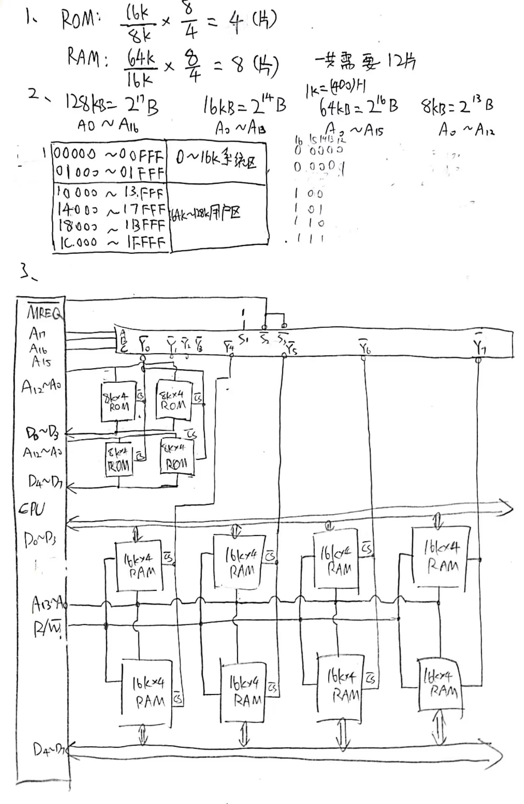

# 2018-2019计算机组成原理期末考试（计科）

一、(17分) 计算

1. IEEE754编码表示的单精度浮点数为(BF400000) H, 其对应的十进制数为多少? (5分)

答案：-0.75  
计算过程：BF400000H = 1011,1111,0100,0000,0000,0000,0000,0000  
符号S=1,是负数。$E = (01111110)_2$，阶码$e = E - 127 = (-1)_{10}$。$M = 10000\cdots 000$，所以尾数为$(1.1)_2 = (1.5)_{10}$。

2. 设 $X=-0.1011_B, Y=0.1101_B$。用加减交替法计算 $X \div Y$，结果保留4位小数，写出商以及余数的真值。(6分)

3. 有两个十进制数：$x=-0.875 \times 2^1, y=0.625 \times 2^2$，设阶码2位，阶符1位，数符1位，尾数4位，按照浮点数加减法的计算方法求 $z=x-y$ 的二进制浮点规格化结果。(6分)

计算步骤如下：
（1）零操作数检查，没有零操作数。  
（2）对阶，小阶向大阶看齐。所以$x = -0.1110\times 2^{+01} = 11.0010 \times 2^{00\;01}$，$y = 0.1100 \times 2^{+10} = 00.1100\times 2^{00\;10}$  
（3）再次检查，无零操作数。  
（4）相减。因为计算$x-y$，所以计算$-y$的补码。$(-y)_{\text{补码}} = 11.0100\times 2^{00\;10}$。计算$x-y = 10.0110 \times 2^{00\;10} = 11.0011 \times 2^{00\;11}$。 

二、(19分) 某8位计算机存储器按字节寻址，地址空间共128KB，地址空间分配如下：$0\sim 16K$ 为系统区，由 $8K \times 4$ 的 ROM组成；地址空间最后64K为用户区，由 $16K \times 4$ 的 RAM芯片组成；。

1. 计算所需的芯片 (2分)
系统区：$d = (16K \times 8)/(8K \times 4) = 4$  
用户区：$d = (64K \times 8)/(16K \times 4) = 8$  
答：需要4片$8K \times 4$的ROM，8片$16K \times 4 $的RAM。

2. 画出地址空间分布图 (6分)

3. 请画出CPU与存储器系统的连线，并注明相关的控制信号 (11分)

三、(12分) 某计算机的主存地址为32位，按字节编址，Cache有128行，采用4路组相联映射方式，Cache块内地址有6位。请问：

1. 主存块的地址标记Tag（主存组号）有几位？(4分)

2. Cache的容量多大？(4分)

3. 主存地址为 $09A4E3C0H$ 的单元被装入 Cache 时，其行号可能为多少？(4分)

四、(10分) 计算机A指令格式包含6位操作码字段(OP)和三个3位地址字段，采用固定长度编码，共有60条指令，OP字段为：000000到111011。其后继产品B需要增加32条指令，与A保持兼容，且操作码尽可能短。

1. 采用操作码扩展技术为计算机B设计指令操作码。(6分)

2. 求计算机B的操作码的平均长度。(4分)

五、(15分) 某机器指令格式如下所示。OP为操作码字段，试分析以下指令格式特点：其中X为寻址特征码，$X=00$ 表示不变址，$X=10$ 表示用变址寄存器 $X2$ 进行变址寻址。

| OP | X | 寄存器X1 | 寄存器X2 |
| --- | --- | --- | --- |
| 偏移量(16位) | 偏移量(16位) | 偏移量(16位) | 偏移量(16位) |

1. 该指令字长是多少？(3分)

2. 根据寻址特征码X，最多可设计多少种寻址方式？(4分)

3. 若某时刻寄存器 $X2=1122H$，请问此时指令 44200010H 和指令 22440010H 的有效地址分别是多少。(8分)

六、（15分）某CPU内部结构如图所示，除A外还设有B、C、D三个寄存器，它们各自的输入和输出端都与CPU内部总线相连，并分别受控制信号控制（如Bin为寄存器B的输入控制，Bout为寄存器B的输出控制），假设ALU的结果直接送入Z寄存器中，一个CPU周期中CPU内部总线只能进行一次数据传送。请设计下列两条指令的完整微程序流图，并标明所需的控制信号。

|指令 | 功能 | 说明|
|--- | --- | ---|
|ADD B, C | (B) + (C) → B | B加C存入B|
|SUB A, [D] | (A) - ((D)) → A | A减（以D为地址的存储器单元）存入A|

七、（12分）简答题

1. 将两个二进制数字A、B和一个进位输入C相加，产生的和输出S为多少？（用公式表示）

    S=A+B+C

2. 为什么需要对DRAM存储器进行“刷新”操作？

    DRAM用栅极电容有无电荷表示信息，每隔一段时间向所有存储元的栅极电容补充电荷

3. 采用“链式查询方式”进行总线总裁时，设备的优先级如何确定？

    越靠近中央仲裁器的优先级越高
4. 按照总线仲裁电路的位置不同，仲裁方式分为哪两类？
    集中式，分布式

5. RISC的最主要的特点是什么？
    第五章

    精简指令系统计算机，简单有限的指令系统；定长指令，指令数目少；配备大量通用寄存器；强调对指令流水线的优化

    PS:CISC复杂指令系统计算机

    指令系统庞大;寻址方式多;指令格式多，指令字长不固定;各种指令使用频率、执行时间相差很大。

6. 程序的“时间同部性”表示什么含义？

    在一段时间访问到的存储单元，过一段时间还会访问到

    PS空间局部性：

