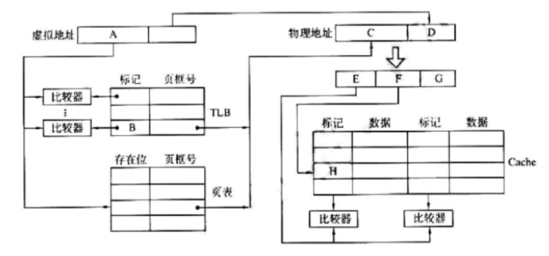

一、（20分）计算

1.IEEE754编码表示的单精度浮点数为(BED00000)H，其对应的十进制数真值是多少？

BED00000=1011 1110 1101 0000

$-1.101\times2^{-2}=0.41625$

将 -131.75 表示成IEEE754编码表示的单精度浮点数（以8位16进制数格式表示）。

$-131.75=1.000001111\times2^7$

1 1000110 000001111=C303C000H

2.某浮点数字长16位，阶码5位（含1位阶符）。尾数11位（含1位数符）。均以补码表示。

请问其所能表示的最大规格化负数是多少？

~~01111 10000000000~~
~~-2^10*2^15=-2^25~~
<span style="color:red;">最大规格化负数，是绝对值最小的规格化负数，阶码尽可能小，尾数尽可能大。</span>
补码规格化形式：0.1xxx或1.0xxx
10000,1.0111111111
$-(2^{-10}+2^{-1})\times2^{-2^4}$

最大规格化正数是多少？(4分)

01111 0.1111111111

$(1-2^{-10})\times2^{2^4-1}$
~~（2^10-1）*2^15~~

3.设x = -01011B，y = 11001B，用加减交替法计算x÷y，结果<mark>保留4位小数</mark>。请写出运算过程，商以及余数的值。(6分)

<span style="color:red;">注意结果保留的是4位小数。还有[-y]补码</span>

<div style="display: flex; flex-direction: row;">
<div style="width:50%;">


</div>
<div style="width:50%;">


</div>
</div>
<br/>

4.已知x=0.125×2^1，y =0.625×2^4，设阶码3位（含1位阶符）。尾数5位（含1位数符）。用浮点数运算方法求 x-y 二进制浮点规格化的结果。并对结果进行简要分析。(4分)

二、（16分）某计算机系统主存空间为8K×8位，最前面的空间由 2K×4位的ROM按位扩展方式构成BIOS，地址最后面的空间由4K×8位的RAM构成数据区，剩余空间全部由1K×8位的RAM芯片构成用户程序区。

1.请写出三种芯片各需要多少片？(3分)

5片

2.将存储器与CPU连接。可行的译码选择方案有哪些？简述优缺点。(4分)

不知道，求解答

3.若采用2:4译码器，请画出CPU与存储器的连线。并注明控制信号。(6分)

4.请问0B1FH 单元所在芯片的最小地址是多少？(3分)

800H

三、（19分）某计算机采用页式虚拟存储管理方式。按字节编址，虚拟地址为32位，物理地址为24位，页大小8KB；快表（TLB）采用全相联映射；Cache数据区大小为64KB，按2路组相联方式组织，主存块大小为64B。存储访问过程如图所示。请回答下列问题。


1.图中字段A~G的位数各是多少？请简要分析理由。(7分)

先计算EFG。其中E、F、G分别表示区号、区内块号、字地址。EFG连接着这个2路组相连的Cache。Cache的行大小等于主存的块大小$64B$。所以$2^G = 64$，也就是$G = 6$。F是块内区号。Cache共有$64KB \div 64B = 1024$行，两行为一组，则有512组。$2^F = 512$，所以$F = 9$。$E+F+G = 24 = \text{物理地址长度}$，所以$E = 9$。  
虚拟地址长度32位，A是逻辑页号，D是页内地址。$2^D = 8KB = \text{页内地址}$，所以$D = 13$。所以$A = 32-D = 19$。$C = 24-D = 11$。  
因为快表是全相连，所以标记位数等于虚存的页数。所以$B = A = 19$。

---

8K=2^13

A=32-13=19位

B=A=19位

64B=2^6,6位
D=13位

C=24-13=11位

64K/64B=1K块=2^10
2^10/2=2^9组

F=9位（表示第几组）

E=C-F=9位

G=D=6位


2.设置快表（TLB）的目的是什么？字段B中存放的是什么信息？(4分)

快表是慢表中部分内容的副本，提高查找速度

答案：
	TLB中标记字段B的内容是虚页号，表示该TLB项对应哪个虚页的页表项。


B:逻辑页号

3.将块号为4099的主存块存入到Cache 中时，所映射的Cache组号是多少？对应的H字段内容是什么？(5分)

00 0100 000 0 1001 1001

答案：
看不懂思密达有人会吗
```
	块号4099=00 0001 0000 0000 0011B，因此，所映射的Cache组号为0 0000 0011B=3，对应的H字段内容为0 0000 1000B。
```


4.Cache缺失处理与缺页处理相比哪种时间开销大？为什么？(3分)

	Cache缺失带来的开销小，而处理缺页的开销大。(1分)因为缺页处理需要访问磁盘，而Cache缺失只要访问主存。

五、（13分）某机器采用单字长指令格式，指令各字段定义如下图所示

1.若采用操作码定长指令格式，该机器指令系统最多可设计多少条指令？(3分)

15-12+1=4；
2^4=16条

2.该计算机最多能设计多少个通用寄存器？简述理由。(4分)

11-6+1=6位

6-3=3

2^3=8,8个通用寄存器

3.若采用可扩展操作码指令格式，且只设计双操作教和无操作数指令，最多可设计多少条双操作数指令？简述理由。(3分)

2^4=16

4.若采用可扩展操作码指令格式，且只设计双操作教和单操作数指令，最多可设计多少条单操作数指令？简述理由。(3分)

16*(2^6)=2^10 条

六、简答题（12分）

1.传统的CPU包括哪两部分？
运算器和控制器

2.用双符号位补码（变形补码）表示数据。当两个符号位为10时，此时该数的数值大小范围是多少？
负溢出
-2<sup>n+1</sup>\~-2<sup>n</sup>-1
若非符号位有n个
10中，
1表示1×-2<sup>n+1</sup>
0表示0×-2<sup>n</sup>
剩下数据部分的范围为0\~2<sup>n</sup>-1

3.采用行、列双译码结构进行地址译码，有什么优点？

减少线的数目

4.微程序控制器由哪三部分组成？

控制存储器
微指令寄存器
地址转移逻辑

5.总线带宽与总线位宽二者有什么关系？

带宽=位宽*工作频率

6.采用“链式查询方式”进行总线总裁时，设备的优先级如何确定？

越靠近中央仲裁器的优先级越高