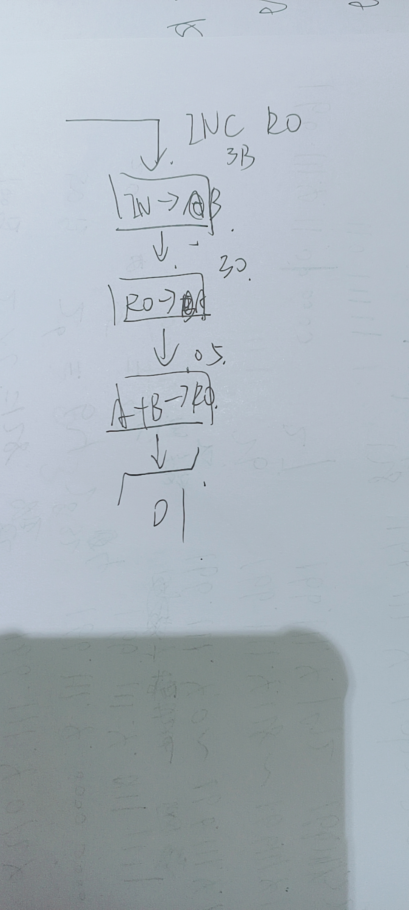
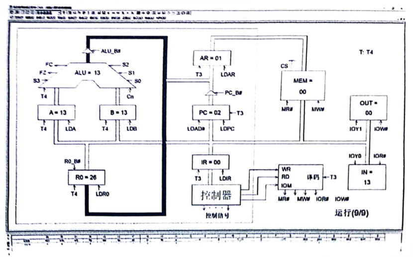

# 2122计组实验期末

1、实验仪器有哪些外部总线？CPU内总线与数据总线是否直通？受哪些信号控制？哪些单元应接入CPU内总线？哪些单元应接入数据总线？

P44

外部总线：数据总线、地址总线、控制总线

受哪些信号控制：


哪些单元应接入CPU内总线？哪些单元应接入数据总线？：不知道，等有缘人写

参考p64图
CPU内总线：IR、ALU&REG、PC&AR
数据总线：IN、OUT、MEM

2、IN、OUT单元的作用分别是什么？如何设置相关的控制信号实现以上功能？（OK）

IN单元作用：
输入数据

OUT单元作用：
输出数据

IN:WR\RD\IOM=011

OUT:WR\RD\IOM=101

3、时序与操作台单元KK2开关“单步”与“单拍”状态有什么区别？（OK）

书P28

单步：运行一条机器指令

单拍：完成一个节拍的工作


4、实验设备发出‘嘀’报警声的原因是什么？应该如何处理？（OK）

P36

总线冲突

立即关闭电源，重新检查冲突所在并关闭三态门，直到排除冲突

5、若IN单元和MEM单元都接在外部数据总线，且都受读写控制逻辑控制，写出将数据55H写入地址AAH单元的操作步骤，并标明相关的控制信号。（OK）

P41-42

（1）IN单元置10101010（AAH），WR/RD/IOM/IOR=0000(关掉存储器的读写),LDAR=1,按动ST产生T3脉冲，即将地址打入AR

(2)IN单元置01010101，WR/RD/IOM=100，使存储器处于写状态，按动ST产生T3脉冲，写入数据

6、CLR按钮有哪些功能？（OK）

P14:对各实验单元清零

7、ALU单元和REG单元在同一个模块中，如何区分它们的输入、输出？


8、T2、T3、T4脉冲分别都有哪些作用？

实验五思考题

**取指周期**

T2:打入微地址寄存器的内容，当前微指令打入微指令寄存器，产生执行部件相应的控制信号

T3:将机器指令打入指令寄存器IR

T4:进行指令译码

**执行周期**

T3:实现OUT单元输出

T4:

往A/B中存数据

把FZ/FC的结果从D触发器送到指示灯R0的写入/读出

ALU的计算


9、程序计数器PC和地址寄存器AR在同一模块，如何区分它们的输出？如何实现PC+1？

第一个不会

实现PC+1：

LDPC=1

LOAD=1

T3脉冲到来

PC+1

10、若A、B寄存器已存入数据，写出ALU实现A加B加1的操作步骤。

实验1

(1)S3S2S1S0=1000,CN=1,连续按动直至产生T4上升沿，实现FC=1

(1)ALU_B=0,LDA=0,LDB=0,S3S2S1S0=1010,连续按动直至产生T4上升沿，实现F=A+B+1

11、若ALU单元的A寄存器中已经存入数据（97）H，FC=0。当S3~S0为0100时，运算结果F为多少？如何读取其运算结果？当S3~S0为0111，CN=1时，运算结果F为多少？FC为多少？如何读取其运算结果？（OK）

```
0100：对A取反
A=10010111
/A=01101000
读取运算结果:WRRDIOM=101
```

12、LDR0和R0_B两个控制信号有什么区别？它们分别如何控制R0寄存器？（OK）
```
LDR0:写入R0
R0_B:读出R0
```

13、读写控制逻辑的IOM、RD和WR高低电平分别表示什么含义？XMWR、XMRD、XIOW和XIOR分别控制什么单元？ （OK）

IOM:是否对MEM读写，为0则对MEM,为1则对外设
RD：是否读入IN/MEM，为1则是
WR:是否写入OUT/MEM，为1则是

XMWR、XMRD：对内存MEM

XIOW和XIOR：对外设

14、在数据通路实验中，采用连续脉冲，如何实现将地址01H的值与地址02H中的值进行异或运算，并将运算结果保存在地址03H单元中？写出主要操作步骤（不必给出相关控制信号）。

实验4

（1）IN单元设置00000001H(地址01H)，LDAR=1,WR\RD\IOM=000，写入AR单元

（2）WR\RD\IOM=010，LDR0=1,01H写入R0

（3）IN单元设置00000010H(地址02H)，LDAR=1,WR\RD\IOM=000，写入AR单元

（4）WR\RD\IOM=010，LDR1=1,02H写入R1

（5）LDA=1,LDB=0，R0写入A;LDA=0,LDB=1,R1写入B

（6）S3S2S1S0=0100,ALU_B=0,得到/A

（7）LDA=1,LDB=0，/A存入A

（8）S3S2S1S0=0010,ALU_B=0，得到/AB

（9）LDR2=1,/AB写入R2

（10）R1_B=0,LDA=1,LDB=0,将R1(B)写入A

（11）S3S2S1S0=0100,ALU_B=0,得到/B

（12）LDA=0,LDB=1，/B存入B

（13）R0_B=0,LDA=1,LDB=0,将R0(A)写入A

（14）S3S2S1S0=0010,ALU_B=0，得到A/B

（15）LDA=0,LDB=1，A/B存入B

（16）R2_B=0,LDA=1,LDB=0,将/AB写入A

（17）S3S2S1S0=0011，ALU_B=0，得到/AB+B/A即异或

（18）LDR0=1,ALU_B写入R0

（19）IN单元设置00000011H(地址03H)，LDAR=1,WR\RD\IOM=000，写入AR单元


（20）R0_B=1,WR\RD\IOM=100，写入03H单元

15、基本模型机实验中，机器指令的后四位有什么作用？若要实现该作用，相关的控制信号要如何接线？

后四位：

选择寄存器R0R1R2R3

LDRi:I0I1=11时LDR0有效

RS_B：I2I3=00,RS_B有效

P57:

接线RS_B连R0_B

LDRi连LDR0

16、若微程序流程图为P62图4-6-4，某两个机器指令码为0110 0000、1100 1011时，经过指令译码后，后继微地址分别为多少？并请简要说明原因。

I7I6=11时I7I6I3I2决定微指令后四位

否则I7I6I5I4决定微指令后四位

机器指令码为0110 0000：

0011 0110=36

机器指令码为1100 1011：

0011 1100=3C

17、参照P62图4-6-4，若其余条件不变，仅修改微指令为$M 03 107060，此时OUT机器指令码经过指令译码后，微程序的微地址为多少？并简要解释。

20

| 高五位 | S3-S0 | A字段 |B字段|C字段|MA5-MA0 |
| --- | --- | --- |--|---|---|
|00000 |0000|  111 | 000| 001 |10，0000|


18、基本模型机实验中，若要实现以下功能：IN→R0, R0中的数值不断翻倍（×2），并将结果显示在OUT单元。应如何修改相关的指令或微指令？

实验6


19、微程序控制实验中增加一条INC R0机器指令，其功能为R0+1→R0，其机器指令码为B0H，请参照p56图4-5-9写出该机器指令完整的微程序流程图（标明微地址）。提示：增量1从IN单元输入。



20、基本模型机实验中，若采用联机软件调试时，某一时刻结果如下图，问：



1）目前执行的微指令其微地址是多少？简述原因

微地址：05H

A+B->R0，即add的最后一条微指令

2）下部窗口中显示的两行编码是什么？请简要说明

A+B->R0和NOP，当前执行的微指令和下一条微指令（不确定）

3）目前执行的是哪一条机器指令？简述原因

ADD，因为正在执行A+B->R0或PC=02

4）当前MEM中显示的是哪个单元的内容？表示什么含义？
01单元的内容，表示ADD机器指令的内容

5）PC寄存器里的内容是什么？表示什么含义？

PC=02，含义是下一条机器指令的地址