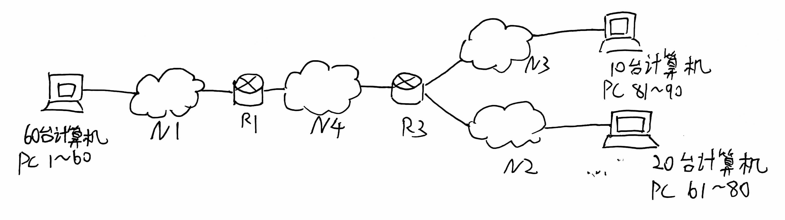
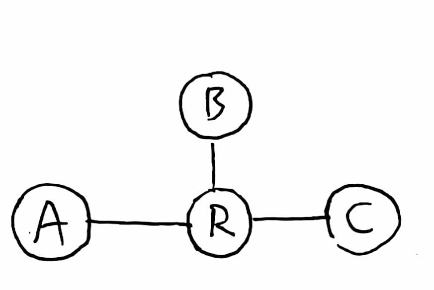
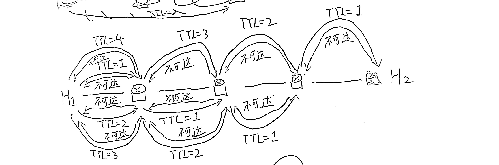
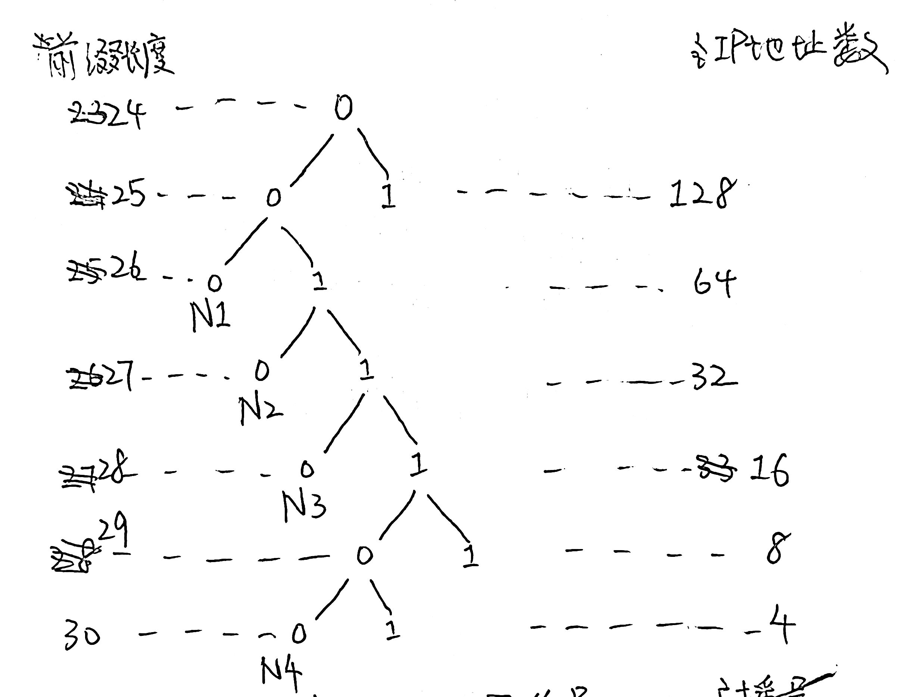

# 2023期中

## 题目

一、填空题（20分）

1. 请写出以下问题是由哪一层协议解决的：（1）在____层决定数据报的路径；（2）在____层把传输的比特流分成数据报（3）在____层将光脉冲变换为二进制码。
2. 将物理信道总带宽分割成若干子信道，每个子信道传输一路信号，这种信道复用技术是____。
3. 采用HDLC传输比特串0111 1111 1000 0001，比特填充后输出是____。
4. 若某通信链路的数据传输率为4800b/s，采用16相位调制，则该链路的波特率是____。
5. 某路由表中有转发接口相同的2条路由表项，其目的网络地址分别为202.118.133.0/24和202.118.130.0/24，将这2条路由聚合后的目的网络地址为____。
6. 路由协议中，____直接使用IP协议进行发送，____使用UDP协议进行发送。
7. ____协议用于在不同自治系统AS之间的路由选择。

二、简答题（40分）

1. （10分）IP首部中有一个“协议”字段，但在IPv6的固定首部中却没有。这是为什么？
2. （10分）简述网络层IP报文直接交付和间接交付的概念，并举例说明在这两种交付方式中的ARP协议的工作过程。
3. （10分）如何使用ICMP消息实现tracert？请画出示意图。
4. （10分）如果在互联网范围内使用链路状态算法计算路由，存在什么问题？请说出至少两个问题。

三、计算题（40分）

1. （10分）考虑建立一个CSMA/CD网络，在1km的线缆上运行速度为1Gb/s（未使用中继器）。线缆上的信号传播速度为200,000km/s。求最小帧长度是多少？

2. （15分）假设地址块为192.168.10.0/24，请给图1所示的小型互联网中的各设备分配IP地址。请按照从大到小，尽量不浪费的原则给N1、N2、N3和N4分配子网。须给出各子网的前缀长度、各子网的网络号（网络地址）和广播号（广播地址）。
 

3. （15分）如图2所示网络拓扑中，各链路距离相等，均为2。已知路由节点R的路由表如下。

<div style="display: flex; align-items: center;">

<div>

| 目的地 | 距离 | 下一跳 |
| --- | --- | --- |
| Net1 | 8 | B |
| Net2 | 6 | B |
| Net3 | 5 | A |
| Net4 | 2 | C |

</div>

<div>

</div>

</div>

   ①R收到来自B的DV信息：(Net1, 4), (Net2, 7), (Net3, 4)，R的路由表如何变化？

   ②紧接着，R又收到来自A的DV信息：(Net2, 2), (Net3, 3), (Net5, 7)，R的路由表如何变化？

   ③R路由表根据B和A的DV信息更新后，使用带毒性逆转的水平分割方法向各个邻居发送自己的DV信息，请列出R发出的DV信息。

（附录是IPv4的头部结构）

## 解答

### 1-1
网络；数据链路；物理
### 1-2
频分复用。（课本56页）
### 1-3
0111 1101 1100 0000 1  
原因：每5个连续的1之后，要插入一个0。
### 1-4

=======
答案：1200

相关公式：
$I = S \cdot \log_{2} n$
其中I是数据传输率（比特率），S是波特率，n是每个码元（每个符号）的负载信息量。

比特率单位是bps（比特/秒）；波特率单位为band（波特）。波特率的定义：单位时间内传输符号的数量。
### 1-5 
202.118.128/21  
### 1-6
第一空：OSPF。（课本P166）  
第二空：RIP。（课本P162）  
### 1-7
BGP。（课本P169）

### 2-1
IPv4首部的“协议”字段，指出此数据报携带的数据使用何种协议，以便目的主机的IP层知道应将数据部分上交哪个协议进行处理。常见协议有ICMP，TCP，UDP，OSPF等。

Ipv6取消了协议字段，用“下一个首部”（“扩展首部”）代替了Ipv4的协议字段或可选字段(p151)

### 2-2
源主机$H_1$要把一个IP数据报发送给目的主机$H_2$。主机$H_1$要先查找自己的转发表，看目的主机$H_2$是否在本网络上。如是，则不需要经过任何路由器而是直接交付。如不是，则必须把IP数据报发送给某个路由。路由器查找转发表之后，再进行间接交付。（P121）  
在直接交付中，ARP协议用于让源主机知道目的主机的MAC地址，并写入高速缓存。然后，源主机向目的主机的MAC地址发送IP数据报。（P133）  
在间接交付中，ARP协议使源主机知道本局域网的路由器的接口的MAC地址，然后源主机把IP数据报发送给此MAC地址（路由器接口），由路由器转发。（P135）  

### 2-3
traceroute(tracert) 发送包含非法端口号的UDP数据报，用IP数据报封装。第1个数据包的TTL为1,经过第1个路由器$R_1$时，TTL减1,$R_1$丢弃此数据报，并向源主机发送一个ICMP超时的报文。接着，再发送TTL为2的数据包，TTL为3的数据包……直到最后一个数据包到达了目的主机，目的主机因为数据包不可交付（含有非法端口号），向源主机发送ICMP不可达消息，traceroute完成。  

图（已经画好了，TBD）




### 2-4

1. 互联网的规模太大，使得自治系统AS之间的路由选择非常困难。主干网上的router，应能转发任何IP地址，因此若使用链路状态协议，每个router都要维护一个很大的链路状态数据库，使用Dijkstra计算最短路花费时间过长。（P168）
2. 链路状态算法没有考虑策略（安全、经济、政治），而互联网上，自治系统AS之间的路由选择必须考虑有关策略。比如有时跳数最少的网络不一定快。比如应当考虑AS之间服务费的计算方式。还应当考虑政治，经济，安全等方面的考虑。比如从国内主机到国内主机的流量，不应经过外国的AS转发。（P168）

### 3-1

最小帧长度应该为： $2 \tau$ 时间内发送的比特数。$\tau$是单程传播时延。  
$$\tau = \frac{1\text{km}}{200,000\text{km/h}} = \frac{1}{200,000} \text{s}$$
$$\text{最小帧长} = 2\tau \times 1\text{Gb/s} = \frac{1 \times 10^9}{100,000} \text{bit} = 10000 \text{bit}$$

所以最小帧长是10000比特。

<span style="color:red">注意计算速率是用K=1000换算，计算存储时用K=1024。</span>

```
网上抄的：

本题考查CSMA/CD协议的最小帧长。在发送的同时要进行冲突检测，这就要求在能检测出冲突的最大时间内数据
不能发送完毕，否则冲突检测不能有效地工作。所以，当发送的数据帧太短时，必须进行填充。最小帧长=数据传
输速率x争用期。争用期=网络中两站点最大的往返传播时间2T=2x(1/200000)=0.00 001;最小帧长
=1000000000x0.00001=10000bit.
```

### 3-2

**以下仅为一种参考答案，答案不唯一**

分配子网按照如下表格。其中“备注”指的是IP地址的第[25,32]位的数值，“x”表示可变范围。备注只是方便理解，考试没要求写。  
|子网|前缀长度|备注|子网网络号|广播号|
|---|---|---|---|---|
|$N_1$|$26$|[00\|xxxxxx]|192.168.10.0|192.168.10.63|
|$N_2$|$27$|[010\|xxxxx]|192.168.10.64|192.168.10.95|
|$N_3$|$28$|[0110\|xxxx]|192.168.10.96|192.168.10.111|
|$N_4$|$30$|[011100\|xx]|192.168.10.112|192.168.10.115|

IP地址分配：  
1. PC1～60分配[192.168.10.1 , 192.168.10.60]共60个IP地址。
2. PC61～80分配[192.168.10.65 , 192.168.10.84]共20个IP地址。
3. PC81～90分配[192.168.10.97 , 192.168.10.106]共10个IP地址。
4. 路由器R1在N1侧的接口，分配192.168.10.61。
5. 路由器R1在N4侧的接口，分配192.168.10.113。
6. 路由器R3在N4侧的接口，分配192.168.10.114。
7. 路由器R3在N3侧的接口，分配192.168.10.107。
8. 路由器R3在N2侧的接口，分配192.168.10.85。

### 3-3
##### （1）
根据DV算法，收到信息后，先把长度+1,然后再比较和更新。  
更新后的转发表如下：
|目的地|距离|下一跳|
|-----|-----|-----|
|Net1|5|B|
|Net2|8|B|
|Net3|5|A|
|Net4|2|C|

##### （2）
|目的地|距离|下一跳|
|-----|-----|-----|
|Net1|5|B|
|Net2|3|A|
|Net3|4|A|
|Net4|2|C|
|Net5|8|A|

##### （3）
毒性逆转的原理：
1. 当R向某个邻居发送距离向量时，如果某个目的地的下一跳是该邻居，则将其距离标记为无穷大 $\infty$。
2. 其余目的地距离保持不变。

关于毒性逆转的解释，可以看 https://blog.csdn.net/zhaoxixc/article/details/88833824


所以结果如下：

R发送给A：
|网络|距离|
|---|---|
|Net1|5|
|Net2|$\infty$|
|Net3|$\infty$|
|Net4|2|
|Net5|$\infty$|

R发送给B：
|网络|距离|
|---|---|
|Net1|$\infty$|
|Net2|3|
|Net3|4|
|Net4|2|
|Net5|8|

R发送给C：
|网络|距离|
|---|---|
|Net1|5|
|Net2|3|
|Net3|4|
|Net4|$\infty$|
|Net5|8|


（1）

书P161

原表
| 目的地 | 距离 | 下一跳 |
| --- | --- | --- |
| Net1 | 8 | B |
| Net2 | 6 | B |
| Net3 | 5 | A |
| Net4 | 2 | C |

收到的（+2）
| 目的地 | 距离 | 下一跳 |
| --- | --- | --- |
| Net1 | 6 | B |
| Net2 | 9 | B |
| Net3 | 6 | B |

最后的
| 目的地 | 距离 | 下一跳 |
| --- | --- | --- |
| Net1 | 6 | B |
| Net2 | 9 | B |
| Net3 | 5 | A |
| Net4 | 2 | C |

（2）
原表
| 目的地 | 距离 | 下一跳 |
| --- | --- | --- |
| Net1 | 6 | B |
| Net2 | 8 | B |
| Net3 | 5 | A |
| Net4 | 2 | C |

收到的（+2）
| 目的地 | 距离 | 下一跳 |
| --- | --- | --- |
| Net2 | 4 | A |
| Net3 | 5 | A |
| Net5 | 9 | A |

最后的
| 目的地 | 距离 | 下一跳 |
| --- | --- | --- |
| Net1 | 6 | B |
| Net2 | 4 | A |
| Net3 | 5 | A |
| Net4 | 2 | C |
| Net5 | 9 | A |

（3）

