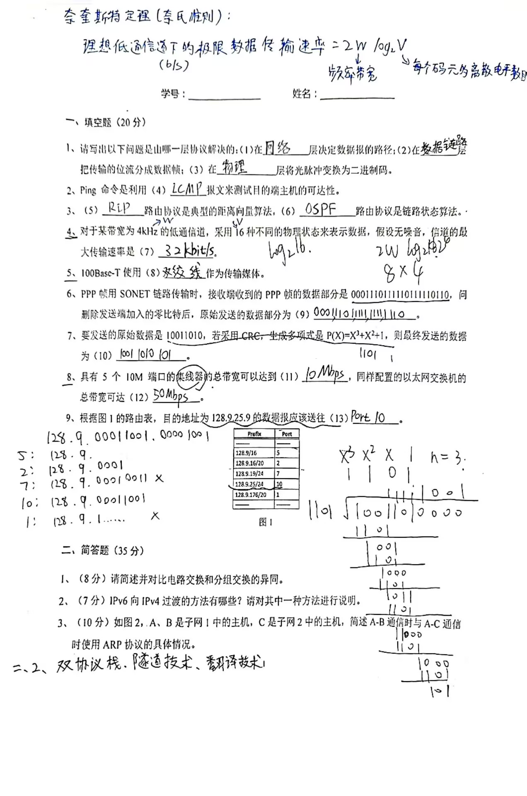
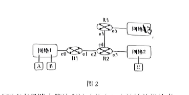
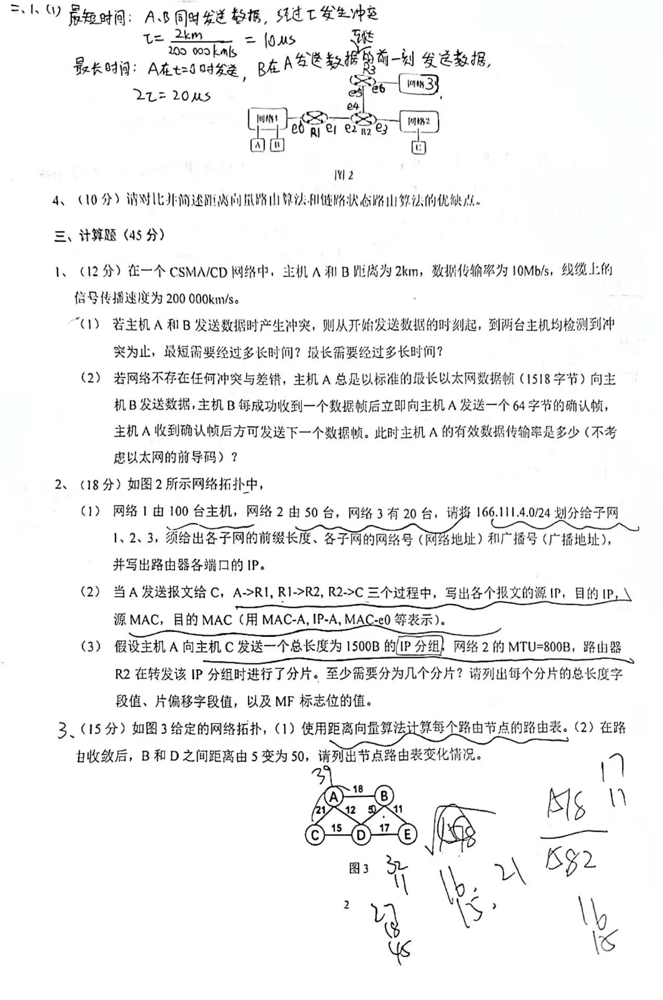

一、填空题（20分）

1、请写出以下问题是由哪一层协设解决的:(1)在__层决定数据报的路径:(2)在__层把传输的位流分成数据帧(3)在__层将光脉冲变换为二进制码。

网络层、数据链路层、物理层

2、Ping命令是利用(4)__报文来测试目的端主机的可达性。
路由协议是链路状态算法。

icmp回复请求报文和icmp回复响应报文

3、(5)_路由协议是典型的距离向量算法，(6)_路由协议是链路状态算法。

RIP
OSPF

4、对于某带宽为 4kHz 的低通信道，采用16种不同的物理状态来表示数据，假设无噪音，信道的最大传输速率是(7)

log216=4

2x4x4=32kHz

6、PPP帧用SONET 链路传输时，接收端收到的PPP帧的数据部分是0001110111110111110110，问删除发送端加入的零比特后，原始发送的数据部分为(9)

0001111111111111110

5、100Base-T使用(8)__作为传输媒体。

双绞线

7、要发送的原始数据是 10011010，若采用CRC，生成多项式是 P(X)=X^3+X^2+1，则最终发送的数据为(10)

P=1101 

10011010000(末尾加3个0)

余数：101
商：11111001

发送：10011010101

8、具有5个10M 端口的集线器的总带宽可以达到(11)_，同样配置的以太网交换机的总带宽可达(12) _

(11)10M

(12)50M

9、
根据图1的路由表，目的地址为128.9.25.9的数据报应该送往(13)

端口10

二、简答题(35 分)

1、(8分)请简述并对比电路交换和分组交换的异同。

书P16

**电路交换：**

1）整个报文的比特流直达终点，在通话的全部时间内，始终占用端到端的通信资源

2）数据传送速率快

3）信道利用率低

4）线路分配灵活性差

5）不支持差错控制

**分组交换**

1）将报文划分为**等长**数据段，加上控制信息的首部构成分组。分组传送到相邻节点，查找转发表并转发。

2）信道利用率高

3）灵活

4）支持差错控制

5）转发分组造成开销

2、(7 分)IPv6 向IPv4 过渡的方法有哪些?请对其中一种方法进行说明。

（1）双协议栈

主机既能接受IPv6协议，又能接受IPv4协议

（2）隧道

在只能用IPv4的网络将IPv6封装进IPv4

3、(10 分)如图2,A、B是子网|中的主机，C是子网2中的主机，简述 A-B通信时与 A-C通信时使用 ARP协议的具体情况。

