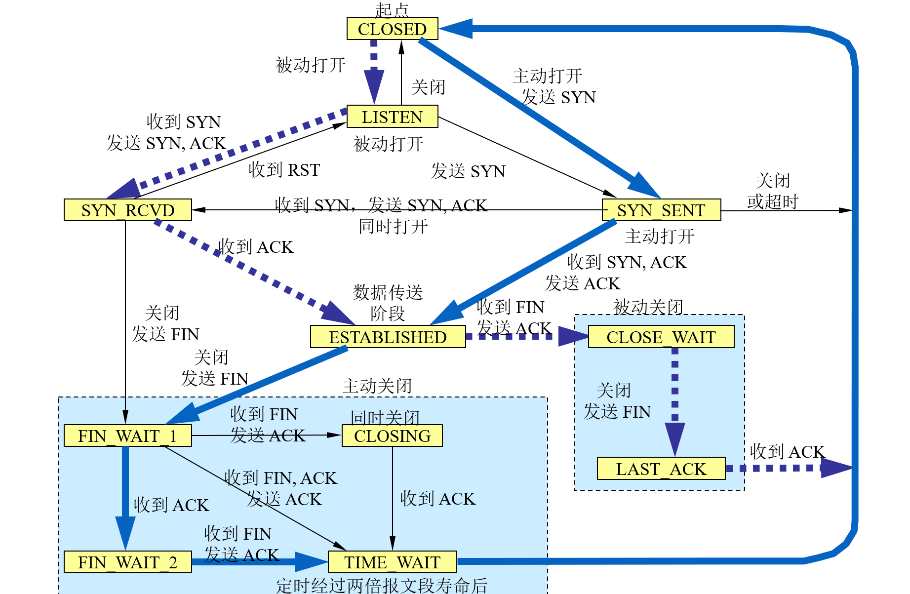

# 计网笔记

[toc]

## 第二章 物理层

### 信道的极限容量

#### 奈奎斯特准则

在理想低通（没有噪声、带宽受限）信道中

$$C=2Wlog_2V$$

$C$:理想信通状态下的极限数据传输速率(bit/s或b/s或bps)
$W$:信道的频率带宽(Hz)
$2W$:极限码原传输速率
$V$:每个码元的离散电平数目(指有多少种不同的码元)

#### 香农公式

$$C=Wlog_2(1+S/N)$$

$$信噪比(DB)=10log_{10}(S/N)$$

$C$:信道的的极限数据传输速率(bit/s或b/s或bps)
$W$:信道的频率带宽(Hz)
$S$:信道内所传信号的平均功率
$N$:信道内部的高斯信号功率

## 第五章 运输层

### udp和tcp

TCP/IP运输层的两个主要协议

1. 用户数据报协议UDP
2. 传输控制协议TCP

#### udp和tcp的特点

|特点|UDP|TCP|
|---|---|---|
|主要特点|简单方便，但不可靠||
|连接|无连接|面向连接的运输层协议|
|可靠交付？|尽最大努力交付，<br/>不保证可靠交付|可靠交付<br/>无差错，不丢失，不重复，按序到达|
|方向|支持一对一，一对多，多对一，多对多的交互通信|每一条TCP连接只能有两个端点，每一条TCP连接只能是点对点的<br/>全双工通信|
|面向|报文|字节流（流入到进程或从进程流出的字节序列）|
|首部|开销小|开销大|
|拥塞控制|没有|有|

#### udp和tcp伪首部的作用

**计算检验和。**
把首部和数据部分一起检验。
udp的伪首部，协议号为17
tcp的伪首部，协议号为6

#### udp和tcp的首部

### tcp可靠传输的工作原理

#### 信道利用率

$$U=\frac{T_D}{T_D+RTT+T_A}$$
其中，
$U$为信道利用率
$T_D$为分组长度/数据率
$T_A$为接收方发送确认分组需要的时间
$RTT$为往返时间

#### 停止等待协议

优点：简单
缺点：信道利用率太低

#### 连续ARQ协议和滑动窗口协议

#### 超时重传时间选择

$$RTO=RTT_S+4\times RTT_D$$

第一次测量：

$$RTT_S=RTT样本$$

$$RTT_D=RTT样本\times \frac{1}{2}$$

后面：

$$新的RTT_S=(1-\alpha)\times(旧的RTT_S)+\alpha\times(新的RTT样本)$$

$$新的RTT_D=(1-\beta)\times(旧的RTT_D)+\beta\times|RTT_S-新的RTT样本|$$

其中，
$RTT$为报文段的往返时间
$RTT_S$为加权平均往返时间（平滑的往返时间）
$RTO$为超时重传时间
$RTT_D$是$RTT$的偏差的加权平均值

推荐$\alpha=1/8$，$\beta=1/4$

**Karn算法**：在计算加权平均$RTT_S$时，只要报文段重传了，就不采用其往返时间样本。这样得出的加权平均$RTT_S$和$RTO$就比较准确

### tcp的流量控制

利用滑动窗口进行流量控制。
发送方的发送窗口不能超过接收方给出的接收窗口的数值。
TCP的窗口单位是字节，不是报文段。

### tcp的拥塞控制

拥塞：

$$\sum对资源的需求>可用资源$$

拥塞控制：防止过多的数据注入到网络中，这样可以使网络中的路由器或链路不至于过载。

<mark>**拥塞控制算法**</mark>(p241)

MSS：最大报文段长度
cwnd：拥塞窗口
rwnd：接收方窗口（通知窗口）
ssthresh：慢开始门限
发送窗口的上限值=```Min[rwnd,cwnd]```

超时时，执行**慢开始**和**拥塞避免**
3-ACK时，执行**快重传**和**快恢复**

具体如下：

#### 1.慢开始

由小到大逐渐增大注入到网络中的数据字节，由小到大逐渐增大拥塞窗口数值

tcp开始发送报文段时,先设置cwnd=1\~2个MSS（目的：试探一下网络的拥塞情况），然后再逐渐增大cwnd。
发送方每收到一个对新报文的确认（不包括对重传的确认），就把发送方的拥塞窗口+1。即cwnd加倍

$$初始cwnd=1$$

$$新的cwnd=旧的cwnd\times2$$

当发送方判断网络拥塞（未按时收到确认）时

+ 第一步：

    $$ssthresh=Max((出现拥塞时的cwnd\div 2), 2)$$

+ 第二步：重新执行慢开始算法
    目的：迅速减少主机发送到网络中的分组数，使得发生拥塞的路由器有足够时间把队列中积压的分组处理完。

#### 2.拥塞避免

<mark>加法增大AI</mark>
拥塞窗口cwnd按线性规律缓慢增长，每经过一个往返时延RTT就把cwnd加1，而不是加倍。

$$新的cwnd=旧的cwnd+1$$

目的：让拥塞窗口cwnd缓慢增大。

慢开始门限ssthresh的用法：

||算法|
|---|---|
|cwnd < ssthresh|慢开始|
|cwnd = ssthresh|拥塞避免|
|cwnd > ssthresh|慢开始或拥塞避免|

当发送方判断网络拥塞（未按时收到确认）时

+ 第一步：

    $$ssthresh=Max((出现拥塞时的cwnd\div 2), 2)$$

+ 第二步：重新执行慢开始算法
    目的：迅速减少主机发送到网络中的分组数，使得发生拥塞的路由器有足够时间把队列中积压的分组处理完。

慢开始和拥塞避免遇到网络拥塞，都要这么做。

#### 3.快重传

发送方只要**一连收到3个重复确认**（3个冗余ACK），就可知道现在并未出现网络拥塞，而是接收方少收到一个报文段，因而**立即重传**相应的报文段，而不等待报文段的超时计时器再重传。
目的：让发送方尽早知道发生了个别报文段的丢失

#### 4.快恢复

<mark>乘法减小MD</mark>
发送方连续收到3个冗余ACK时，

$$新的cwnd=ssthresh=当前cwnd\div 2$$

然后执行**拥塞避免**算法（加法增大）

与慢开始算法不同的是，它不是将cwnd调整为1，而是减为一半。要预防网络发生拥塞，但发送方认为没有那么严重的拥塞。

---

### tcp的有限状态机



---

### 第五章习题

课本p253

#### 5-12

一个应用程序用 UDP, 到了IP层把数据报再划分为4个数据报片发送出去。结果前两个数据报片丢失，后两个到达目的站。过了一段时间应用程序重传UDP,而IP层仍然划分为4个数据报片来传送。结果这次前两个到达目的站而后两个丢失。试问：在目的站能否将这两次传输的4个数据报片组装为完整的数据报？假定目的站第一次收到的后两个数据报片仍然保存在目的站的缓存中。

解答：不行。重传时， IP数据报的**标识字段**会有另一个标识符。仅当**标识符相同**时IP数据报片才能组装成一个IP数据报。前两个IP数据报片的标识符与后两个IP数据报片的标识符不同，因此不能组装成一个IP数据报。

#### 5-21

假定使用连续 ARQ 协议，**发送窗口大小是3**, 而序号范围是[0, 15]，而传输媒体保证在接收方能够按序收到分组。在某一时刻，在接收方，下一个期望收到的序号是5。试问：

(1) 在发送方的发送窗口中可能出现的序号组合有哪些？
(2) 接收方已经发送出的、但仍滞留在网络中（即还未到达发送方）的确认分组可能有哪些？说明这些确认分组是用来确认哪些序号的分组。

解答：

(1) 在接收方，下一个期望收到的序号是5。这表明序号到**4**为止的分组都**已收到**。若这些确认都已到达发送方，则发送窗口最靠前，其范围是[5,7]。
假定所有的确认都丢失了，发送方都没有收到这些确认。这时，发送窗口最靠后，应为[2, 4] 。因此，发送窗口可以是[2, 4], [3, 5], [4, 6], [5, 7]中的任何一个。

(2) 接收方期望收到序号5 的分组，说明序号为2,3,4的分组都已收到，并且发送了确认。
对序号为 1 的分组的确认肯定被发送方收到了，否则发送方不可能发送4号分组。可见，对序号为2,3,4的分组的确认有可能仍滞留在网络中。这些确认是用来确认序号为2,3,4的分组的。

#### 5-68

在 TCP 的连接建立的三报文握手过程中，为什么第三个报文段不需要对方的确认？这会不会出现问题？

A在发送第三个报文段时有两种选择

+ 仅仅是确认而不携带数据
+ 不仅是确认，而且携带上自己的数据

当服务器端B在经过一段时间后未收到来自A的确认报文段，会终止这个半开状态，A必须重新建立TCP连接。这是第三个报文段的丢失导致TCP连接无法建立。
但假设A紧接着就发送数据，由于在数据报文段中，自己的序号不变，ACK=1，确认号是B的初始序号加1。当B收到这个报文段，就知道A收到了自己发送的SYN+ACK报文段，于是进入ESTABLISH状态。
A丢失了第三个报文段就不会造成影响。于是A发送第一种选择，只要紧接着发送数据报文段就无妨。

#### udp和tcp选择题

+ tcp首部没有目标主机ip地址
+ udp提供不可靠的传输服务，不需要对报文编号，所以不会有**序列号字段**。而tcp提供可靠的传输服务，因此需要设置序列号字段。
+ 目的IP地址属于ip数据报中的内容。
