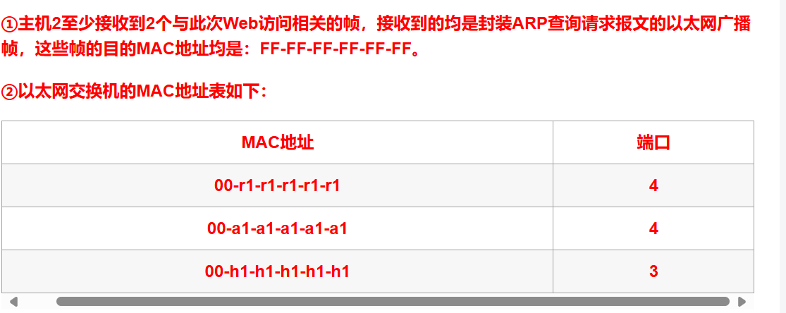

## 10.简单网络管理协议 SNMP(UDP)
网络管理协议

探询和陷阱：
周期性的探询以及在两次探询之间的特殊情况，陷阱
## 11.动态主机配置协议DHCP
即插即用连网，无需手动配置则可加入新的网络获得IP地址
## 12.邮件协议
### 1.POP与SMTP

POP邮件读取协议，SMTP简单邮件传送协议（发送）

### 2.POP与IMAP
共同点：客户服务器方式

不同点：
POP:用户只要一读取，服务器就删除

IMAP：可以保存邮件，读取需要上网，可以在不同地点使用不同计算机

### 3.POP的工作流程
客户服务器：用户代理运行POP客户程序，

收件人的邮件服务器运行POP服务器程序和SMTP服务器程序，读取从客户程序发来的邮件

### 4.MIME

在SMTP的基础上在邮件首部说明邮件数据格式

## 13.掌握HTTP协议的作用和工作过程；能描述出当用户在浏览器中输入某一URL地址后，数据传输的过程和用到的所有协议；
**例1：**
域名转换的过程 域名服务器中的高速缓存

若主机m.xyz.com查询y.abc.com

(1)域名放在 DNS请求报文中，以 UDP 用户数据报方式发给本地域名服务器dns.xyz.com

(2)本地服务器先看高速缓存有没有

(3)没有就向根服务器迭代查询

(4)根服务器告诉本地服务器向dns.com顶级服务器查询

(5)顶级服务器告诉本地服务器向权限域名服务器dns.abc.com查询

(6)权限域名服务器告诉本地服务器IP地址

高速缓存：存最近查询过的域名映射的信息，减少根服务器的负担，减少DNS查询报文的数量


**例2**：在浏览器中输入https://www.zhaopin.com并按回车，直到智联招聘的网站首页显示在浏览器的过程中，按照TCP/IP参考模型，问：

（1）从应用层到网络接口层都用到了哪些协议？请简要说明协议的名称和作用。

（2）客户端的浏览器需要经过哪些步骤才能将该主页显示在客户端的屏幕上，简要描述从输入网址到页面显示的整个流程。

重要程度：★★★★★
```
（1）从应用层到网络接口层用到的协议：

①应用层用到的协议主要有HTTP和DNS协议，HTTP规定了WEB服务器和浏览器之间传输WEB网页时需要遵循的规则和格式，DNS协议用于域名解析；

②传输层用到的协议主要有TCP和UDP协议，TCP协议为HTTP提供可靠的数据传输，而DNS一般使用传输层的UDP协议；

③网络层用到的主要协议有IP、ARP协议，IP协议用于数据包的传输，ARP协议用于将本机的默认网关IP地址映射为物理MAC地址。

④数据链路层：不同的局域网将会使用不同的标准，目前常用的以太网标准是802.3，无线局域网标准是802.11。

(2)

①DNS解析域名：得到WEB服务器的IP地址；

②TCP连接：浏览器与www.zhaopin.com的Web服务器建立TCP连接；

③HTTP 请求报文：浏览器利用HTTP的GET方法向www.zhaopin.com的Web服务器发送获取首页资源的请求；

④HTTP响应报文：Web服务器在接收到浏览器的HTTP请求后，将构建所请求Web页面的各种信息，并将信息（由HTML描述）通过Internet传送给客户端的浏览器；

⑤显示：浏览器对收到的信息进行解释，然后将Web页面显示在屏幕上。
```


## 14.掌握DHCP协议的作用和工作原理，能描述DHCP协议的工作过程

某网络拓扑如下图所示，其中路由器内网接口、DHCP服务器、DNS服务器与主机1均采用静态IP地址配置，相关地址信息见图中标注；主机2~主机N通过DHCP服务器动态获取IP地址等配置信息。


请回答以下问题：

（1）DHCP服务器可为主机2~主机N动态分配IP地址的最大范围是什么？主机2使用DHCP协议获取IP地址的过程中，发送的封装DHCP Discover报文的IP分组的源IP地址和目的IP地址分别是什么？（5分）

（2）若主机2的ARP表为空，则该主机访问Internet时，发出的第一个以太网帧的目的MAC地址是什么？封装主机2发往Internet的IP分组的以太网帧的目的MAC地址是什么？（5分）

（3）若主机1的子网掩码和默认网关分别配置为255.255.255.0和100.110.15.2，则该主机是否能访问DNS服务器？是否能访问Internet？请说明理由。（5分）

**据说很重要：（4）若主机1的ARP表和以太网交换机的MAC地址表均为空，主机1在此刻利用浏览器输入域名请求访问Internet中的某台Web服务器，直到该web页面在浏览器显示出来，假设期间网络未发生任何与此次Web访问无关的网络通信，问：**

①主机2至少会接收到几个与此次Web访问相关的帧？接收到的是什么帧？帧的目的MAC地址是什么？

②写出此时以太网交换机的MAC地址表的内容（MAC地址表只有MAC地址和端口两项内容）

 重要程度：★★★★★

（1）DHCP服务器可为主机2~主机N动态分配IP地址的最大范围是100.110.15.5~100.110.15.254；主机2发送的封装DHCP Discover报文的IP分组的源IP地址和目的IP地址分别是0.0.0.0和255.255.255.255。

（2）主机2发出的第一个以太网帧是ARP请求帧，其的目的MAC地址是FF-FF-FF-FF-FF-FF；封装主机2发往Internet的IP分组的以太网帧的目的MAC地址是00-r1-r1-r1-r1-r1。

（3）主机1能访问DNS服务器，但不能访问Internet。由于主机1的子网掩码配置正确，所以能访问同一个子网内的DNS服务器，但是默认网关配置错误，应该配置为路由器位于内网的接口地址100.110.15.1，所以无法访问Internet。


（第二行应该错了：端口为2）