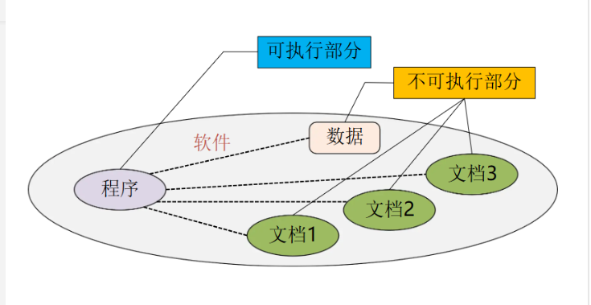
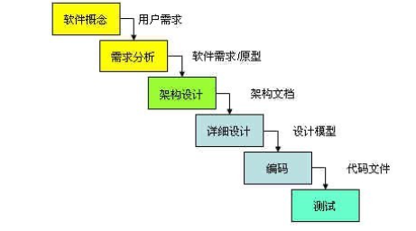
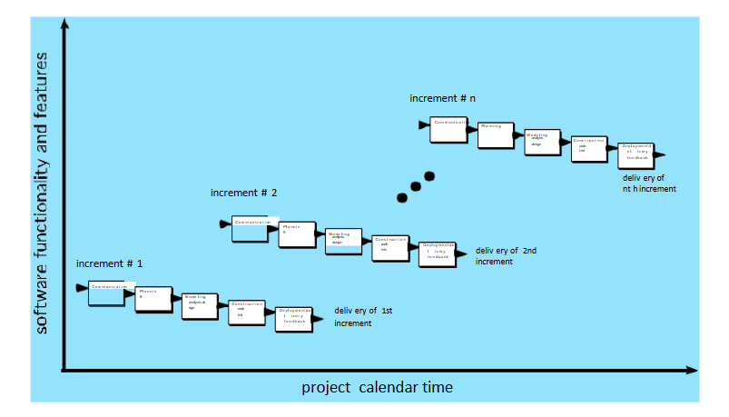
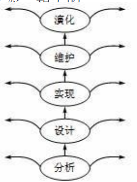
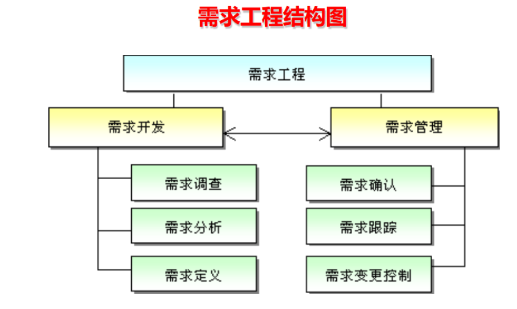
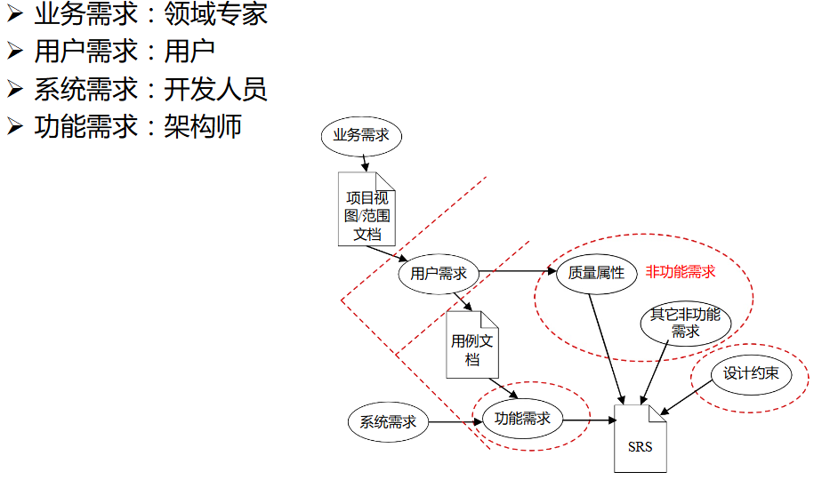
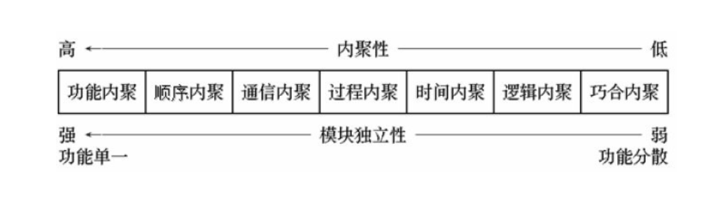
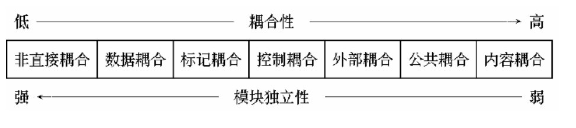

P.S：部分来源于学长，部分来自ppt
# 一、软件工程：
## 1.软件定义
软件是**逻辑的而不是有形的系统元件**

**程序**（可执行部分）：**它被执行时提供希望功能和性能的指令**
程序是按事先设计的功能和性能要求执行的指令序列

**数据**（不可执行部分）：**使得程序能够适当地操作信息的数据结构**
如文字、图形、图像、声音等

**文档**（不可执行部分）：**描述程序操作和使用的文档**
	与程序开发、维护和使用有关的阐明性资料，文档一般是给人看的，不一定装入计算机
## 2.软件危机
（1）定义

落后的**软件生存方式**无法满足迅速增长的计算机**软件需求**，

从而导致软件开发与维护过程中出现一系列严重问题的现象。

（2）问题

许多软件项目**不能满足客户的要求**
（需求）

许多软件项目**超出预算和时间安排**（成本）

（3）表现

对软件开发**成本和进度**的估计常常很不正确（成本）

用户对“已完成的”软件系统**不满意**的现象经常发生（需求）

软件产品的**质量**往往靠不住（质量）

软件常常是**不可维护**的

软件通常没有适当的**文档**资料（文档）

软件成本在计算机系统总成本中所占的比例逐年上升

软件开发生产率提高的速度远远跟不上计算机应用迅速普及深入的趋势

(4)原因

软件是**逻辑**产品，开发进度、成本难以估计

缺乏或不完整、不一致的**文档**给维护带来困难（文档）

用户对软件**需求**的描述往往不够精确，有遗漏，有二义性（需求）

软件开发人员对需求的理解与用户的本来愿望有差异

---

大型软件项目需**多人协同**完成，缺乏管理经验

开发人员不能有效地、独立地处理大型软件的全部**关系**

缺乏有力的**方法学和工具**的支持

软件项目的特殊性和人类智力的局限性

（5）解决途径

消除**错误**的概念和做法

推广使用**成功**的开发技术和方法

使用**软件工具和软件工程**支持环境
## 3.生存周期
软件生存周期（SDLC）大体可分为如下几个活动：计算机系统工程、需求分析、设计、编码、测试、运行和维护
## 4.过程模型
瀑布模型

增量模型

	增量模型将软件的开发过程分成若干个日程时间交错的线性序列，每个线性序列产生软件的一个可发布的“ 增量”版本，后一个版本是对前一版本的修改和补充，重复增量发布的过程，直至产生最终的完善产品

原型模型

    原型（prototype）是**预期系统的一个可执行版本**，它反映了系统性质（如功能、计算结果等）的一个选定的子集。一个原型不必满足目标软件的所有约束，其目的是能快速、低成本地构建原型

螺旋模型

    螺旋模型沿着螺线旋转，在四个象限上分别表达	四个方面的活动，即：
    - 制定计划：确定软件目标，选定实施方案，弄清项目开发的限制条件
    - 风险分析：评价所选的方案，识别风险，消除风险
    - 工程实施：实施软件开发，验证工作产品
    - 客户评估：评价开发工作，提出修正建议

喷泉模型

    体现迭代和无间隙特征
	迭代：各开发活动常常重复工作多次，相关的功能在每次迭代中随之加入演进的系统
	无间隙：开发活动之间不存在明显的边界（一个过程不能明显区分出是分析、设计还是实现，可能三种活动都在做）

## 5.软件生命周期
感觉和3是一样的吗？
# 项目管理：
## 1.软件项目管理
**软件项目管理定义**

是指**软件生存周期中软件管理者所进行的一系列活动**，其目的是在一定的时间和预设范围内，有效地利用人力、资源、技术和工具，使软件系统或软件产品按原定计划和质量要求如期完成。

**软件项目管理的关注点（4P）**

- 人员（People）
人员是软件工程项目的基本要素和关键因素
在对人员进行组织时，有必要考虑参与软件过程（及每一个软件项目）的人员类型
- 产品（Product）
定义项目范围，其中包括建立产品的目的和范围、可选的解决方案、技术或管理的约束等
- 过程（Process）
通常将项目分解为任务—子任务等，其分解准则是基于 软件工程的过程
- 项目（Project）
采用科学的方法及工具对项目基本内容进行管理
## 2.风险
（1）

**被动风险**
大多数软件项目团队还是仅仅依赖于被动的风险策略。被动策略最多不过是针对可能发生的风险来监测项目，直到风险发生时，才会拨出资源来处理它们。

**主动风险**
主动（proactive）风险策略早在技术工作开始之前就已经启动了。标识出潜在的风险，评估它们出现的概率及产生的影响，并按其重要性进行排序。

（2）

**不确定性（uncertainty）**。风险可能发生也可能不发生；即没有100％会发生的风险（100％发生的风险是加在项目上的约束）。

**损失（loss）**。如果风险发生，就会产生恶性后果或损失。

（3）分类

**项目风险（project risk）** 威胁到**项目计划**。也就是说，如果项目风险发生，就有可能会拖延项目的进度和增加项目的成本。项目风险是指预算、进度、人员(聘用职员及组织)、资源、利益相关者、需求等方面的潜在问题以及它们对软件项目的影响。在第4讲估算中，项目复杂度、规模、及结构不确定性也属于项目(和估算)风险因素。

**技术风险（technical risk）** 威胁到要**开发软件的质量及交付时间**。如果技术风险发生，开发工作可能变得很困难或根本不可能。技术风险指设计、实现、接口、验证和维护等方面的问题。此外，规格说明的歧义性、技术的不确定性、陈旧的技术以及“前沿”技术也是技术风险因素。技术风险的发生是因为问题比我们所设想的更加难以解决。

**商业风险（business risk）** 威胁到要**开发软件的生存能力** ，且常常会危害到项目或
产品。五个主要的商业风险是：
(1)开发了一个没有人真正需要的优秀产品或系统(市场风险)； (2)开发的产品不再符合公司的整体商业策略(策略风险)；
(3)开发了一个销售部门不知道如何去销售的产品（销售风险）；
(4)由于重点的转移或人员的变动而失去了高级管理层的支持(管理风险)； (5)没有得到预算或人员的保证(预算风险)。
**风险缓解、监测和管理计划（RMMM计划）** 。Risk Mitigation,Monitoring and Management
## 4.项目进度安排：基本原则
**项目划分** ：将项目划分成多个可以管理的活动、动作和任务。为了实现项目的划分，产品和过程都需要进行分解。

**依赖性**：划分后的各个活动、动作或任务之间的相互依赖关系必须是明确的。有些任务必须按顺序出现，而有些任务则可以并发进行。有些活动或动作只有在其他活动产生的工作产品完成后才能够开始，而有些则可以独立进行。

**时间分配** ：每个安排了进度计划的任务必须分配一定数量的工作单位（例如，若干人·日的工作量）。此外，还必须为每个任务指定开始日期和完成日期，任务的开始日期和完成日期取决于任务之间的相互依赖性及工作方式是全职还是兼职。

**工作量确认** ：每个项目都有预定数量的人员参与。在进行时间分配时，项目管理人员必须确保在任意时段中分配的人员数量不会超过项目团队中的总人员数量。例如，某项目分配了3名软件工作师（例如，每天可分配的工作量为3人·日）。在某一天中，需要完成7项并发的任务，每个任务需要0.50人·日的工作量，在这种情况下，所分配的工作量就大于可供分配的工作量。

**确定责任** ：安排了进度计划的每个任务都应该指定特定的团队成员来负责。

**明确结果** ：安排了进度计划的每个任务都应该有一个明确的输出结果。对于软件项目而言，输出结果通常是一个工作产品（例如一个模块的设计）或某个工作产品的一部分。通常可将多个工作产品组合成“可交付产品”。

**确定里程碑** ：每个任务或任务组都应该与一个项目里程相关联。当一个或多个工作产品经过质量评审并且得到认可时，标志着一个里程碑的完成。

## 5.软件质量保证
（1）软件质量定义：

软件要**符合明确的功能和性能需求**，符合**已清晰文档化** 的开发标准，并且具有专业人员开发的软件所应有的**隐含特征**。

（2）SQA活动

SQA活动都是由一个独立的SQA小组完成的，包括以下的工作：

编制项目质量保证计划（编制计划）

参与项目的软件过程描述的编写（参与文档编写）

评审软件工程活动，以验证是否符合规定的软件过程（评审活动）

审核指定的软件工作产品以验证是否遵守作为软件过程一部分的那些规定（审核产品）

确保根据文档化的规程记录和处理软件工作及工作产品中的偏差（控制规程与实际产品的偏差）

记录各种不符合的部分，并报告给高层管理人员（记录不合规部分并报告）
## 6.软件评审种类
在休息室里讨论技术问题的**非正式会谈**是一种评审方式；

将**软件架构正式介绍**给客户、管理层和技术人员也是一种评审方式。

**正式技术评审（FTR）**，即同行评审，有时也称为走查（Walkthrough）或审查（inspection）。从质量保证的角度出发，正式的技术复审是最有效的过滤器。由软件工程师（或其他人）进行的正式技术复审是一种发现错误和提高软件质量的有效手段。

## 7.正式技术评审
正式技术评审（FTR）是一种由软件工程师（以及其他人）进行的软件质量控制活动。
FTR的目标是：

(1)发现软件的任何一种表示形式中的功能、逻辑或实现上的错误； （发现错误）

(2)验证评审中的软件是否满足其需求；（验证满足需求）

(3)保证软件的表示符合预先定义的标准；（符合标准）

(4)得到以统一的方式开发的软件； （统一开发方式）

(5)使项目更易于管理。（易于管理）

由于FTR的进行使大量人员对软件系统中原本并不熟悉的部分更为了解，因此，
FTR还起到了提高项目连续性和培训后备人员的作用。

FTR实际上是一组评审方式，包括**走查（Walkthrough）、审查（Inspection）、轮查（Round-robin Review）** 以及其他软件小组的技术评估。

每次FTR都以会议形式进行，只有经过适当的计划、控制和参与，FTR才能获得成功。

在后面的段落中，我们给出了类似于走查的典型正式技术评审的指导原则。
## 8.什么是软件质量控制？
质量控制是为了保证每一件工作产品都能**满足对它的需求**而应用于整个开发周期中的一系列**审查、复审和测试**。
## 9.质量成本的构成有哪些？
质量成本可以细分为 **预防成本、鉴定成本 及失效成本**。

**预防成本** 包括质量计划、正式技术复审、测试设备及培训。

**鉴定成本**包括为深入了解“首次通过”各个过程时的产品状态而开展的那些活动。如：过程内和过程间的审查，设备校准和维护，测试。

**失效成本**是指如果将产品交付给客户之前没有缺陷的话就不会存在的成本。
## 10.软件工程中的六西格玛
六西格玛方法学有3个主要的核心步骤：

**定义** ：通过与客户交流的方法来定义客户需求、可交付的产品及项目目标。

**测量** ：测量现有的过程及其产品，以确定当前的质量状况（收集缺陷度量信息）

**分析** ：分析缺陷度量信息，并挑选出重要的少数原因。

如果某个现有软件过程是适当的，只是需要改进，六西格玛还需要另外两个核心步骤：

**改进** ：通过消除缺陷根本原因的方式来改进过程。

**控制** ：控制过程以保证以后的工作不会再引入缺陷原因。以上3个核心步骤和另两个附加步骤有时叫做 DMAIC方法。

如果某组织正在开发软件过程（而不是改进现有的过程），则需要增加下面两个核
心步骤：

**设计**：设计过程，以达到（1）避免缺陷产生的根本原因；（2）满足客户需求。

**验证**：验证过程模型是否确实能够避免缺陷，并且满足客户需求。上述步骤有时称为DMADV（定义、测量、分析、设计和验证）方法。
## 11.变更管理，也称为软件配置管理（SCM）
**软件配置管理（SCM）**，又称为变更管理，是 **在软件生命期内管理变化的一组活动**，用来标识、控制、报告变化，确保适当的实现了变化。

**基线**：通过了正式复审的软件配置项，可以作为进一步开发的基础，只有通过正式的变化控制过程才能改变它。

**步骤**：

1. 由于在开发软件时会产生很多工作产品，所以必须 **唯一标识每一个工作产品**。
2. 标识了工作产品之后，就可以 **制定版本和变更控制机制** 了。
3. 为了保证变更发生时维护好质量，就要 **审核变更过程**；
4. 为了保证将变更通知到那些需要知道的人员，就要 **报告变更**。
## 维护 版本 关键点(PPT上归纳的，不知道是啥)
# 软件估算：类型、方法、比较等
# 需求分析：原则、步骤、可行性分析、SRS等
## 1.需求分析的基本原则
- 能够表达和理解问题的**数据域和功能域**
- 按自顶向下、逐步分解的方式对问题进行**分解和不断细化**
- 要给出系统的**逻辑视图和物理视图**
## 2.步骤（不确定）

## 3.可行性分析
- 经济可行性：主要进行成本效益分析，从经济角度，确定系统是否值得开发
- 技术可行性：主要根据系统的功能、性能、约束条件等，分析在现有资源和技术条件下系统能否实现
- 法律可行性：研究系统开发过程中可能涉及到的合同、侵权、责任以及各种与法律相抵触的问题
## 4.软件需求规格说明书(SRS)
- 需求分析的主要成果：软件需求规格说明书(Software Requirement Specification,SRS)
- 为用户、需求分析人员、系统设计人员、开发人员及测试人员之间相互理解和交流提供了方便
- 是系统设计、实现、测试和验收的主要依据
- 需要及时更新
## 5.需求种类
用户需求

功能需求

系统需求

业务需求

非功能需求

# 软件设计：任务、总体设计、详细设计、结构化分析、数据流图、数据字典、判定树、判定表等
## 1.高内聚低耦合
高内聚：内部结构紧密

低耦合：模块间关联和依赖程度尽可能小，接口简单

## 2.内聚度的七个层次

## 3.耦合度的七个层次

# 建模编码：程序设计语言、编码风格等
# 软件测试：测试覆盖、白盒测试、黑盒测试、单元测试、集成测试等
## 1.白盒测试、黑盒测试
（1）

白盒测试：知道产品的**内部工作过程** ，通过测试来检验产品内部动作是否按照规格说明书的规定正常进行

逻辑覆盖测试

基本路径测试

数据流测试

循环测试：简单循环、嵌套循环、串接循环和非结构循环

（2）

黑盒测试：知道产品应该**具有的功能** ，通过测试来检验每个功能是否都能正常使用

1.等价类划分

2.边界值分析

3.比较测试

4.错误猜测

5.因果图

6.功能图
# 质量保证：手段工具、评审、测试规范、变更控制、缺陷管理等