# 《软件工程》期末笔记
**题型**
1. 选择题 10×3 分
2. 简答题 4×5 分
3. 计算题 2×10 分
4. 画图题 3×10 分

<mark>别忘了带计算器</mark>

## 1-软件工程概论
**软件的定义**：
1. 程序：当执行时，能提供按事先设计的、需要的功能与性能的计算机程序; 
2. 数据：程序能够被适当地操作信息的数据结构; （如文字、图形、图像、声音等）
3. 文档：描述程序使用和操作的文档。

**软件危机**的表现和对应原因

|表现|原因|
|-|-|
|对软件开发**成本和进度**的估计常常很不正确|软件是**逻辑**产品，开发进度、成本难以估计|
|用户对“已完成的”软件系统**不满意**的现象经常发生|软件开发人员对需求的理解与用户的本来愿望有差异，用户对软件需求的描述往往不够精确，有遗漏，有二义性|
|软件产品的**质量**往往靠不住||
|软件常常是**不可维护**的|缺乏或不完整、不一致的**文档**给维护带来困难|
|软件通常没有适当的**文档**资料||
|软件**成本**在计算机系统总成本中所占的比例逐年**上升**|
|软件开发生产率提高的速度远远跟不上计算机应用迅速普及深入的趋势|

软件危机的其它原因和克服途径：
+ 大型软件项目需**多人协同**完成，缺乏管理经验
+ 开发人员不能有效地、独立地处理大型软件的全部**关系**
+ 缺乏有力的**方法学和工具**的支持 👉推广使用成功的开发**技术和方法**，使用**软件工具**和**软件工程**支持环境
+ 软件项目的特殊性和人类智力的局限性 👉消除错误的概念和做法

**软件的生存周期**
+ 软件有一个孕育、诞生、成长、成熟、衰亡的生存过程
+ 包括：计算机系统工程、需求分析、设计、编码、测试、运行和维护

**软件过程模型**
+ 软件开发全部过程、活动和任务的结构框架
+ 典型的软件过程模型
  + 瀑布模型（waterfall model）
  + 演化模型（evolutionary model）
    + 增量模型（incremental model）
    + 原型模型（prototyping model）
    + 螺旋模型（spiral model）
  + 喷泉模型（water fountain model）
  + 基于构件的开发模型（component-based development model）
  + 形式方法模型（formal methods model）

详细如下：
+ 瀑布模型
  线性顺序连接，包括需求分析、设计、编码、测试、运行与维护(PPT里没有)
  + 特征
    + 接受上一阶段的结果作为本阶段的**输入**
    + 利用这一输入实施**本阶段**应完成的活动
    + 对本阶段的工作进行**评审**
    + 将本阶段的结果作为输出，**传递**给下一阶段
  + 缺点：*需求一变，全盘遭殃；问题发现，已经上线*
    + 缺乏灵活性，难以适应**需求不明确或需求经常变化**的软件开发
    + 开发早期存在的问题往往要到**交付使用时才发现**，维护代价大
+ 演化模型
  + **原型**：可以在获取了一组基本的需求后，通过快速分析构造	出该软件的一个初始可运行版本
  + 然后根据用户在试用原型的过程中提  出的意见和建议、或者增加新的需求，对原型进行改造，获得原型的新版本，重复这一过程，最终得到令客户满意的软件产品
  + 适用于**对软件需求缺乏准确认识**的情况
  + 典型的演化模型有：**增量模型**、**原型模型**、**螺旋模型**
+ 增量模型
  + 增量模型将软件的开发过程分成若干个**日程时间交错**的线性序列，每个线性序列产生软件的一个可发布的“增量”版本，后一个版本是对前一版本的修改和补充，重复增量发布的过程，直至产生最终的完善产品
  + 增量模型融合了瀑布模型的基本成分（重复地应用）和演化模型的迭代特征
  + 增量模型强调每一个增量都发布一个可运行的产品
  + 增量模型特别适用于
    + 需求经常变化的软件开发
    + 市场急需⽽开发⼈员和资⾦不能在设定的市场期限之前，实现⼀个完善的产品的软件开发
  + 增量模型能有计划地管理技术风险，如早期增量版本中避免采用尚未成熟的技术
+ 原型模型
  + **原型**（prototype）是预期系统的一个**可执行版本**，	它反映了系统性质（如功能、计算结果等）的一个	选定的子集。一个原型不必满足目标软件的所有约	束，其目的是能快速、低成本地构建原型
+ 螺旋模型
  + 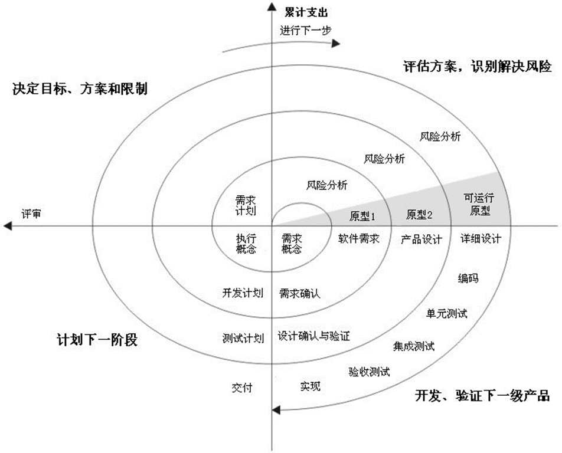
  + 是瀑布模型和演化模型的结合，并增加了风险分析
  + 螺旋模型沿着螺线旋转，在四个象限上分别表达	四个方面的活动，即：
    + 制定计划：确定软件目标，选定实施方案，弄清项目开发的限制条件
    + 风险分析：评价所选的方案，识别风险，消除风险
    + 工程实施：实施软件开发，验证工作产品
    + 客户评估：评价开发工作，提出修正建议
+ 喷泉模型
  + 喷泉模型是一种支持面向对象开发的模型
  + 体现迭代和无间隙特征
    + 迭代：各开发活动常常重复工作多次，相关的功能在每次迭代中随之加入演进的系统
    + 无间隙：开发活动之间不存在明显的边界
+ 基于构件的开发模型
  + 支持软件复用（reuse）
  + 利用预先包装好的软件构件（包括组织内部开发	的构件和现存商品化构件COTS）来构造应用系统
+ 形式方法模型
  + 在严格数学基础上，生成计算机软件形式化的**数学规格说明**(PPT里没有)

## 2-项目管理
### 第3章：项目管理的概念
软件项目管理是指软件生存周期中软件管理者所进行的一系列活动，其目的是在一定的时间和预设范围内，有效地利用**人力、资源、技术和工具**，使软件系统或软件产品按原定**计划和质量**要求如期完成
关注点（4P）：人员People、产品product、过程Process、项目Project

### 第4章：软件过程和项目度量
**软件度量**是指对计算机软件的范围广泛的测度
在软件项目管理的语境中，我们主要关心**生产率**和**质量**的度量
+ 测量（measure）
  + 对一个产品或过程的某个属性的范围、数量、维数、容量或大小提供了一个定量的指标
  + 每个数据点的数据采集
+ 测度（measurement）
  + 确定一个测量的行为
  + 若干个点的数据采集
+ 度量（metric）
  + 对一个系统、部件或过程具有的某个给定属性的度的一个定量测量
  + 由数据采集得到的评审结论

+ 面向规模的度量
  + **LOC*+ (Lines of Codes) 测量依赖于程序设计语言。
  + 通过规范化质量和/或生产率的测量而得到
    + 每千行代码的错误数
    + 每千行代码的缺陷数
    + 每个代码行的花费
    + 每千行代码的文档页数
+ 面向功能的度量
  + 功能点（**FP**，Function Point）是基于软件信息域的可计算的测量及软件复杂性的评估而导出的。

### 第5章：软件项目计划
#### 软件规模估算
（ppt p65起）

先根据历史经验或直觉，确定规模的乐观值 $S_{opt}$（低）、可能值 $S_m$ 和悲观值 $S_{pess}$（高），然后以1:4:1的概率将它们结合起来，公式如下（必须记住）：
$$
S = (S_{opt} + 4S_m + S_{pess} ) / 6
$$

计算题：**基于LOC/FP的估算**和工作量估算（要多少钱，雇多少人）

（todo：例题）

#### 经验估算模型
（ppt p95起）

根据软件以前收集的数据回归而得到的，估算模型的结构(必须记住)：
$$
E = A + B × {( e_v )}^C
$$
其中，
+ $A$、$B$、$C$是经验常数，
+ $E$ 是工作量（以人·月为单位，点号的意思是人×月），
+ $e_v$ 是估算变量（LOC或FP）。

**COCOMO基本模型**

上个公式也是COCOMO基本模型的核心。考试时有计算题，老师会给COCOMO的公式。请了解COCOMO（Constructive Cost model）是怎么出现的。

（todo：例题）

### 第6章：风险分析和管理

### 第7章：项目进度安排及跟踪

### 第8章：软件质量保证
#### 软件可靠性

**平均失效间隔时间**

$$
MTBF=MTTF+MTTR
$$

+ MTBF（Mean-Time-Between-Failure ）：平均失效间隔时间
+ MTTF （Mean-Time-To-Failure）:平均失效时间
+ MTTR（Mean-Time-To-Repair）:平均维修时间

**软件可用性**

$$
可用性\times100\%=\frac{MTTF}{MTTF+MTTR}
$$

| 指标               | 含义            |
| ---------------- | ------------- |
| **MTTF**         | 平均无故障时间（能用多久） |
| **MTTR**         | 平均修复时间（修多久）   |
| **MTBF**         | 平均故障间隔（隔多久再坏） |
| **Availability** | 可用度（能不能用）     |

<mark>重点：计算题</mark>

| 符号        | 含义                          |
| --------- | --------------------------- |
| $N$       | 程序规模（指令条数，如 10000 / 100000） |
| $E_T$     | 程序中错误总数（估计值）                |
| $E_c(t)$ | 截至时间 (t) 已修正错误数             |
| $E_T-E_c$ | 剩余错误数                       |
| $k$       | 错误—故障比例系数                   |
| $MTTF$      | 平均无故障时间                     |
| $t$      | 集成测试时间（h）                   |

$$
1\ \text{month}=24\times 30=720\ \text{h}\\\\
\text{MTTF}=\frac{N}{k(E_T-E_c)}\\\\
\text{MTTF}=a t+b
$$

### 第9章：软件配置管理
**变更管理**，通常叫做**软件配置管理**（SCM），是贯穿于整个软件过程的普适性活动。因为变更可能随时发生，所以SCM活动的目标就是为了：
+ 标识变更
+ 控制变更
+ 保证正确地实现变更
+ 向那些利害相关的人员报告变更

软件配置管理的主要目标是：当变更发生时，能够提高适应变更的容易程度，并且能够减少所需花费的工作量。

## 3-需求分析
### 第10章：需求分析概述
需求分析的基本原则:
+ 能够表达和理解问题的**数据**域和**功能**域
+ 按**自顶向下、逐步分解**的方式对问题进行分解和不断细化
+ 要给出系统的**逻辑视图**和**物理视图**
### 第11章：需求工程
基本步骤

+ 需求开发的目的是**通过调查与分析，获取用户需求并定义产品需求**
+ 需求开发过程包括：
  + **需求调查**：获取需求信息，形成《需求陈述》
  + **需求分析**：分析需求、消除错误、刻画细节
  + **需求定义**：形成《软件需求规格说明书（SRS）》

可行性分析的目的
+ 可行性分析主要从**经济、技术、法律等方面**分析解决方案是否可行
+ 判断是否能在**规定的资源和时间约束下完成系统开发**

三种类型
+ **经济可行性**：进行成本效益分析，判断系统是否值得开发
+ **技术可行性**：分析在现有技术和资源条件下系统能否实现
+ **法律可行性**：分析合同、侵权、责任及法律风险问题

可行性分析结论形式
+ 可以立即开始
+ 需要在条件落实后开始
+ 需要修改目标后开始
+ 因技术或经济原因不能进行

SRS（软件需求规格说明书）

SRS 的地位与作用
+ **软件需求规格说明书（SRS）是需求分析的主要成果**
+ SRS 是**系统设计、实现、测试和验收的主要依据**
+ 为用户、分析人员、设计人员、开发人员、测试人员之间的沟通提供基础

+ SRS 的重点是阐述 **“做什么（What）”而不是“怎么做（How）”**
+ “怎么做”属于系统设计和实现阶段内容，不应写入 SRS

需求优先级
+ 在进度、费用、人力受限时，应**为需求确定优先级**
+ 通常划分为**高 / 中 / 低**
+ 需求优先级由**用户和开发方共同确定**

## 4-软件设计
两个重要考点，研究例题
+ 数据流图（DFD）
  + 考试只需要画顶层数据流图，虽然实际软件工程中有0层、1层
  + 掌握数据流图向结构图的转变，分成“输入，转变，输出”三部分
+ 判定树，判定表（决策和判定一个意思）

内聚度与耦合度
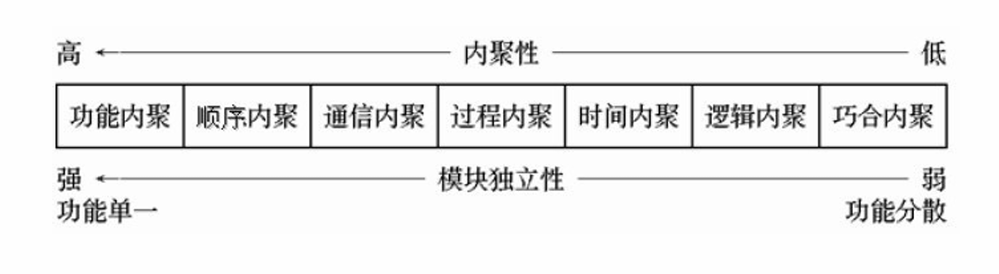
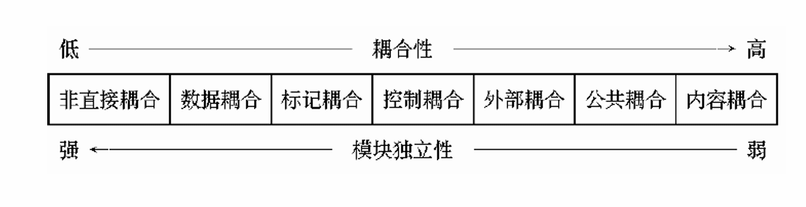

判定树和判定表
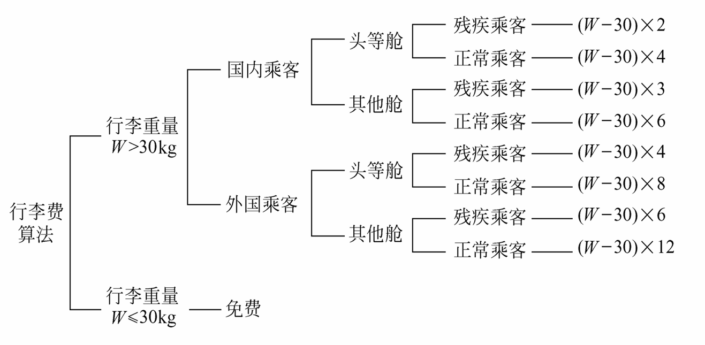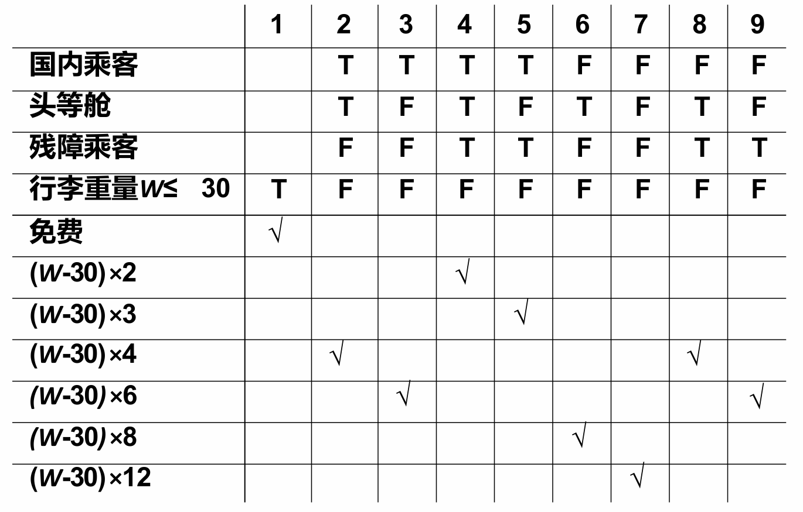

盒图
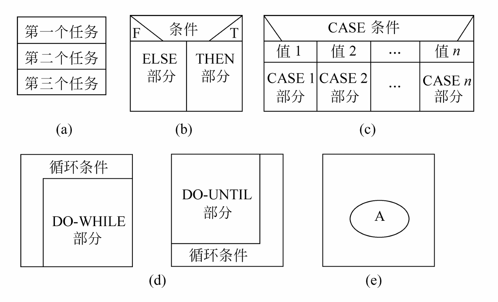
## 5-软件建模
### UML概述
**UML**（Unified Modeling Language）即统一建模语言。
+ UML是用于描绘软件蓝图的标准语言
+ UML是一种语言，也就意味着它有属于自己的标准表达规则。它不是一种类似Java、C++的编程语言，而是一种**分析设计语言**，也就是一种**建模语言**。
+ UML是由图形符号表达的建模语言

按照视图，UML分为以下图：
+ 用户视图
  + **用例图**
+ 结构视图
  + **类图**
  + 对象图
  + 包图
  + 组合结构图
+ 行为视图
  + **状态图**
  + 活动图
  + 交互图
  + **顺序图**
  + 通信图
  + 定时图
+ 实现视图
  + 组件图
+ 环境视图
  + 部署图

组件图、部署图等只需要了解是什么，不考画图。

### 类图
类图的组成
1. 类
2. 接口
3. 协作
4. 依赖、关联、实现、泛化关系（这也是UML模型的4中基本关系）

类（Class）包装了**信息和⾏为**，类是具有相同**属性**、**操作**的对象集合
一个好的类应该遵守**单⼀职责原则**

类的构成：
|类名|
|-|
|属性|
|操作()|

即

|类名|
|-|
|可⻅性 名称:类型 = 缺省值|
|可⻅性 名称(参数列表):返回类型|

例子：
|Student|
|-|
|- id : int - name : String - age : int|
|+ borrow() : bool + getAge() : string + setAge(int newAge) : void|

可见性的符号：（补充，PPT里没有）

|符号|java表示|解释|
|-|-|-|
|`+`|public|公有的|
|`-`|private|私有的|
|`#`|protected|受保护的|
|`~`|package|包的|

类图的关系按强弱排序：
依赖 < 关联 < 聚合 < 组合 < 实现 ≈ 泛化

#### 依赖
独立事物发生变化后会影响到依赖事物。独立事物“使用”依赖事物。
例如：司机使用汽车

#### 关联
关联是一种结构关系。指⼀种对象和另⼀种对象有联系。给定**有关联**的两个类，其中**⼀个类的对象包含另⼀个类的对象**

关联有双向关联和单向关联

**聚合**和**组合**都是特殊类型的关联。
+ 相同点：都表示类之间整体和部分的关系
+ 不同点：
  + **聚合**：弱的“拥有”关系。部分独立于整体。整体消失，部分依然存在。
  + **组合**：强的“包含”关系“。部分与整体共存亡（具有相同的⽣存期）。⼀旦整体对象不存在，部分对象也将不存在。（“唇亡齿寒”）

##### 聚合
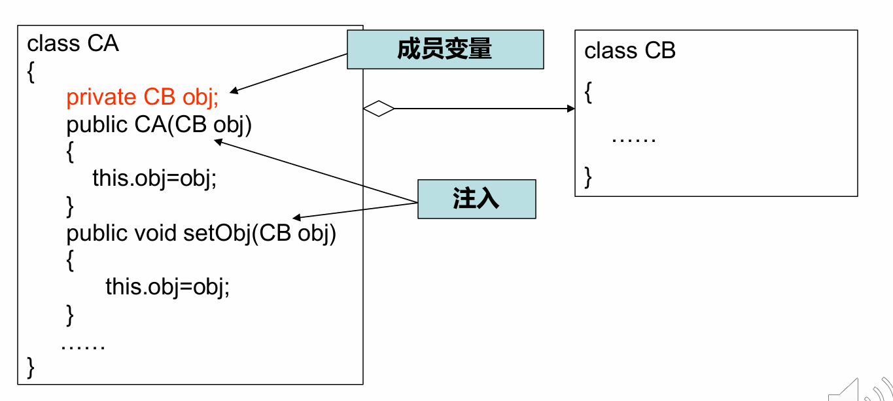

##### 组合

#### 实现
类实现了接⼝，类中的操作实现了接⼝中所定义的操作。
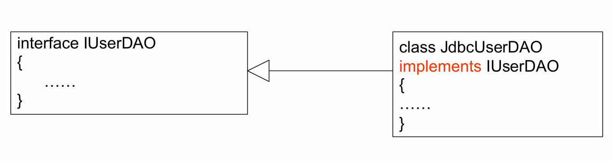

#### 泛化
泛化也就是**继承**关系。

### 对象图
定义
+ 所有的对象都是有唯⼀标识的独⽴实体
+ 任何对象都是某个类的实例
+ 对象图是类图在某⼀时刻的⼀个实例

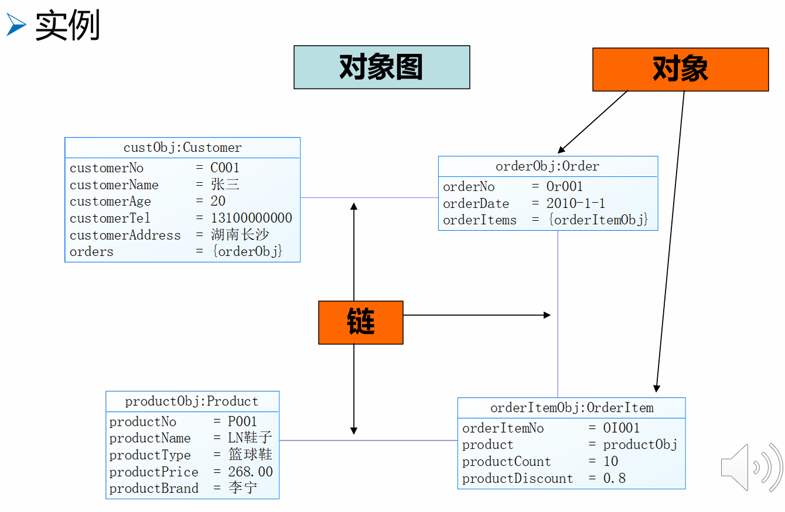

### 用例图
⽤例建模（Use Case Modeling）使⽤**⽤例**的⽅法
来描述系统功能需求。主要包括：
+ ⽤例图(Use Case Diagram)
+ ⽤例描述⽂档 (Use Case Specification)

用例图的组成
1. 用例（圆圈表示）
2. 执行者（参与者）（火柴人表示）
3. 四种关系
   1. **泛化**关系（执行者-执行者）（有说法也是用例-用例的关系，但是PPT里没有就是没有）
   2. **包含**关系（`<<include>>`）和**扩展**关系（`<<extend>>`）（用例-用例）
   3. **关联**关系（执行者-用例）

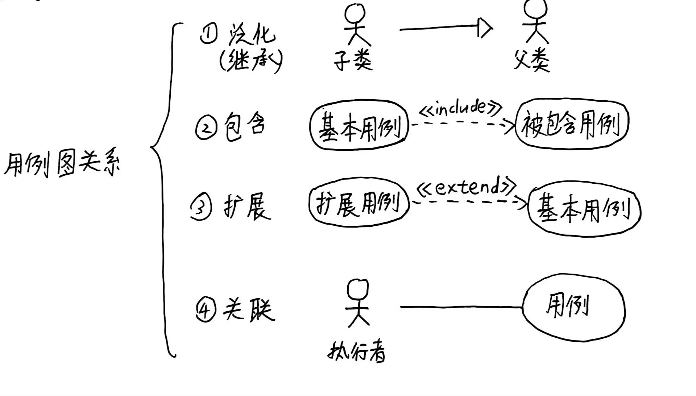

**包含**与**扩展**
+ 联系​：都是从现有用例中抽取部分行为，减少重复
+ 区别：包含关系为“必需”的步骤，而扩展关系是“特殊”“可选”的增强功能
+ 易错点：箭头的指向

用例图的关系举例

执行者之间的**泛化**：执行者的父类子类关系
执行者与用例之间的**关联**（通信）：执⾏者和⽤例之间进⾏交互
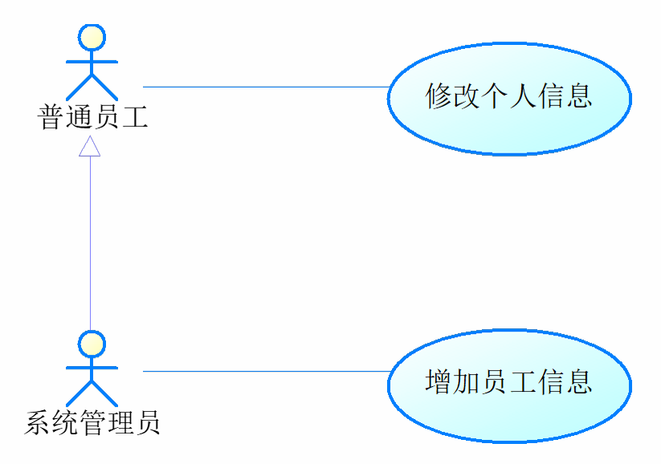

用例之间的**包含**：描述在多个⽤例中都有的公共⾏为

用例之间的**扩展**：扩展⽤例可以在基础⽤例之上添加新的⾏为
+ 基础⽤例（Base）中定义有⼀⾄多个已命名的扩展点
+ 扩展关系将扩展⽤例（Extension）的事件流在⼀定的条件下按照相应的扩展点插⼊基础⽤例中

#### 用例文档
+ 用例名为谓词+宾语
+ 基本路径为主谓宾结构
+ 都用主动句

举例：
+ 用例编号：UC0101
+ 用例名：借阅图书
+ 执行者：用户
+ 前置条件：用户已登录系统，借书证有效
+ 基本路径：
  + 1.用户提交借书请求
  + 2.系统验证用户借书资格
  + 3.系统登记借书信息
  + 4.系统提示借书成功
+ 后置条件：借书记录已保存，图书状态更新

### 状态图
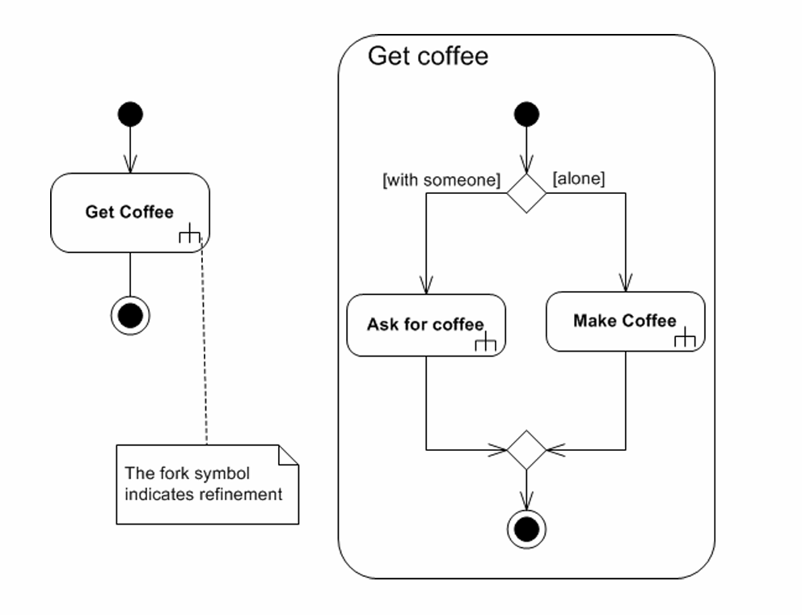
（deposit：在正常状态下可以存款；withdraw：可以取款；destroy：离开该状态时会触发销毁相关资源（如账户对象））

+ 初始状态一个实心圈，终止状态圈套实心圈。
+ 状态可以大状态套小状态
+ 注意状态不能是动作。
+ 一个状态图**只描述一个对象**
+ 箭头是触发条件，格式为`事件 [条件] / 动作`
+ 状态图中，状态框：上层写“状态名”，下层写“状态内动作（entry / do / exit）

| 关键字         | 含义     | 什么时候执行 |
| ----------- | ------ | ------ |
| **entry /** | 进入状态时  | 一次     |
| **do /**    | 状态保持期间 | 持续     |
| **exit /**  | 离开状态时  | 一次     |

### 顺序图
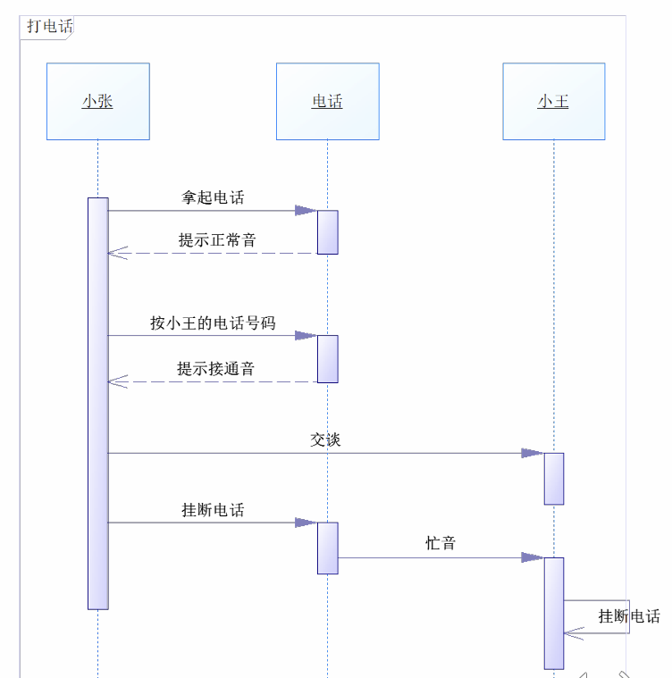

+ 执行者对象用方框
+ 纵向虚线时间轴
+ 时间轴上**激活**长条
+ 生命线往右是实线箭头，返回往左的**虚线**箭头

## 6-软件测试
### 测试覆盖（Coverage，白盒核心）
测试覆盖的总体目标
* 测试覆盖用于**度量测试用例对程序逻辑结构的覆盖程度**
* 希望用**尽量少的测试用例满足给定的覆盖标准**

六种逻辑覆盖
* 常见的逻辑覆盖标准包括：
  **语句覆盖、判定覆盖、条件覆盖、判定-条件覆盖、条件组合覆盖、路径覆盖**

覆盖强度关系（常考判断）
* 覆盖强度从弱到强依次为：
  **语句 < 判定 < 条件 < 判定-条件 < 条件组合 < 路径**
* **条件组合覆盖是最强的逻辑覆盖，但仍不能保证覆盖所有路径**

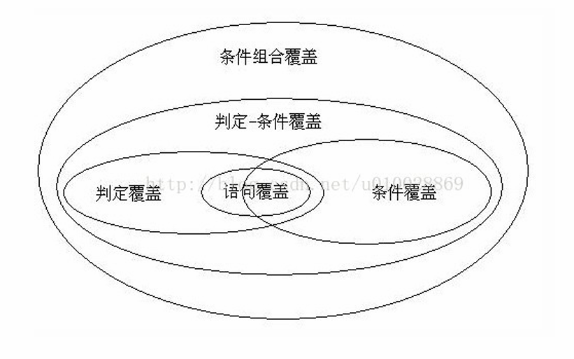

### 白盒测试（White-box Testing）
白盒测试定义
* 白盒测试把程序看作**透明盒子**
* 根据**程序内部逻辑结构**设计测试用例
* 检查**所有逻辑路径是否按预期执行**

白盒测试的典型目标
* 每条独立路径至少执行一次
* 每个判定的所有结果至少出现一次
* 在边界及有效范围内运行所有循环
* 验证内部数据结构的有效性

常用白盒测试方法
+ **逻辑覆盖测试、基本路径测试、数据流测试、循环测试**

### 黑盒测试（Black-box Testing）
黑盒测试定义
* 黑盒测试依据**软件需求规约**
* 不关心程序内部结构
* 检查**功能是否符合需求说明**

常见黑盒测试方法
+ **等价类划分、边界值分析、比较测试、错误猜测、因果图**

等价类划分核心思想
* 将输入数据划分为**若干等价类**
* 每个等价类中的数据对发现错误是等效的
* 分为**有效等价类**和**无效等价类**

例：
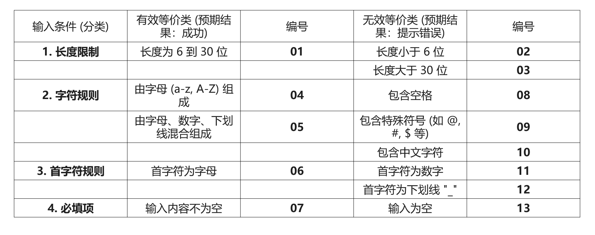

边界值分析要点
* 大量错误发生在**输入或输出范围的边界**
* 选择**等于边界、刚小于边界、刚大于边界**的值进行测试
* 是等价类划分的重要补充

例：规定输入的考试成绩在0～100之间，则取0，100，-1，101作为测试输入数据。

### 单元测试（Unit Testing）
单元测试定义
* 单元测试是对**软件设计的最小单元（模块）**进行测试
* 主要发现**编码阶段产生的错误**
* 通常采用**白盒测试**

单元测试关注内容
* 模块接口（参数个数、顺序、类型）
* 局部数据结构
* 边界条件
* 所有独立路径
* 错误处理路径

驱动与桩
* 测试模块时需要：
  * **驱动程序（driver）**：调用被测模块
  * **桩模块（stub）**：替代被调用模块

### 集成测试（Integration Testing）
集成测试目的
* 模块单独工作正常，但**组合后可能出错**
* 集成测试主要发现**接口、数据传递和模块协作错误**

集成方式分类
* 集成测试分为：
  * **非增量式集成**
  * **增量式集成**

增量集成的两种策略
* **自顶向下集成**：从主控模块开始，用桩替代下层模块
* **自底向上集成**：从底层模块开始，用驱动替代上层模块
* 二者结合称为**三明治测试**

## 7-如何实现持续集成与持续交付
（略）
