# 《软件工程》期末笔记
**分数构成**
1. 实验（15%）：课程项⽬，包括：
Visio/Project/PowerDesigner三个软件的实验测试
各占5%
2. 项⽬（35%）：
   1. 演示（10%）：Slides/Video/Demo等
   2. ⽂档（15%）：SRS/SDD/STD等（学期末交）
   3. 代码（10%）：Repository/Commit/Release等（GitLab Commit）
3. 期末（50%）：闭卷考试

**题型**
1. 选择题 10×3 分
2. 简答题 5×5 分
3. 计算题 2×10 分
4. 画图题 10+10+15 分

其中，根据老师上课的语气，预计画图题会考ER图、数据流图和uml中的类图/用例图（软考三大题）（uml图一定会考）。但是做过实验的图都需要复习一下。

<mark>别忘了带计算器</mark>

## 1-软件工程概论

## 2-项目管理
### 第3章：项目管理的概念
**LOC** (Lines of Codes) 测量依赖于程序设计语言。
功能点（**FP**，Function Point）是基于软件信息域的可计算的测量及软件复杂性的评估而导出的。

### 第4章：软件过程和项目度量

### 第5章：软件项目计划
#### 软件规模估算
（ppt p65起）

先根据历史经验或直觉，确定规模的乐观值 $S_{opt}$（低）、可能值 $S_m$ 和悲观值 $S_{pess}$（高），然后以1:4:1的概率将它们结合起来，公式如下（必须记住）：
$$
S = (S_{opt} + 4S_m + S_{pess} ) / 6
$$

计算题：**基于LOC/FP的估算**和工作量估算（要多少钱，雇多少人）

（todo：例题）

#### 经验估算模型
（ppt p95起）

根据软件以前收集的数据回归而得到的，估算模型的结构(必须记住)：
$$
E = A + B × {( e_v )}^C
$$
其中，
+ $A$、$B$、$C$是经验常数，
+ $E$ 是工作量（以人·月为单位，点号的意思是人×月），
+ $e_v$ 是估算变量（LOC或FP）。

**COCOMO基本模型**

上个公式也是COCOMO基本模型的核心。考试时有计算题，老师会给COCOMO的公式。请了解COCOMO（Constructive Cost model）是怎么出现的。

（todo：例题）

### 第6章：风险分析和管理

### 第7章：项目进度安排及跟踪

### 第8章：软件质量保证

### 第9章：软件配置管理

## 3-需求分析
### 第10章：需求分析概述

### 第11章：需求工程

## 4-软件设计
### 第13章：软件设计概述

### 第14章：体系结构设计

### 第15章：用户界面设计

### 第16章：结构化程序设计

### 第17章：编码设计

## 5-软件建模
### UML概述
**UML**（Unified Modeling Language）即统一建模语言。
+ UML是用于描绘软件蓝图的标准语言
+ UML是一种语言，也就意味着它有属于自己的标准表达规则。它不是一种类似Java、C++的编程语言，而是一种**分析设计语言**，也就是一种**建模语言**。
+ UML是由图形符号表达的建模语言

按照视图，UML分为以下图：
+ 用户视图
  + **用例图**
+ 结构视图
  + **类图**
  + 对象图
  + 包图
  + 组合结构图
+ 行为视图
  + **状态图**
  + 活动图
  + 交互图
  + **顺序图**
  + 通信图
  + 定时图
+ 实现视图
  + 组件图
+ 环境视图
  + 部署图

组件图、部署图等只需要了解是什么，不考画图。

### 类图
类图的组成
1. 类
2. 接口
3. 协作
4. 依赖、关联、实现、泛化关系（这也是UML模型的4中基本关系）

类（Class）包装了**信息和⾏为**，类是具有相同**属性**、**操作**的对象集合
一个好的类应该遵守**单⼀职责原则**

类的构成：
|类名|
|-|
|属性|
|操作()|

即

|类名|
|-|
|可⻅性 名称:类型 = 缺省值|
|可⻅性 名称(参数列表):返回类型|

例子：
|Student|
|-|
|- id : int - name : String - age : int|
|+ borrow() : bool + getAge() : string + setAge(int newAge) : void|

可见性的符号：（补充，PPT里没有）

|符号|java表示|解释|
|-|-|-|
|`+`|public|公有的|
|`-`|private|私有的|
|`#`|protected|受保护的|
|`~`|package|包的|

类图的关系按强弱排序：
依赖 < 关联 < 聚合 < 组合 < 实现 ≈ 泛化
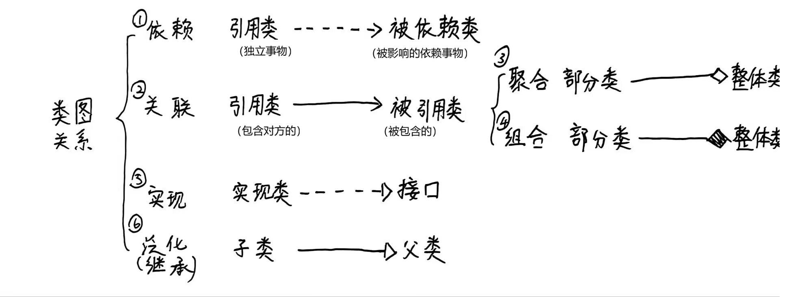

#### 依赖
独立事物发生变化后会影响到依赖事物。独立事物“使用”依赖事物。
例如：司机使用汽车

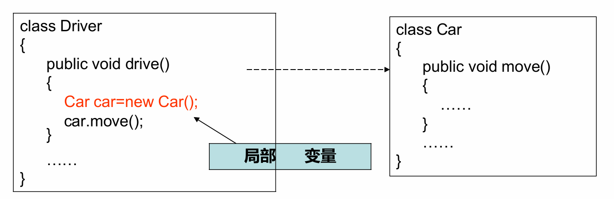
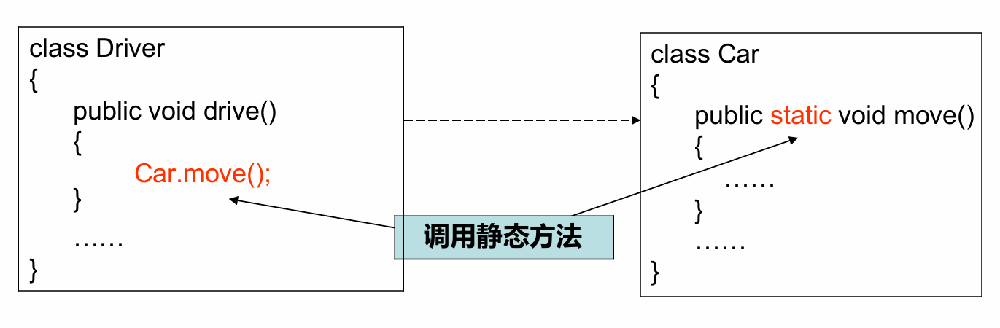

#### 关联
关联是一种结构关系。指⼀种对象和另⼀种对象有联系。给定**有关联**的两个类，其中**⼀个类的对象包含另⼀个类的对象**

关联有双向关联和单向关联

**聚合**和**组合**都是特殊类型的关联。
+ 相同点：都表示类之间整体和部分的关系
+ 不同点：
  + **聚合**：弱的“拥有”关系。部分独立于整体。整体消失，部分依然存在。
  + **组合**：强的“包含”关系“。部分与整体共存亡（具有相同的⽣存期）。⼀旦整体对象不存在，部分对象也将不存在。（“唇亡齿寒”）

##### 聚合

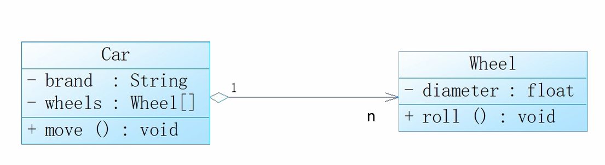

##### 组合
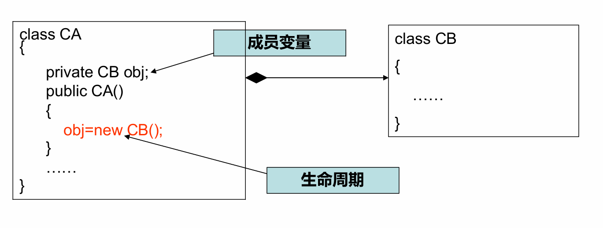
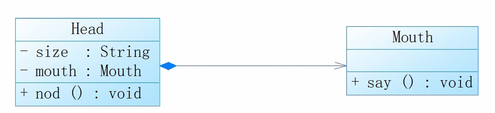

#### 实现
类实现了接⼝，类中的操作实现了接⼝中所定义的操作。

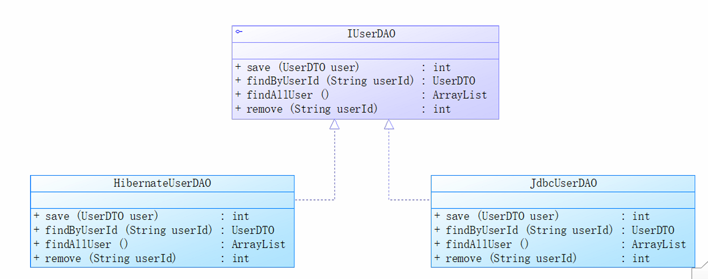

#### 泛化
泛化也就是**继承**关系。
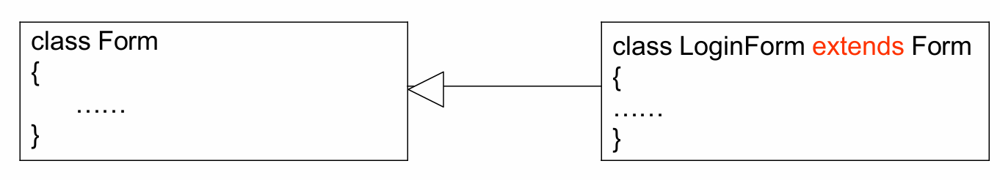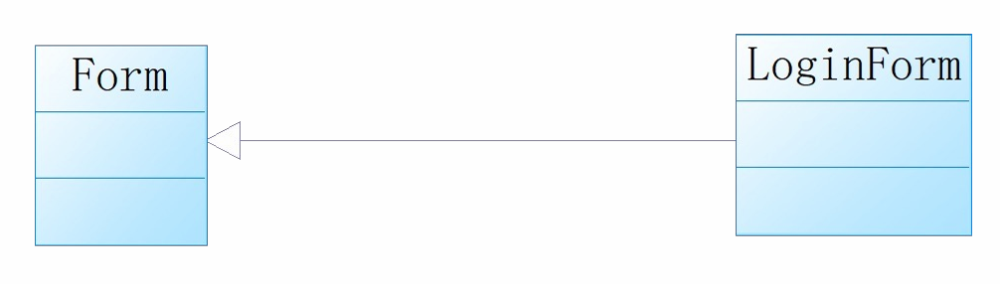

### 对象图
定义
+ 所有的对象都是有唯⼀标识的独⽴实体
+ 任何对象都是某个类的实例
+ 对象图是类图在某⼀时刻的⼀个实例

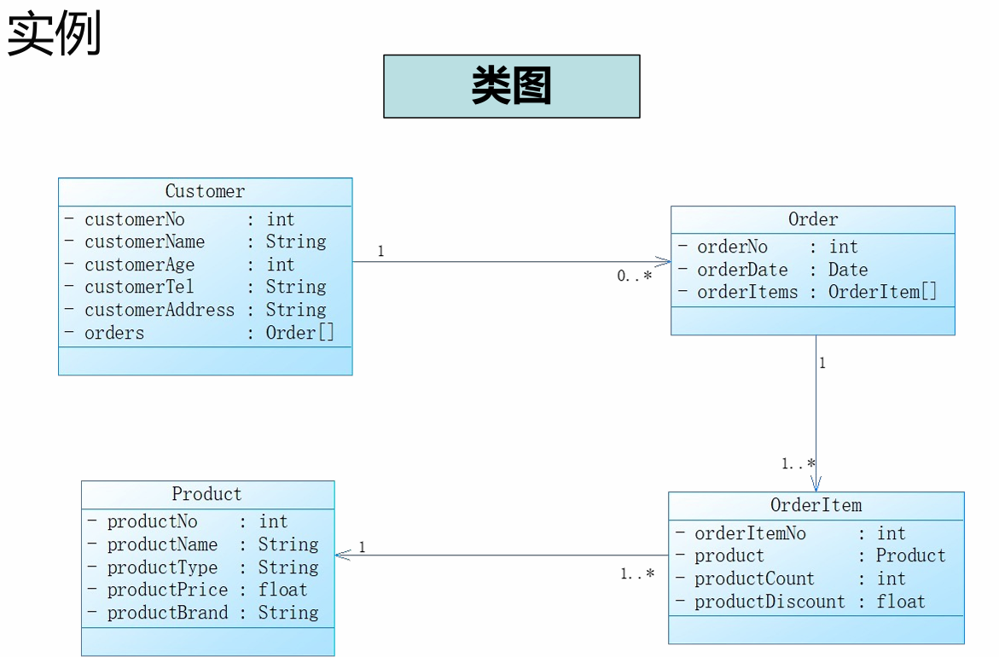

### 用例图
⽤例建模（Use Case Modeling）使⽤**⽤例**的⽅法
来描述系统功能需求。主要包括：
+ ⽤例图(Use Case Diagram)
+ ⽤例描述⽂档 (Use Case Specification)

用例图的组成
1. 用例（圆圈表示）
2. 执行者（参与者）（火柴人表示）
3. 四种关系
   1. **泛化**关系（执行者-执行者）（有说法也是用例-用例的关系，但是PPT里没有就是没有）
   2. **包含**关系（`<<include>>`）和**扩展**关系（`<<extend>>`）（用例-用例）
   3. **关联**关系（执行者-用例）

**包含**与**扩展**
+ 联系​：都是从现有用例中抽取部分行为，减少重复
+ 区别：包含关系为“必需”的步骤，而扩展关系是“特殊”“可选”的增强功能
+ 易错点：箭头的指向

用例图的关系举例

执行者之间的**泛化**：执行者的父类子类关系
执行者与用例之间的**关联**（通信）：执⾏者和⽤例之间进⾏交互

用例之间的**包含**：描述在多个⽤例中都有的公共⾏为
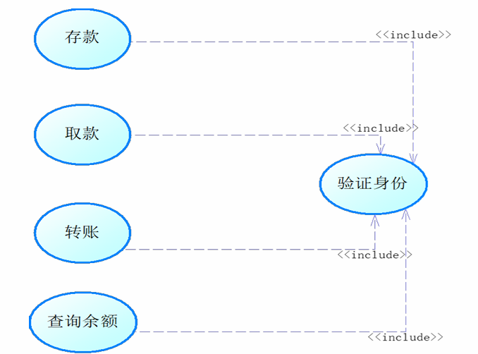

用例之间的**扩展**：扩展⽤例可以在基础⽤例之上添加新的⾏为
+ 基础⽤例（Base）中定义有⼀⾄多个已命名的扩展点
+ 扩展关系将扩展⽤例（Extension）的事件流在⼀定的条件下按照相应的扩展点插⼊基础⽤例中
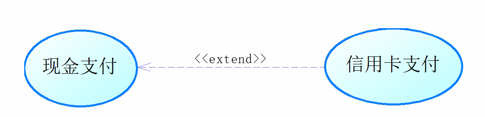

#### 用例文档
todo

## 6-软件测试

## 7-软件建模
