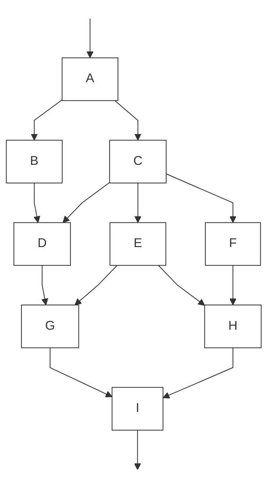
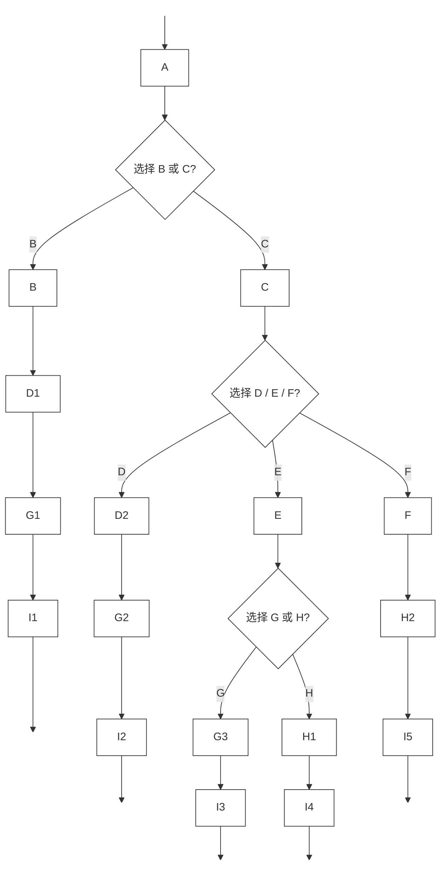
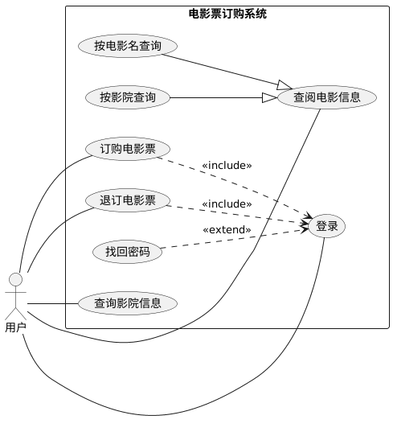

# 2025 年《软件工程》期末考试

## 答案与解析（回忆版）

> 说明：本解析基于课堂讲授内容与期末回忆题整理，个别题目（如选择题第 10 题、挣值分析部分数据）存在回忆不完整情况，已在文中标注。~~学长学姐不会做，所以~~答案基于ChatGPT生成，请保留批判思维。

---

## 一、选择题答案与解析（30 分）

### 1. 当客户没有明确需求的时候选择什么模型

**答案：C（原型模型）**

**解析：**
当需求不清晰、存在不确定性时，原型模型通过快速构建可运行原型，帮助用户澄清真实需求，是最合适的过程模型。

---

### 2. 增量集成测试比爆炸集成测试的关键优点

**答案：B（可并行开发，便于定位错误）**

**解析：**
增量集成可以逐步集成模块，错误更容易定位，同时支持一定程度的并行开发；爆炸集成一次性集成，错误定位困难。

---

### 3. 模块内结合的紧密程度是指（ ）性，这个指标最好要（ ）

**答案：C（内聚 / 高）**

**解析：**
模块内部各成分联系的紧密程度称为**内聚性**。设计原则要求**高内聚、低耦合**。

---

### 4. Windows 更新系统的时候修改软件属于哪种维护

**答案：B（适应性维护）**

**解析：**
为了适应运行环境（如操作系统版本变化）而对软件进行修改，属于**适应性维护**。

---

### 5. 用例图中 A 用例包含 B 用例且 B 用例不可或缺，属于什么关系

**答案：A（包含）**

**解析：**
`<<include>>` 表示被包含用例是基础用例执行过程中**必不可少的步骤**。

---

### 6. 软件变更管理是用来干什么的

**答案：D（控制和追踪软件的变更）**

**解析：**
软件变更管理（配置管理）的核心目标是对变更进行**标识、控制、跟踪和报告**。

---

### 7. 测试覆盖中，最弱和最强的覆盖

**答案：A（语句覆盖 / 路径覆盖）**

**解析：**
逻辑覆盖强度从弱到强依次为：
语句 < 判定 < 条件 < 判定-条件 < 条件组合 < 路径

---

### 8. 软件需求规格说明书（SRS）不包括什么

**答案：D（算法的设计细节）**

**解析：**
SRS 关注“**做什么（What）**”，而不是“怎么做（How）”；算法设计属于设计阶段内容。

---

### 9. 数据流测试的作用是什么

**答案：C（检查程序中变量的定义与使用是否合理）**

**解析：**
数据流测试关注变量的**定义—使用—销毁**路径，用于发现未定义使用、重复定义等问题。

---

### 10. （题目遗失）

**说明：**
该题题干未能回忆，答案暂缺，建议在回忆版中明确标注。

---

## 二、概念题（4 × 5 = 20 分）

> **评分提醒**：概念题一般按“要点给分”，不是按字数。
> 每题写出 **3–5 个关键点** 基本可以拿满分。

---

### 1. 回归测试的概念和作用

**概念：**
回归测试是指在软件发生修改（如修复缺陷、功能增强、环境变化）之后，**重新执行原有测试用例或其子集**，以确认修改没有对已有功能产生新的影响。

**作用与意义：**

1. 验证修改或修复**未引入新的缺陷**
2. 保证系统原有功能在演化过程中仍然正确
3. 是持续集成、持续交付中的关键测试活动
4. 降低“修复一个错误，引入多个新错误”的风险

**特点：**

* 通常重复执行已有测试用例
* 成本高，实际工程中常配合**自动化测试**

---

### 2. 边界值分析与等价类分析的联系与区别

**共同点（联系）：**

1. 二者均属于**黑盒测试方法**
2. 都基于对输入数据域的分析
3. 目的都是在**尽量少的测试用例下发现更多缺陷**

**区别：**

| 方面   | 等价类分析       | 边界值分析      |
| ---- | ----------- | ---------- |
| 核心思想 | 输入域划分为若干等价类 | 错误易发生在边界附近 |
| 关注点  | 类内任意值等效     | 边界值、临界点    |
| 选值方式 | 每类选 1 个代表   | 选边界及其邻近值   |

**关系：**

* 边界值分析是对等价类分析的**重要补充**
* 实际测试中通常**组合使用**

---

### 3. 信息隐藏的定义及其与内聚、耦合的关系

**信息隐藏的定义：**
信息隐藏是一种软件设计原则，要求模块只暴露**必要的接口**，而将其内部实现细节（数据结构、算法）对外部模块隐藏。

**与内聚、耦合的关系：**

1. 信息隐藏有助于提高模块的**内聚性**

   * 模块内部围绕单一职责实现
2. 信息隐藏有助于降低模块间的**耦合度**

   * 外部模块只依赖接口，而非实现细节
3. 信息隐藏是实现“**高内聚、低耦合**”的重要手段

**工程意义：**

* 提高可维护性和可修改性
* 减少修改的传播范围

---

### 4. 重构的定义及作用

**定义：**
重构是指在**不改变软件外部可观察行为**的前提下，对内部代码结构进行调整和优化的过程。

**作用：**

1. 提高代码可读性和可理解性
2. 降低代码复杂度，提高可维护性
3. 消除重复代码和坏味道（Code Smell）
4. 为后续功能扩展和修改创造条件

**注意：**

* 重构不等同于功能增强
* 通常需要回归测试作为保障

---

## 三、作图题（3 × 10 = 30 分）

---

### 1. 判定树（会员等级评定）
(请参考PPT。)

```mermaid
%%{init: {"flowchart": {"curve": "step"}}}%%
flowchart LR
    %% 根
    A[当前是否欠费]:::plain

    %% 根分支：否 / 是（不写在箭头上，单独做节点）
    A --> N0[否]:::plain
    A --> Y0[是]:::plain

    %% ========= 无欠费：按话费分段 =========
    N0 --> N1[月话费 ≥ 500]:::plain
    N1 --> N1Y[是]:::plain --> R1[钻石卡]:::plain
    N1 --> N1N[否]:::plain --> N2[月话费 ≥ 300]:::plain

    N2 --> N2Y[是]:::plain --> R2[金卡]:::plain
    N2 --> N2N[否]:::plain --> N3[月话费 ≥ 100]:::plain

    N3 --> N3Y[是]:::plain --> R3[银卡]:::plain
    N3 --> N3N[否]:::plain --> R4[不授予会员卡]:::plain

    %% ========= 有欠费：先看历史欠费 =========
    Y0 --> H1[是否有历史欠费记录]:::plain
    H1 --> H1N[否]:::plain --> H2[月话费 ≥ 500]:::plain

    %% 有欠费但无历史欠费：仍按话费标准
    H2 --> H2Y[是]:::plain --> R5[钻石卡]:::plain
    H2 --> H2N[否]:::plain --> H3[月话费 ≥ 300]:::plain

    H3 --> H3Y[是]:::plain --> R6[金卡]:::plain
    H3 --> H3N[否]:::plain --> H4[月话费 ≥ 100]:::plain

    H4 --> H4Y[是]:::plain --> R7[银卡]:::plain
    H4 --> H4N[否]:::plain --> R8[不授予会员卡]:::plain

    %% 有欠费且有历史欠费：看是否按时补缴
    H1 --> H1Y[是]:::plain --> P1[历史欠费是否均按时补缴]:::plain
    P1 --> P1N[否]:::plain --> R9[不授予会员卡]:::plain
    P1 --> P1Y[是]:::plain --> P2[月话费 ≥ 100]:::plain

    P2 --> P2Y[是]:::plain --> R10[银卡]:::plain
    P2 --> P2N[否]:::plain --> R11[不授予会员卡]:::plain

    %% 统一“无框”样式（只保留文字）
    classDef plain fill:none,stroke:none,color:#000;
```

**评分要点：**

* 第一层判断：是否当前欠费
* 正确处理三种历史信用情况
* 每条路径均有明确结果

---

### 2. 非程序结构流图 → 程序结构流图（编码复制）
非程序结构流图：


程序结构流图：



> **说明：**
> 通过结构化顺序与选择结构，消除了多出口和交叉控制流，形成程序结构流图。

---

### 3. 用例图（电影票订购系统）



---

## 四、计算题解析（20 分）

### 1. 软件可靠性（MTTF）
已知条件（整理题意）

* 程序规模：
$$
  N = 100000 \quad (\text{指令数})
$$

* 集成测试过程中观测数据：

| 时间点     | 累计改正错误数 | 对应 MTTF |
| ------- | ------- | ------- |
| B（7 月初） | 0     | 0 h   |
| B（8 月初） | 100     | 0.4 h   |
| C（9 月初） | 300     | 2 h     |


本题采用**课堂给定的简单可靠性增长模型**，其平均无故障时间（MTTF）估计公式为：

$$
\text{MTTF} = \frac{N}{k(E_t - E_c)}
$$

其中：

* $N$：程序规模（指令数）
* $k$：与程序结构、测试环境有关的常数
* $E_t$：程序中**最初存在的错误总数**
* $E_c$：当前已经发现并改正的错误数

#### 第一步：建立方程

根据 8 月初的数据（改正 100 个错误，MTTF = 0.4h）：

$$
\frac{100000}{k(E_t - 100)} = 0.4
\tag{1}
$$

根据 9 月初的数据（改正 300 个错误，MTTF = 2h）：

$$
\frac{100000}{k(E_t - 300)} = 2
\tag{2}
$$

化简两个方程

由 (1) 式得：

$$
k(E_t - 100) = \frac{100000}{0.4} = 250000
\tag{3}
$$

由 (2) 式得：

$$
k(E_t - 300) = \frac{100000}{2} = 50000
\tag{4}
$$

联立消元求解

用 (3) − (4)：

$$
k[(E_t - 100) - (E_t - 300)] = 250000 - 50000
$$

解得

$$
\begin{cases}
k = 1000\\
E_t = 350
\end{cases}
$$

> 程序中最初存在的错误总数约为
> $$
> \boxed{E_t = 350}
> $$

（2）当 MTTF = 10 h 时，还需测试多长时间

当目标 MTTF = 10h 时，有：

$$
\frac{100000}{k(E_t - E_c)} = 10
$$

代入已知：

* $k = 1000$
* $E_t = 350$

得：

$$
\frac{100000}{1000(350 - E_c)} = 10
$$

#### 第二步：求已改正错误数 (E_c)

$$
1000(350 - E_c) = 10000
$$

$$
350 - E_c = 10
$$

$$
E_c = 340
$$

目前已改正错误数为 300（9 月初），目标为 340：

$$
340 - 300 = 40 \quad (\text{个错误})
$$

从题目给出的测试进度可知：

* 7–8 月：改正 100 个错误
* 8–9 月：再改正 200 个错误

即测试效率约为 **每月 20 个错误左右**（后期趋缓）

因此改正剩余 40 个错误，约需：

$$
\frac{40}{20} = 2 \text{ 个月}
$$

根据可靠性增长模型估计，程序中初始错误总数约为 350 个。当平均无故障时间达到 10h 时，需要改正约 340 个错误。按照当前测试阶段的改错进度，仍需约 2 个月的测试时间。

---

### 2. 挣值分析（EVM）

#### （1）BAC、PV、EV

* **BAC** = 30,000 + 25,000 + 20,000 + 15,000 + 10,000 = **100,000**
* **PV** = 同上（假定当前时间点计划全部任务）
* **EV** =

  * A：30,000 × 100% = 30,000
  * B：25,000 × 100% = 25,000
  * C：20,000 × 60% = 12,000
  * D、E：0
    → **EV = 67,000**

---

#### （2）AC

* AC = 28,000 + 26,000 + 22,000 = **76,000**

---

#### （3）SV、CV

* SV = EV − PV = 67,000 − 100,000 = **−33,000**
* CV = EV − AC = 67,000 − 76,000 = **−9,000**

---

#### （4）SPI、CPI

* SPI = EV / PV = 0.67 → **进度滞后**
* CPI = EV / AC ≈ 0.88 → **成本超支**
